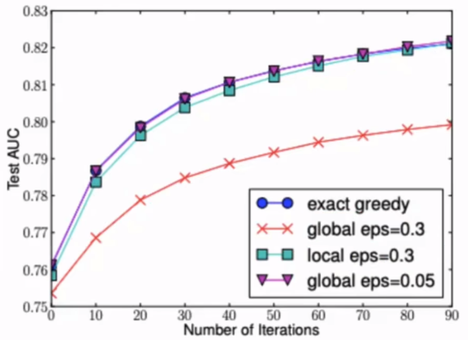
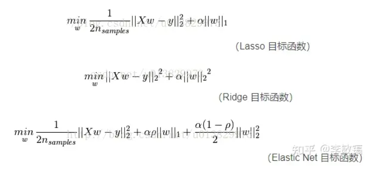
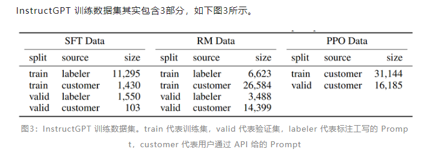

# 推荐算法

## 频繁项集挖掘

Apriori

- k项频繁集 ==满足阈值==> k+1项频繁集

FP-tree

- 原理：构建一颗树，根到子树路径上的节点包含item和item出现的频次，**保证k项频繁集能够重叠一条路径**

- 算法步骤：

  1. 统计一遍所有item，记录每个item的频次，降序得到item的表头指针数组
  2. 根据每条记录集合，按照频数降序集合后，插入到树中，重叠item节点，频数+1；否则创建分支。同时将对应item的表头指针指向第一个出现该item的节点
     - 同时将同类item用链表相连
  3. 遍历每一个表头数组中的item元素，从下至上得到该item的一条路径，并遍历同类item元素的路径，得到该item的k项频繁集，k为该路径中item的频次

  

- 时间复杂度：**Apriori**每计算一次就需要扫描一遍数据库。FP-growth Tree只需扫描两遍数据库

## 协同过滤

https://zhuanlan.zhihu.com/p/80069337?utm_medium=social&utm_oi=771806150197805056

原理：

- 两个user对很多item的喜恶相同==相似分数高=>**相似的人A和B**===>A喜欢的item，B喜欢未知，推荐该item给B
- 两个item M和N，**M和N的标签被很多人都打的相同**====>相似的M和N===>A喜欢M，推荐N给A
- 计算用户和物品之间的相似度


用户行为矩阵$score$：行列分别表示user和item，维度分别为M和N，元素$(i，j)$表示$user_i$对$item_j$的评分

- 稀疏性：M和N很大，而每个user只会操作过有限个item

- 相似度：余弦相似度（夹角越小，值越大越相似）

- user-baesd：

  1. 计算与$user_i$最相似的K个用户，有用户相似度$sim(user_i，user_j)$取topk个排列

  2. 遍历每个$item_j$计算$user_i$对$item_j$的评分
     $$
     score(i,j) = \sum_{k\in topK} sim(user_i, user_k)*score[k, j]
     $$

  3. 将topN个最高评分的补全item推荐给$user_i$

- item-based 方法类似

基于分布式技术的大数据推荐

- 每台机器存放着不同的$user_k$对所有item的评分向量$u_k$，要知道关于item的向量$v_i$和$v$之间的向量相似度
  $$
  sim(v_i, v_j) = \frac{\sum_{k} score[k,i]*score[k,j]}{||v_i||_2*||v_j||_2}
  $$

- 分子和分母can derive from 不同user的$u_{k，i}*u_{k，j}$以及$u_{k，i}^2$、$u_{k，j}^2$，等价于对每个$u_i$计算笛卡尔积

  

  1. 对每个user得到笛卡尔积的结果二维结构RDD1，
  2. RDD1按item的$i，j$分组再求和，得到分子
  3. 对RDD1 filter出对角线的一维结构RDD2，求和求根再相乘，得到分母

- 对以上计算通过RDD的分区特性+广播，再通过排序和指定user，得到不同补全item对于该user的评分

  - 通过矩阵相乘得到新的评分矩阵
    $$
    score_{M*N}^{new} = score_{M*N}^{old} * sim_{N*N}
    $$

  - 将$sim$结果通过广播传到不同节点上，即可完成分布式的并行推荐计算

- 实时数据处理：Kafka+HBase+Spark Streaming
  - 数据流处理：近实时协同过滤算法需要处理实时的数据流，而不是离线的批处理数据。Kafka是一个高吞吐量的分布式消息队列，可以用于接收和传输实时数据流。它提供了可靠的消息传递机制，并**支持水平扩展**，能够满足大规模数据流的处理需求。
  - 实时计算：Spark Streaming是一个流处理框架，基于Apache Spark构建，可以处理实时数据流并进行实时计算。它提供了高级的流处理抽象，**可以将数据流分成小的批次进行处理**，同时支持高吞吐量和低延迟的计算。Spark Streaming可以与Kafka集成，从Kafka主题中读取数据流，并应用协同过滤算法进行实时计算。
  - 数据存储：HBase是一个分布式的列式存储系统，具有高可扩展性和高可靠性。它适用于存储大规模数据集，并**支持快速的随机访问**。在协同过滤算法中，需要存储user-item评分数据和生成的推荐结果等信息。HBase提供了高吞吐量的读写操作，并能够处理大量的存储和检索请求。

  

  1. Spark Streaming从Kafka中按user分组，读取一个时间窗口的用户行为数据 $U$

  2. 根据U中在$t$时刻，对item $sid_i和sid_j$的评分，更新到HBase中存放item相似度表（CR）中的value
     $$
     value_{i,j} = \sum_kscore_i*score_j
     $$

  3. 从U中选取最近的记录，更新HBase中的用户行为表（UAction）。如果用户操作的某个item已经在行为表UAction中(这种情况一般是用户对同一个标的物做了多次操作，昨天看了这短视频，今天刷到了又看了一遍)，需要将这两次相同的行为合并起来，具体上我们可以将这两次行为中得分高的赋值给行为表中该标的物的得分，同时将操作时间更新为最新操作该标的物的时间。

  4. 计算关于item s的评分，并选取最高的进行推荐
     $$
     R(U, s)=\sum_{t \in UAction } \operatorname{score}(U, t) * \operatorname{sim}(t, s)
     $$

## 知识图谱+GNN

- user-item的二分图+关于item的KG图，从而连接更多的边，得到item之间的高阶关系

  

- 表示学习user和item的embedding，预测$user_i$ 购买 $item_j$的概率进行训练；考虑标签平滑缓解过拟合


## 冷启动

推荐系统中的新用户冷启动问题是指系统在没有足够的历史数据支持的情况下，如何为新用户推荐合适的内容。以下是几种解决方案：

1. 基于user的推荐：**利用新用户提供的信息**（比如年龄、性别、地理位置、搜索关键词等)建立用户画像，然后利用这些信息为其推荐相似内容。
2. 基于人口统计学数据的推荐：通过新用户的人口统计学数据(比如年龄、性别、地理位置、职业等)来预测其兴趣，从而推荐合适的内容。
3. 基于热门内容的推荐：将当前最热门的内容推荐给新用户，这样可以避免出现不合适的推荐，但是可能会降低用户满意度。
4. 混合推荐：将多种推荐策略结合起来，根据不同的用户情况进行不同的推荐。比如对于新用户，可以先使用基于人口统计学数据的推荐策略，然后再结合基于内容的推荐策略。
5. 主动获取用户反馈：在新用户使用推荐系统的过程中，主动向用户询问反馈，比如问用户是否喜欢当前的推荐内容，或者提供一些有奖励的问卷调查等方式，以此来建立用户画像和改进推荐算法。


## 指标

平均倒数排名（Mean Reciprocal Rank,MRR），该指标反应的是我们找到的这些item是否摆在用户更明显的位置，强调位置关系，顺序性。公式如下，N表示推荐次数，$p_i$表示用户真实访问的item在推荐列表中的位置，如果没在推荐序列中，则p为无穷大，1/p为0。
$$
MRR=\frac{1}{N}\sum_{i=1}^{N}\frac{1}{p_i}
$$

- 加入我们取top-5，推荐[1,2,3,4,5]这5个item，然后测试数据中对应的访问的item为3，则该item的RR为1/p=1/3。

MAP（mean average precision），核心是利用q（搜索/推荐算法）对应的相关的d（搜索/推荐结果）出现的位置来进行排序算法准确性的评估

- q1对应相关的d排名是1，2，5，7（假设q1有4个相关d），那么对于q1的ap（average precision）的计算就是（1/1+2/2+3/5+4/7）/4=ap1，

- q2的排序结果结果中与之相关的d的排名是2，3，6（假设q2有5个相关d），那么对于q2的ap就是（1/2+2/3+3/6+0+0）/5=ap2

- 那么这个排序算法的MAP就是（ap1+ap2）/2

  

# 搜索算法


# 机器学习基础知识

https://www.showmeai.tech/article-detail/185

偏差：预测平均值与真实值的接近程度 （预测平均值是给定无数套训练集而期望拟合出来的模型就是**平均模型的平均预测结果**）

方差：预测值之间的方差，表示对数据的变动敏感

防止过拟合：

- 数据集角度：在训练集中提升数据分布的丰富性，尽可能多的得到不同场景的数据，通过采样和数据增强技术，缓解分类问题中的数据类别不平衡问题
  - 采样：从数据源头采集更多数据、复制原有数据并**加上随机噪声**、重采样、根据当前数据集**估计数据分布参数，使用该分布产生更多数据**等。
- 优化模型复杂度：通过加入Dropout、LoRA等优化模型复杂度的模型结构或者L1正则等损失函数，降低模型过拟合到训练样本的可能性
- 超参调整：改变模型的学习率、批量大小、采用早停等训练策略
- 集成学习：组合不同的分类器，或者不同的模型，通过投票、平均等方式做出综合预测结果

评价指标：

- 回归问题：拟合优度、决定系数。由**模型的预测**偏差之和，与直接从**样本中计算出的平均预测**结果作比较
  $$
  R^2 = 1-\frac{\sum_i y_i - \bar y }{\sum_i y_i - \hat y} \\
  \bar y = \frac{1}{n} \sum_iy_i
  $$
  

- （二）分类问题：Precision和Recall

  混淆矩阵中的第一个T/F 是真实类别，第二个P/N是预测类别

  Precision是，预测正例正确的个数，占所有模型预测为正例的个数

  Recall是，预测正例正确的个数，占所有真正正确的个数

  F1：Precision和Recall的调和平均数
  $$
  Precision = \frac{TP}{TP+FP} \\
  Recall = \frac{TP}{TP+TF} \\
  F1 = \frac{2}{\frac{1}{P} + \frac{1}{R}}
  $$
  ROC曲线和AUC面积

  - 考虑分类时，对每个样本会有个[0, 1]的分类概率输出，**将正类概率降序排列**，作为二分类的截断点（阈值），大于等于截断点的判为正类，否则为负类，将依次落在x轴

  - 计算各个截断点x下的 TPR和FPR

    - TPR：预测正例正确样本占所有正例样本的比例
    - FPR：预测正例错误样本占所有负例样本的比例

    $$
    TPR = \frac{TP}{TP+FN} \\
    FPR = \frac{FP}{FP+TN} \\
    $$

  - ROC曲线横坐标为FPR，纵坐标为TPR。ROC曲线直观上反映了模型在选择不同阈值的时候敏感性与1-特异性的趋势走向

  - ROC曲线的意义，FPR小但是TPR高，表示犯错误尽可能小的情况下，成功的概率大

  - AUC即为ROC曲线下的面积

    ```python
    import numpy as np
    from sklearn import metrics
    
    y = np.array([1, 1, 2, 2])
    scores = np.array([0.1, 0.4, 0.35, 0.8])
    fpr, tpr, thresholds = metrics.roc_curve(y, scores, pos_label=2)
    >>> fpr
    array([ 0. ,  0.5,  0.5,  1. ])
    # 真阳性率
    >>> tpr
    array([ 0.5,  0.5,  1. ,  1. ])
    # 阈值
    >>> thresholds
    array([ 0.8 ,  0.4 ,  0.35,  0.1 ])
    
    auc = metrics.auc(fpr, tpr)
    ```

    

  


## 分类回归模型

线性回归损失 $y=\sum_ix_iw_i$
$$
\nabla_x    x_{1×n}*w_{n×1} = w^T \\
\nabla_w    x_{1×n}*w_{n×1} = x^T 
$$
逻辑回归损失

-  sigmoid函数的导数，用于得到输出端的

  

- 逻辑回归：MLP+sigmoid激活函数得到二分类的预测概率$\hat y$，目标函数与真实类别$y$的MLE最大化或者损失为BCE（负的MLE）最小化
  $$
  \hat y=\frac{1}{1+e^{-(w^Tx+b)}} \\
  \Rightarrow  \ ln\frac{\hat y}{1- \hat y}=w^Tx+b=定义为= ln\frac{p(y=1|x)}{p(y=0|x)} \\
  则有 \ p(y=1|x)= \frac{e^{w^Tx+b}}{1+e^{w^Tx+b}}、p(y=0|x)= \frac{1}{1+e^{w^Tx+b}}
  $$

  - MLE目标函数为$argmax_{w,b} \{ y_i*p(y=1|x)+(1-y_i)p(y=0|x) \}$

  - BCE的损失为 
    $$
    argmin_{w,b}\ -\{y*ln(\hat y) + (1-y)*ln(1-\hat y)\} \\
    =-\{ln\frac{1}{1+e^{-(w^Tx+b)}}+ln\frac{e^{-(w^Tx+b)}}{1+e^{-(w^Tx+b)}} \} \\
    =-\{ln\frac{e^{w^Tx+b}}{1+e^{w^Tx+b}}+ln\frac{1}{1+e^{w^Tx+b}} \}\\
    =argmax_{w,b}\{ y_i*p(y=1|x)+(1-y_i)p(y=0|x) \}
    $$

反向传播中的线性变换

- N为样本数，H为特征维度或隐藏层大小，M为输出维度

$$
\nabla_x    x_{N×H}*W_{H×M} = 上游梯度*W^T \\
\nabla_w    x_{N×H}*W_{H×M} = x^T *上游梯度 \\
$$

交叉熵损失

- q为预测的各类别概率向量，p为ont-hot向量，真实类别下标的元素值为1，其他为0
  $$
  CE(p,q)= - \sum_i p_i *log(q_i)= q -p
  $$
  


## 树模型

随机森林 GBDT   xgboost lightgbm 

https://zhuanlan.zhihu.com/p/526729828?utm_id=0

### 随机森林

https://www.showmeai.tech/tutorials/34?articleId=191

算法

1. Bootstrap Sampling

   有放回的采样T次，每次得到的数据集构建一个决策树（CART）

   - 使得初始训练集中约 63.2%的样本出现在一个采样集中，并带来数据集的差异化
   - 未出现的约 36.8% 的样本可用作验证集来对后续的泛化性能进行「包外估计」

2. 随机特征筛选

   随机选择 k 个属性，然后再从这 k 个属性中选择一个最优属性进行划分（最大信息增益）

3. 简单投票/平均进行预测

优缺点：

1. 优点
   - 对**于高维（特征很多）稠密型的数据适用，不用降维，无需做特征选择**。
   - 构建随机森林模型的过程，亦可帮助判断特征的重要程度。
   - 可以借助模型构建组合特征。
   - **并行集成，有效控制过拟合。**
   - 工程实现并行简单，训练速度快。
   - 对于不平衡的数据集友好，可以平衡误差。
   - 对于特征确实鲁棒性强，可以维持不错的准确度。
2. 缺点
   - 在噪声过大的分类和回归数据集上还是可能会过拟合。
   - 相比单一决策树，因其随机性，模型解释会更复杂一些。

参数与调优

- 


### GBDT 

Gradient Boosting Decision Tree


核心方法，目标函数直接用泰勒一阶导，详细推导看XGBoost：

- GBDT的目标函数即为 $L(y_i, F_m(x_i) ) - L (y_i, F_{m-1}(x_i)) = L' (y_i, F_{m-1}(x_i))f_m(x_i) \le 0$，一阶梯度是在$F_m(x_i)=F_{m-1}(x_i)$时的梯度
- 目的是使加入当前基学习器的预测结果，损失要比仅用前m-1轮的要小，令$f_m(x_i)=-L' (y_i, F_{m-1}(x_i))$，不等式恒成立，而**此时的梯度值越偏大，负梯度越偏小，当前基分类器优化的效果越好**

- **拟合负梯度**：对于第m轮的基学习器，使用前一轮的梯度结果，即 $(x_i, -L' (y_i, F_{m-1}(x_i)))$，拟合的是前一轮预测结果的负梯度

  - 当L为回归问题的MSE损失时，负梯度即为真实值与前一轮预测的差（残差），**拟合的即为数值残差，此时$f_m(x_i)$的取值是有最优（小）解的，为残差和（当前标签）的平均**

  - 当L为二分类问题的BCE损失时，同样将累加结果通过sigmoid函数输出为0~1的概率，:question:**此时需要保留y和(1-y)进行推导，我理解是因为y不是0/1离散的二值，而是连续值**，而不像前面的logistic回归那样直接舍弃，**拟合的是分类概率的残差，此时该梯度没有闭式解或说$f_m(x_i)$的取值没有最优解**
    $$
    \hat y_m = \frac{1}{1+e ^{-F_m(x_i)}} \\
    \begin{align}
    L(y, F_m(x_i)) &= -\{y*ln(\hat y_m) + (1-y)*ln(1-\hat y_m)\} \\
    &=\log(1+e^{-F_m(x_i)}) + (1-y)F_m(x_i) 
    \end{align}\\
    -L_{F_m(x_i)}^{'}(y, F_m(x_i)) = (y - \frac{1}{1+e^{-F_m(x_i)}}) |_{F_m(x_i)=F_{m-1}(x_i)} = y - \hat y_{m-1} \\
    L_{F_m(x_i)}^{''}(y, F_m(x_i)) = - \frac{e^{-F_m(x_i)}+1-1}{(1+e^{-F_m(x_i)})^2} =\hat y_{m-1}(1-\hat y_{m-1}) \\
    $$

    - 为了得到$f_m(x_i)$的最优取值，此处的方法就是被XGBoost直接拿过来改进的（使用二阶泰勒展开，凑成一元二次方程得到闭式解的方法），不一样（局限于L）的是损失函数L是特定的BCE损失，梯度G H也是该损失推导的一阶导和二阶导 （$r_m$表示一阶情况下的残差）

    - 使用连续数值的BCE作为损失（称为“总体损失”），计算其闭式最优解，可以统一处理分类和回归问题
      $$
      g=L_{F_m(x_i)}^{'}(y, F_m(x_i)) = (y - \frac{1}{1+e^{-F_m(x_i)}}) |_{F_m(x_i)=F_{m-1}(x_i)} =  \hat y_{m-1}-y\\
      h=L_{F_m(x_i)}^{''}(y, F_m(x_i)) = - \frac{e^{-F_m(x_i)}+1-1}{(1+e^{-F_m(x_i)})^2}|_{F_m(x_i)=F_{m-1}(x_i)} =\hat y_{m-1}(1-\hat y_{m-1}) \\
      f_m(x_i)^* =  -\frac{G}{H} = \frac{\sum r_m}{\sum (y-r_m)(1-y+r_m)},r_m=-g\\
      $$

- 确定树的结构

  - 枚举特征和划分方式，**选择最小损失**的划分方式，但直接使用总体损失枚举计算的开销很大
  - 特点：**MSE和总体损失得到的树的结构是一样**，故使用MSE确定树的结构，再根据该结构计算总体损失得到的叶子结点值（$f_m(x_i)$）

- 

- 加$f_m(x_i)$当前基学习器的学习率，又被XGBoost学去了

训练流程：

1. 使用随机常数c作为初始预测，初始化$f_0(x_i)=-L' (y_i, c)$
2. 1~m轮迭代，每次使用前一轮的梯度得到新训练样本


GBDT 需要将多棵树的得分累加得到最终的预测得分，且每轮迭代，都是在现有树的基础上，增加一棵新的树去拟合前面树的预测值与真实值之间的残差。


### XGBoost

https://www.nowcoder.com/discuss/511318796121006080?sourceSSR=dynamic

https://www.bilibili.com/video/BV1nP4y177rw?p=9&spm_id_from=pageDriver&vd_source=89ddf71eb38188bf588f77ea08dd93b4

GBDT与XGBoost（eXtreme Gradient Boosting）

- GBDT使用的是损失函数一阶导数，相当于函数空间中的梯度下降；XGBoost还使用了损失函数二阶导数，相当于函数空间中的牛顿法。
- XGBoost在GBDT算法基础上还有一些工程实现方面的优化，以下是XGBoost补充的工程实现和优化
  - **正则化**：XGBoost显式地加入了正则项来控制模型的复杂度，能有效防止过拟合。
  - **列采样**：XGBoost采用了随机森林中的做法，每次节点分裂前进行列随机采样。
  - **缺失值**：XGBoost运用稀疏感知策略处理缺失值，GBDT无缺失值处理策略。
  - **并行高效**：XGBoost的列块设计能有效支持并行运算，效率更优。

梯度提升与梯度下降

- 梯度提升：定义在函数空间里，寻找最优的预测函数y，没有参数（如xgboost没有参数，只有最优的y用损失函数如何表示，如何使用二次函数转换得到最优的y）
- 梯度下降：定义在参数空间里，用参数矩阵θ来表示模型函数y


核心概念

1. 目标函数

   - 前$m-1$个基学习器（分类回归树）对某个样本关于特征$x_i$的预测值，加上当前的基学习器第$m$步的预测$f_m(x_i) $。$F_{m-1}(x_i)$是当前步的固定值，损失函数**以$F_m(x_i)$为变量，可在$F_{m-1}(x_i)$处进行泰勒展开，从而分离出$f_m(x_i) $**，其中一阶和二阶梯度表示的是某样本的特征值$x_i$在**前一轮预测结果**的损失梯度
     $$
     F_m(x_i) = F_{m-1}(x_i)+f_m(x_i) \\
     L(y_i, F_m(x_i) ) = L (y_i, F_{m-1}(x_i)+f_m(x_i)) \\
     L(y_i, F_m(x_i) ) = L (y_i, F_{m-1}(x_i)) + L' (y_i, F_{m-1}(x_i))f_m(x_i)+\frac{1}{2}L'' (y_i, F_{m-1}(x_i))f_m^2(x_i)
     $$

     > GBDT的目标函数即为 $L(y_i, F_m(x_i) ) - L (y_i, F_{m-1}(x_i)) = L' (y_i, F_{m-1}(x_i))f_m(x_i) \le 0$
     
   - 加入正则项 $\frac{1}{2}\lambda f_m^2(x_i)+\gamma T$，其表示控制预测值的大小与叶子节点数量（预测的个数），得到最小化的优化目标。
     
   - 进一步进行累加：对每个叶子结点内得到若干样本$x$一次计算梯度，其中的**$G$ $H$ 表示分类$x_i$的得到的样本集，各个样本在前面一轮预测累加值的一阶和二阶损失梯度和**，可从之前一轮中计算得到
     $$
     Obj^{(m)} =\gamma T + f_m(x_i)G+\frac{1}{2}f_m^2(x_i)(\lambda+H)
     $$

2. 最优化目标函数

   - $Obj^{(m)}$是关于当前预测$f_m(x_i)$的二次函数

   - 损失函数是凸函数，$\lambda$是正数，故一阶导和二阶导都是正数，故该二次函数存在最小值

   - 该值只与之前轮的损失梯度有关
     $$
     f_m(x_i)^* =  -\frac{G}{\lambda+H}\\ 
     Obj^{(m)^{*}} = \gamma T - \frac{1}{2}\frac{G^2}{\lambda+H}
     $$

3. 确定树的结构 （精确贪心算法）

   - 影响树的划分---》叶子节点的样本集合---》损失---》叶子节点的预测

   - 枚举节点分裂，选择最小$Obj^{(m)}$的，涉及特征数量、特征范围、树的层数（叶子个数），穷举的复杂度太高

   - 使用增益确定是否分裂、按照什么特征分裂。
     $$
     gain = Obj_前^*-Obj_后^*=  \frac{1}{2}[\frac{G_{左}^2}{\lambda+h_{左}}+\frac{G_{右}^2}{\lambda+H_{右}}-\frac{G_{前}^2}{\lambda+H_{前}}] - \gamma T
     $$

   - 何时停止分裂：1. 增益小于等于某个阈值 2. 叶子节点包含的样本数小于等于某个阈值 3. 限制叶子结点数

   - 算法流程

     - 枚举各个特征；排序当前特征（可用于累加g, h，避免重复计算），再枚举特征值，计算按照当前特征值进行分裂的增益（每层枚举每个特征值会对应一颗树）
     - 特征范围特别多时，**排序开销很大**

     

4. 确定树的结构 （近似算法：优化性能，但牺牲精度）

   - 特征筛选：压缩特征数

     - 按树随机：随机选特征，每次分裂时都**只用随机选的特征**
     - 按层随机：**每层**随机选某个特征

   - 特征值筛选

     - 分桶法：指定特征值的个数，对各个特征下的样本数，分桶（指定特征2个，样本12个，指定三个桶，每个桶下需要有4个样本），如下，取特征值2和5作为筛选的特征值

       

     - 加权分位法：不能对桶里的每个样本一视同仁，考虑样本的权重，权值由$Obj^{(m)}$进行转化（可以凑成完全平方）
       $$
       \begin{align}
       Obj^{(m)} &=\gamma T + f_m(x_i)g_{x_i}+\frac{1}{2}f_m^2(x_i)(\lambda+h_{x_i}) \\
       &=\frac{1}{2}h_{x_i}(\frac{g_{x_i}^2}{h_{x_i}^2}+2\frac{g_{x_i}}{h_{x_i}}+f_m^2(x_i)) + \Omega(f_m)\\
       &=\frac{1}{2}h_{x_i}(f_m(x_i)-(-\frac{g_{x_i}}{h_{x_i}}))^2 + \Omega(f_m)
       \end{align}
       $$
       可知优化过程应优先考虑有着较高$H$的样本$x_i$，相当于某个分桶中的一个$x_i$其实表示了更多的样本数，按照$H$的值进行分桶，得到分位数作为选取的特征值（或者同理采用分位阈值，累加$H$达到分位阈值后作为选取特征值）。如下12 50表示阈值为0.6的分位数，将其作为选取的特征值（**分位阈值越小，表示分的桶越多，越接近采样全部样本，越近似，但计算性能越差**）
     
       | 特征  | 1    | 2    | 3    | 4    | 5    | **12** | 45   | 50   | 99   |
       | ----- | ---- | ---- | ---- | ---- | ---- | ------ | ---- | ---- | ---- |
       | $h_i$ | 0.1  | 0.1  | 0.1  | 0.1  | 0.1  | 0.1    | 0.4  | 0.2  | 0.6  |
     
     - 全局策略：分裂跟时选取的$x_i$的各个特征值，后续的每次节点分裂都用这几个特征值。会导致有的节点停止分裂生长，因为此时的样本全是某个特征值半边区间，因此可能得选取多个特征值，效果才比较好
     
     - 局部策略：对每个节点的样本集，根据特征值进行重新采样划分
     
     - 图中表示，同等采样率下，局部策略能比全局策略效果好的明显，已经接近了采样全部样本
     
       

5. 缺失值处理

   - 对于特征$x_i$，缺少该特征值的样本集作为整体，分别计算其放在左/右子树的信息增益，选择大的放法
   - 其中缺失$x_i$的各个样本其前一轮的g和h是有的

6. 学习率shrinkage
   $$
   F_m(x_i) = F_{m-1}(x_i) + \eta f_m(x_i)
   $$

   - 防止前面几个基学习器就能拟合数据，导致过拟合，采样$\eta$控制当前基学习器的过拟合能力，通常$\eta=0.1$

7. 系统设计

   1. 加载数据涉及到的核外块运算
   2. 排序数据涉及到的分块并行（特征选择涉及到精确贪心算法或者采样近似算法）
   3. 1.2中进一步优化读取数据，涉及到缓存访问优化

   - 核外块运算：处理大规模计算量和磁盘IO开销

     - 每个样本及其特征和梯度需要再内存中进行统计特征/值 与增益计算，数据量很大时，没法全部导入内存，采用磁盘存储每个样本信息，作为一个block块
     - 数据在磁盘和内存中解压缩，用**解压缩block的开销换取磁盘读取的开销**
     - 将block分散储存在多个磁盘中，**提高磁盘吞吐量**（多个磁盘同时读写数据，从而实现并行读写，并减少单个磁盘的存储和负载压力）
     - 使用一个**独立的线程**专门从磁盘中读取数据到内存中，**实现计算和读取数据的同时进行**

   - 分块并行：并行计算 

     - 对于精确贪心算法中的两层循环，需要到遍历每个特征与遍历**排序后**的特征值集合

     - 空间换时间：预先将每个特征的特征值排序结果存放到block中，并以**索引**将当前样本的特征值及其梯度统计量对应起来，每次节点分裂时会重复调用排好序的块。

     - 扫描一遍block，不同特征下树结构确定的计算互不干扰，可以进行**分布式或多线程**的计算（每个节点或线程处理一批不同特征、相同数量的样本，通过调度中心汇聚不同特征值划分下的增益）

       

   - 缓存访问优化：解决索引带来的非连续读取问题

     - 内存从磁盘中读取数据，**一次读取会在磁盘中顺序取出多组数据到缓存中**，便于下次内存读取，先从缓存中找找看，没有再重新到磁盘中读取
     - 但由于特征值的预先排序和采取索引访问获取样本数据（该样本的梯度$g \ h$），缓存中没有按索引要得到的非连续样本数据，导致缓存命中率低，
     - 空间换时间优化：预先为每个扫描特征的线程分配一个单独的**连续缓存区，用来存放该特征梯度信息**，而不是用索引映射

## 贝叶斯模型


## 生成模型 


算法工程师的职责

- 算法研究和开发：算法工程师需要深入研究机器学习、深度学习等算法，并需要关注新的研究成果和技术趋势，不断学习和掌握新的算法和技术，并将其应用到实际的工程项目中，开发出高性能、高精度的模型。
- 数据预处理：算法工程师需要对数据进行清洗、特征提取等预处理工作，以提高模型的准确性和鲁棒性。
- 模型调优：算法工程师需要对模型进行调优，包括超参数调节、模型结构优化等，以提高模型的性能和效率。
- 算法集成和部署：算法工程师需要将开发好的模型集成到实际的应用系统中，并保证模型能够在实时环境中高效运行。
- 算法维护和优化：算法工程师需要对已经上线的模型进行监控和维护，及时发现并修复潜在的问题，并不断优化算法性能，以保证模型的可用性和可靠性。


## **特征选择**(排序)

https：//zhuanlan.zhihu.com/p/556658560

**特征选择主要有两个功能：**

- 减少特征数量、降维，使模型泛化能力更强，减少过拟合
- 增强对特征和特征值之间的理解

方法：

1. 去掉取值变化小的特征 (Removing features with low variance)

2. 单变量特征选择(Univariate feature selection)

   单变量特征选择能够对每一个特征进行测试，**衡量该特征和响应变量（输出）之间的关系**，根据得分扔掉不好的特征。对于回归和分类问题可以采用卡方检验等方式对特征进行测试。

   这种方法比较简单，易于运行，易于理解，通常对于理解数据有较好的效果（但对特征优化、提高泛化能力来说不一定有效）；这种方法有许多改进的版本、变种。

   - 皮尔逊线性相关系数：Pearson相关系数计算速度快，这在处理大规模数据的时候很重要
   - 距离相关系数：能出来非线性，如果距离相关系数是0，那么我们就可以说这两个变量是独立的。

3. **Embedded(嵌入法)**：使用机器学习算法模型在数据集上进行训练，从而得到各个特征的重要性得分，根据系得分高低选择少数特征（类似于Filter法，只不过**系数是通过模型训练过程**中学习得来的）。

   - 线性回归模型的权重系数看重要性

     - **模型学习的不稳定**：

       在很多实际的数据当中，往往存在多个互相关联的特征，这时候模型就会变得不稳定，数据中细微的变化就可能导致模型的巨大变化（模型的变化本质上是系数，或者叫参数，可以理解成W），这会让模型的预测变得困难，这种现象也称为多重共线性。

       例如，假设我们有个数据集，它的真实模型应该是Y=X1+X2，当我们观察的时候，发现Y’=X1+X2+e，e是噪音。**如果X1和X2之间存在线性关系，例如X1约等于X2，这个时候由于噪音e的存在，我们学到的模型可能就不是Y=X1+X2了，有可能是Y=2X1，或者Y=-X1+3X2。**

   - 树模型处理某个特征和响应变量之间的关系是非线性的情况（决策树、随机森林、或者扩展的线性模型等）

     - 基于树的方法比较易于使用，因为他们对非线性关系的建模比较好，并且不需要太多的调试

       >决策树可以根据数据特征的非线性关系进行分段建模，而不像线性模型那样受限于线性关系的假设。

     - 但要注意过拟合问题，因此树的深度最好不要太大，再就是运用交叉验证。

     - 返回 R² 分数，表示对应特征与目标变量之间的线性关系强度（取值范围为 -∞ 到 1）。分数越接近 1，表示模型能够更好地解释目标变量的方差。

       >**随机森林**是一种非常流行的特征选择方法，它易于使用，一般不需要feature engineering、调参等繁琐的步骤，并且很多工具包都提供了平均不纯度下降方法。
       >
       >它的两个主要问题，1是重要的特征有可能得分很低（关联特征问题），2是这种方法对特征变量类别多的特征越有利（偏向问题）。尽管如此，这种方法仍然非常值得在你的应用中试一试。

4. 正则化模型

   

   1. L1正则/Lasso

      L1正则化将系数w的L1范数作为惩罚项加到损失函数上，**由于正则项非零，这就迫使那些弱的特征所对应的系数变成0**。因此L1正则化往往会使学到的模型很稀疏（系数w经常为0），这个特性使得L1正则化成为一种很好的特征选择方法。**然而模型的学习还是不稳定的**

   2. L2正则/Ridge回归

      L2正则化会让系数的取值变得平均。对于关联特征，这意味着他们能够获得更相近的对应系数。

      还是以Y=X1+X2为例，假设X1和X2具有很强的关联，如果用L1正则化，不论学到的模型是Y=X1+X2还是Y=2X1，惩罚都是一样的，都是2alpha。但是对于L2来说，第一个模型的惩罚项是2alpha，但第二个模型的是4*alpha。**可以看出，系数之和为常数时，各系数相等时惩罚是最小的，所以才有了L2会让各个系数趋于相同的特点。**

      可以看出，L2正则化对于特征选择来说一种稳定的模型，不像L1正则化那样，系数会因为细微的数据变化而波动。所以L2正则化和L1正则化提供的价值是不同的，L2正则化对于特征理解来说更加有用：表示能力强的特征对应的系数是非零。

   3. 弹性网络（Elastic Net）

      ElasticNet 是一种使用L1和L2先验作为正则化矩阵的线性回归模型.这种组合用于只有很少的权重非零的稀疏模型，比如：Lasso, 但是又能保持Ridge 的正则化属性。**当多个特征和另一个特征相关的时候弹性网络非常有用。Lasso 倾向于随机选择其中一个，而弹性网络更倾向于选择两个。**

      在实践中，Lasso 和 Ridge 之间权衡的一个优势是它允许在循环过程（Under rotate）中继承 Ridge 的稳定性。 ElasticNetCV 通过交叉验证来确定$\alpha$ and$\rho$ 。

5. 

- **Filter(过滤法)**：将每个特征变量与目标变量进行度量评分，按照得分高低来选择与目标变量最相关的少数特征。
- 
- **Wrapper(包装法)**：，每次增加（或删除）若干特征，建立算法模型，根据最后的评价函数得分，进行特征选择。


# LLM

## response selection

对LM的输出做选择排序，使用额外的BERT编码器，输出候选回答的分数，选择topk个

- [后训练编码器技巧：增删搜](https://readpaper.com/pdf-annotate/note?pdfId=4556330656603316225&noteId=707840689600626688)，对utterance编码前加入token，判断该token的二分类损失
  - 增：随机删除一个utterance，后训练判断当前token是不是需要增加的
  - 删：随机增加一个utterance，后训练判断当前token是不是需要删除的
  - 搜：保持最后一个utterance不动，打乱前面轮次的对话，后训练判断当前token是不是最后一个utterance的前一个utterance

- 推理：拼接前面的对面和模型输出回答，预测当前回答的评分
  - [cross优化](https://readpaper.com/pdf-annotate/note?pdfId=681724692745945088&noteId=681724938364026880)：将不同的回答拼接起来，使用交叉熵多分类选出最佳回答


## 指令学习

1. 训练三阶段：pretrain、instruction tuning、alignment

   前两个用于赋予模型能力，前者赋予基础能力和知识、后者解锁，强化pretrain阶段的能力或者补充能力

   第三阶段，把人类的价值观赋予模型，牺牲性能换安全

   > 学术基础模型 FLAN-T5（11B）
   >
   > FLAN 是谷歌在 LaMDA 137B 模型基础上进行进一步的指令微调（Instruction tuning）得到的模型，通过指令微调提高语言模型在未知任务上的 zero-shot 性能和泛化能力。 
   >
   > zero-shot 实验中 FLAN 在评估的 25 个数据集中的 20 个上超过了 GPT-3 175B。FLAN 在 ANLI、RTE、BoolQ、AI2-ARC、OpenbookQA 和 StoryCloze 上的表现甚至大大优于 few-shot GPT-3。
   >
   > 论文的消融实现表明，微调数据集的数量、模型规模和自然语言指令是指令微调成功的关键。

2. pretraining

   目标：strong base model

   Leaderboard-MMLU数据集（有57个任务）：Code-davinci-002，PaLM，Chinchilla，Gopher，Galactica，GLM-130B，BLOOM，OPT

   Abilities：Language generation，World knowledge，In-context learning，Code understanding/ generation，Complex reasoning/chain-of-thought

   - In-context learning：给出完成任务的例子，fewshot冷启动效果好

3. Instruction Tuning

   目标：**unlock** model abilities

   Leaderboard - MMLU数据集：Text-davinci-002/003，FlanPaLM，OPT-IML，LM self-instruct

   Abilities：Follow instructions，Zero-shot generation, no in-context，Generalize to unseen instructions/ tasks，Compositional generalization（组合泛化，已有能力组合出新的能力，向内组合出的能力，不算是完全新的能力：对文章摘要+代码生成--->泛化到代码的摘要），Complex reasoning/ Chain-of-thought， Better in-context learning (LM mixing，一个batch做指令学习，一个batch做LM学习)

   - 指令数量要足够多

   - 和预训练的基础模型有关，OPT-IML175B模型，不如11B的FLAN-T5
   - 考虑不同指令数量平衡的问题

4. ALignment

   目标：align with human value system，牺牲能力，换取安全

   Models：OpenAI - ChatGPT，DeepMind-Sparrow，Anthropic - Claude

   Abilities：Informative and useful responses，Impartial responses，Reject improper queries，Reject unknown knowledge

5. 在Instruction Tuning后做Specialization

   - 把技能在一个方向上提升，但会导致在其他能力上性能下降
   - 小模型在能力上不可能超过大模型，但只要小模型的行为和大模型相似，可以拿小模型实验


从ChatGPT中薅指令数据，微调自己的NLP模型


- 不同于Prompt tuning，输入时给更多的任务描述信息

  - 可以是LM的方式，给一段前面的话，让模型去补充后面的话

  - 采用更加详细的任务描述信息

    

- 泛化到unseen task（pretrain LM能理解世界知识）

  

- 根据模版，构建任务指令（FLAN有1800个任务 3M样本）

  


## RLHF训练

[面试细节可参考](https：//www.xiaohongshu.com/explore/64b7d2d1000000001a0126db?app_platform=android&app_version=8.9.0&author_share=2&ignoreEngage=true&share_from_user_hidden=true&type=normal&xhsshare=WeixinSession&appuid=60ed423a000000000101f5bc&apptime=1697702613)

数据集



SFT：带有指令的人工对话数据集，微调预训练模型PLM得到LLM

Reward模型训练：由SFT微调的模型生成Prompt的回答，由人工排序打分，训练奖励模型

PPO训练：将SPF的回答作为Policy输入Reward模型，输出作为Reward，包含三部分损失

- LLM输出的分数越大越好
- LLM和实时PPO得到的模型，差距不要太大，加一项两者输出损失的 KL 散度
- 结合PLM的自回归语料损失再训练SPF


## 微调技术

https：//blog.csdn.net/weixin_39663060/article/details/130724730

开源实现https：//github.com/huggingface/peft

### soft prompt软提示

[论文](https：//aclanthology.org/2021.emnlp-main.243.pdf) [代码][https：//github.com/google-research/prompt-tuning/tree/main/prompt_tuning]

可调软提示+结模型：提示是可学习的向量，由离散的文本token组成；可以组成若干个提示句子一起与Input Text组成，由于模型输入长度限制，最多五十个

- 预训练+微调，需要为每个任务构建数据集，微调该模型的参数
- Prompt Tuning，只存储任务提示词，可以混合不同的提示词进行多任务的学习Prompt。因为只训练何种提示词，参数量比微调这个模型小了5个数量级（假设一个Prompt的长度只有5个token，预训练模型都是T5-11B）
- soft prompt比较依赖于模型参数大小，更加适合零样本和小样本，如果用来大数据量下微调模型，效果可能会比普通微调差不多或者更差点；在参数量超过10B的模型上，效果追上了fine-tune
- 连续Prompt：可用MLP+LSTM的方式来对Prompt Embedding进行一层处理，将一些伪prompt输入至LSTM中，然后利用LSTM的输出向量来替代原始的prompt token，然后一起输入至预训练语言模型中。而且，LSTM和随着预训练语言模型一起训练。


```python
import torch
import torch.nn as nn

class SoftEmbedding(nn.Module)：
    def __init__(self, 
                wte： nn.Embedding,
                n_tokens： int = 10, 
                random_range： float = 0.5,
                initialize_from_vocab： bool = True)：
        """appends learned embedding to 
        Args：
            wte (nn.Embedding)： original transformer word embedding
            n_tokens (int, optional)： number of tokens for task. Defaults to 10.
            random_range (float, optional)： range to init embedding (if not initialize from vocab). Defaults to 0.5.
            initialize_from_vocab (bool, optional)： initalizes from default vocab. Defaults to True.
        """
        super(SoftEmbedding, self).__init__()
        self.wte = wte
        self.n_tokens = n_tokens
        self.learned_embedding = nn.parameter.Parameter(self.initialize_embedding(wte,n_tokens, random_range,initialize_from_vocab)) # 可学习的Prompts
            
    def initialize_embedding(self, 
                             wte： nn.Embedding,
                             n_tokens： int = 10, 
                             random_range： float = 0.5, 
                             initialize_from_vocab： bool = True)：
        """initializes learned embedding
        Args：
            same as __init__
        Returns：
            torch.float： initialized using original schemes
        """
        if initialize_from_vocab：
            return self.wte.weight[：n_tokens].clone().detach()
        return torch.FloatTensor(n_tokens, wte.weight.size(1)).uniform_(-random_range, random_range)
            
    def forward(self, tokens)：
        """run forward pass
        Args：
            tokens (torch.long)： input tokens before encoding
        Returns：
            torch.float： encoding of text concatenated with learned task specifc embedding
        """
        input_embedding = self.wte(tokens[：, self.n_tokens：])
        learned_embedding = self.learned_embedding.repeat(input_embedding.size(0), 1, 1)
        return torch.cat([learned_embedding, input_embedding], 1)

    
from transformers import AutoConfig, AdamW, AutoTokenizer, AutoModel
import torch
import torch.nn as nn
from soft_embedding import SoftEmbedding

n_tokens = 20
initialize_from_vocab = True
tokenizer = AutoTokenizer.from_pretrained("nezha-base-wwm")
config = AutoConfig.from_pretrained("nezha-base-wwm", num_labels=num_class)
config.output_hidden_states = True  # 需要设置为true才输出
model = AutoModel.from_pretrained(self.model_path, config=config)
s_wte = SoftEmbedding(model.get_input_embeddings(), 
                      n_tokens=n_tokens, 
                      initialize_from_vocab=initialize_from_vocab)
model.set_input_embeddings(s_wte) 
inputs = tokenizer("May the force be", return_tensors="pt")

# need to pad attention_mask and input_ids to be full seq_len + n_learned_tokens
# even though it does not matter what you pad input_ids with, it's just to make HF happy
inputs['input_ids'] = torch.cat([torch.full((1,n_tokens), 50256), inputs['input_ids']], 1)
inputs['attention_mask'] = torch.cat([torch.full((1,n_tokens), 1), inputs['attention_mask']], 1)

outputs = model(**inputs)

```


### P-Tuning v2

在每一层都加入了Prompts tokens作为输入，而不是仅仅加在输入层

- 更多可学习的参数（从P-tuning和Prompt Tuning的0.01%增加到0.1%-3%），同时也足够参数高效。
- 加入到更深层结构中的Prompt能给模型预测带来更直接的影响。


### LoRA


动机（LLM的内在低秩特性）：大模型在预训练完收敛之后模型包含许多进行矩阵乘法的稠密层，这些层通常是满秩的，在微调过程中其实改变量是比较小的，在矩阵乘法中表现为低秩的改变，注入可训练层的目的是想下游微调的低秩改变由可训练层来学习，冻结模型其他部分，大大减少模型训练参数。

方法：

- 模型的Linear层的旁边增加一个“旁支”A和B。
- 对矩阵A使用随机高斯初始化，对矩阵B用0进行初始化。 
- 可训练层维度和预训练模型层维度一致为d，先将维度d通过全连接层降维至r（超参），再从r通过全连接层映射回d维度，r<<d，r是矩阵的秩，这样矩阵计算就从d x d变为d x r + r x d，参数量减少很多

### 灾难性遗忘

小模块的灾难性遗忘：少参数的学习模块微调时却是改变量巨大，容易给模型在推理时产生较大偏置，使得以前的回答能力被可学习模块带偏，

- 最好能够在微调语料中也加入**通用学习语料一起微调**，避免产生对微调语料极大的偏向，在instruct gpt论文中也提到在强化学习ppo的时候模型也会很容易对于ppo数据拟合，降低模型通用自然语言任务能力，所以在**ppo loss中加入了SFT梯度和预训练梯度来缓解这种遗忘问题**。


### 指令微调


## 训练优化

https：//mp.weixin.qq.com/s/hpdGB-2oNH4R8j0zuPj7hA

https：//mp.weixin.qq.com/s/MAoPU3yv2as_VTunFvG7SQ

- **混合精度训练** ：FP16+FP32 或 BF16+FP32；
- **DeepSpeed分布式训练** ：ZeRO-1、ZeRO-2、ZeRO-3；零冗余 **数据并行** 的分布式训练
- **Torch FSDP + CPU Offloading** ；
- **3D并行** ；
- **INT8模型量化** ：对称/非对称量化、量化感知训练；
- **参数有效性学习（Parameter-Efficient Learning）** ：LoRA、Adapter、BitFit、P-tuning；
- **混合专家训练（Mixed-of Experts，MoE）** ：每次只对部分参数进行训练；路由控制哪个专家FFN
- **梯度累积（Gradient Accumulation）** ：时间换空间  一个BN不GD，选择多个BN的梯度，一次性优化
- **梯度检查点（Gradient checkpointing）** ：时间换空间
- **Flash Attention**

### 混合精度训练

混合精度训练是一个很常用的显存优化技术，其适用于单机单卡或多卡并行场景。一般情况下，计算机在进行浮点运算时所采用的是**FP32（单精度）**，其中8位用于存储整数部分，23位存储小数部分，因此其可以存储高精度浮点数。

因此在显存优化场景下，牺牲浮点运算的精度可以降低存储量。例如采用FP16进行浮点运算时，只需要一半的存储空间即可，因此成为**半精度浮点运算**。但是FP16的整数为只能最大到65536，很容易出现溢出问题，为此，BF16是另一种半精度浮点运算表示，其相较于FP16来说，增大了整数部分的存储位，避免计算溢出问题，但是也牺牲了一定的精度。

在实际的训练时，通常是将单精度与半精度进行混合实现浮点运算的。典型代表是 **动态混合精度法（Automatic Mixed Precision，AMP）** ，如下图所示：


- O0：表示最原始的FP32浮点运算；
- O1：除了优化器部分为FP32，其余都使用FP16；
- O2：在O1的基础上，额外使用FP32保存了一份参数用于参数更新；
- O3：所有参数全部为半精度；

AMP采用的是混合FP32+FP16，在不同的训练阶段动态地指定那些部分转换为半精度进行训练。AMP典型的是使用上图的O2部分，即使用混合精度训练不仅可以提高乘法运算过程中的效率问题，还有效避免累加时的舍入误差问题。

Pytorch1.5版本后继承了AMP的实现，调用AMP进行混合精度训练的例子如下：

```python
from torch.cuda.amp import autocast, GradScaler
# FP32模型
model = Net().cuda()
optimizer = optim.SGD(model.parameters(), ...)
scaler = GradScaler()
for epoch in epoches：
    for input, target in data：
        optimizer.zero_grad()
        with autocast()：
            output = model(input)
            loss = loss_fn(output, target)
        scaler.scale(loss).backward()
        scaler.step(optimizer)
        scale.update()

```

### DeepSpeed分布式训练


## Langchain

工具

支持导入各种LLM，进行问答交互

支持自定义模板，生成Prompt


## +Graph

[GraphGPT](https://readpaper.com/pdf-annotate/note?pdfId=4815671845877448705&noteId=2061150952448108800)

- 图指令调优范式：GraphGPT 引入了一个“文本-图结构”**数据对齐范式**，通过结合文本信息的对比学习，在图编码器中实现了文本语义的有效对齐。
  1. 在第一阶段，利用无标签的图结构数据，通过自监督的**图匹配任务**来引导大型语言模型获取与图数据相关的结构性知识，从而增强对图结构的理解。
  2. 在第二阶段，为了进一步优化大型语言模型在各种下游图学习任务中的推理能力，我们使用特定任务的**图数据指令对模型进行微调**，增强其适应性。

- COT：最后，通过采用Chain-of-Thought (COT)方法，将闭源的大型语言模型（如 ChatGPT）整合到 GraphGPT 中，提升了**模型的逐步推理能力**，并显著降低了由于分布偏移带来的性能下降。


1. 初始化**GraphTransformer图编码器**：利用由中心节点得到的多跳子图的gragh token embedding 与图上文本的BERT编码器特征text embeddding对齐（对比学习训练图编码器）
2. 图匹配任务微调**对齐MLP**：
   - 指令与训练目标：根据图节点 token 的顺序重新排序节点文本信息列表，使LLM其能够准确地捕获图结构中的关联信息
   - 对齐MLP作用：**建立了图结点 token 和自然语言 token 之间的对应关系**
   - 步骤
     1. 由中心节点得到多跳子图（节点token）和对应的节点文本token，将节点文本token打乱构成`<NodeTexts`输入序列
     2. 将原始的节点token输入到**对齐MLP**生成`<Graph>`输入序列
     3. 将上述两个序列构成LLM的输入instruct token序列，训练对齐MLP

3. 特定任务的指令微调
   1. 指令类型：如节点分类、边预测
   2. 微调：同样优化对齐MLP
   3. 思维链蒸馏：将LLM生成的CoT指令数据结合上述自定义的指令数据进行较小模型的指令微调
      - 动机：面对各种图数据，语言模型可能会碰到之前未曾接触过的模式和结构。这种数据分布的差异可能会影响模型生成准确且流畅的答案，尤其是当不同图数据中的节点类别数量发生变化时。为了在数据分布发生变化时仍然保持高准确率，赋予 GraphGPT **逐步推断的能力**变得尤为关键。
      - 融合思维链方法来增强 GraphGPT 文本生成的连续性和准确性，使其能够按照逻辑顺序进行思考，从而更好地理解和推断给定的图数据。
      - 借助闭源模型（GPT-3.5）的强大推理能力，模型能够整合这些知识和推理技巧，并在复杂的图任务上大幅提升性能。


分类任务使用交叉熵损失函数的主要原因是交叉熵损失函数在分类问题中的表现更好。以下是交叉熵损失函数相对于均方误差 (MSE) 损失函数的优点：

1. 更适合分类问题的输出：交叉熵损失函数通常用于分类问题的输出，它可以将目标分布视为独热编码，从而更好地适应分类问题的输出。相比之下，MSE 损失函数通常用于回归问题的输出，它假设输出是一个连续的实数值。
2. 更好的梯度性质：交叉熵损失函数具有更好的梯度性质，这使得神经网络更容易进行训练和优化。相比之下，MSE 损失函数在某些情况下可能具有梯度消失或梯度爆炸的问题。
3. 更好的分类效果：交叉熵损失函数可以更好地区分不同类别之间的差异，从而提高分类效果。相比之下，MSE 损失函数通常无法很好地区分不同类别之间的差异，并且可能会导致分类效果较差。

