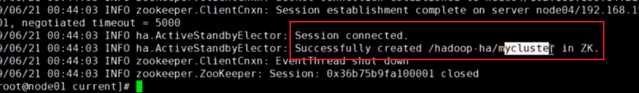
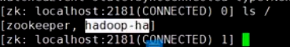

Hadoop生态体系⭐️⭐️⭐️⭐️⭐️

- 主要掌握分布式数据处理，存储的思想，以及会写一些简单的MR任务：
- Hadoop生态圈的全貌
- MR,Yarn,HDFS的工作过程
- Zookeeper架构以及原理
- 数据采集的对应框架Sqoop，Flume
- 任务平台Oozie和Azkaban，主要是了解工作原理


数据仓库：https://www.bilibili.com/video/BV1YK411f78Z?p=9&spm_id_from=pageDriver&vd_source=89ddf71eb38188bf588f77ea08dd93b4

黑马Hadoop实操：https://www.bilibili.com/video/BV1WY4y197g7/?spm_id_from=333.337.search-card.all.click&vd_source=89ddf71eb38188bf588f77ea08dd93b4

马士兵Hadoop+源码：https://www.bilibili.com/video/BV1HG411g71n?p=4&spm_id_from=pageDriver&vd_source=89ddf71eb38188bf588f77ea08dd93b4

马士兵Spark：https://www.bilibili.com/video/BV1Tg411Y7pr?p=1&vd_source=89ddf71eb38188bf588f77ea08dd93b4


数据采集技术：

- 离线数据采集：SQOOP、DataX、Kettle
- 实时数据采集：Flume、Maxwell、Canal、Nifi

中间件技术栈：

- 分布式协调服务zookeeper
- 分布式缓存Redis
- 分布式消息系统Kafka
- 分布式消息系统Pulsar
- ELK Stack数据分析

分布式存储技术：

- 分布式文件系统HDFS
- 分布式数据库HBase
- 分布式数据仓库Hive
- 数据湖Hudi
- 数据湖Delta lack
- 数据湖Iceberg

数据处理技术：

- 分布式计算框架MapReduce
- 分布式计算框架Spark  速度十倍于MR
- 分布式计算框架Flink

OLAP生态：

- OLAP -Kylin 麒麟
- OLAP - Presto
- OLAP - Druid
- OLAP - Impala
- OLAP - ClickHouse
- OLAP - Phoenix
- OLAP - Kudu
- OLAP- Doirs

稳健架构设计

- 离线数仓构建方法论
- 实时数仓构建方法论
- 数据治理-数据质量管理
- 数据治理-元数据管理
- 数据治理-数据安全管理
- Kerberos
- 数据中台构建方法论
- 可视化：TCV，superset，Hue

集群调度体系

- 分布式资源调度Yarn
- 任务流调度oozie
- 任务流调度Azkaban
- Airflow
- 集群管理平台 cloudera Manager
- Ambari

数据挖掘算法。。


岗位：主要有三个， 需要掌握大数据核心技术+特定岗位的技能点

- 大数据ETL 开发
- 大数据离线数仓开发；大数据实时数仓开发
- 大数据接口开发
- 大数据业务分析开发
- 大数据平台开发；大数据可视化开发
- 大数据数据挖掘
- 总体难度，数仓<平台（JAVA）<挖掘


​    Hadoop（★★★★★）

​        Hadoop是由一个Apache基金会所开发的分布式系统基础架构，主要解决海量数据的存储和海量数据的分析计算问题，广义上来说，Hadoop通常是指一个更加广泛的概念--Hadoop生态圈。

​    Sqoop

​        Sqoop是一款开源的工具，主要用于在Hadoop、Hive与传统的数据库（MySql）间进行数据的传递，可以将一个关系型数据库（例如 ：MySQL，Oracle 等）中的数据导进到Hadoop的HDFS中，也可以将HDFS的数据导进到关系型数据库中。

​    Zookeeper

​        它是一个针对大型分布式系统的可靠协调系统，提供的功能包括：配置维护、名字服务、分布式同步、组服务等。

​    Hive（★★★★★）

​        Hive是基于Hadoop的一个数据仓库工具，可以将结构化的数据文件映射为一张数据库表，并提供简单的SQL查询功能，可以将SQL语句转换为MapReduce任务进行运行。

​    Flume

​        Flume是一个高可用的，高可靠的，分布式的海量日志采集、聚合和传输的系统，Flume支持在日志系统中定制各类数据发送方，用于收集数据；

​    Kafka（★★★★★）

​        Kafka是一种高吞吐量的分布式发布订阅消息系统；

​    HBase

​        HBase是一个分布式的、面向列的开源数据库。HBase不同于一般的关系数据库，它是一个适合于非结构化数据存储的数据库。

​    Spark（★★★★）

​        Spark是当前最流行的开源大数据内存计算框架。可以基于Hadoop上存储的大数据进行计算。

​    Flink（★★★）

​        Flink是当前最流行的开源大数据内存计算框架。用于实时计算的场景较多。


# 大数据引入

单机处理大数据存在的问题

- 通过散列存储+计算，可以减少IO，但性能提升已经是极限（内存寻址比IO寻址快10万倍）
- 瓶颈在IO、内存太小（单机最大的内存SAP HANA数据库，内存2T 还要打包买服务器、软件 需要2亿）

数据分发+分布式存储+并行计算+网络传输，在数据不断增量的场景下有优势


大数据技术的关键：分而治之、并行计算、计算向数据移动、数据本地化读取

企业追求平台（中台）、微服务、云

- 要求**开发平台**，方便业务人员使用，方便直接调（大数据）接口使用


05年开始的技术

**Hadoop项目**包括，Hadoop common、Hadoop Distribution File System、Hadoop YARN、Hadoop MapReduce

**Hadoop生态圈**还包括：HBase、Hive、Spark、ZooKeeper...

Cloudera公司的CDH提供Hadoop生态圈的技术和版本线

- 接入层、存储层、统一服务层、处理解析服务（Impala是Cloudera自己的产品）
- 批式计算-》流式计算（spark flink还能实时，阿里主推，只需对增量部分计算） 


# HDFS

在此之前也有分布式文件系统，但设计HDFS的目的是**支持分布式计算**

## 存储模型

背死（数据块的特性）：大的文件划分块存在不同节点（分治），将计算向数据移动

逻辑模型：

- 文件线性按**字节**切割成块(block)，具有offset， id
  - 八个比特组成字节，计算机中的数据都是一堆字节数组。
  - 100字节数据=[10字节块，...，10字节块]，id从0到9 ，偏移量为10*id字节 
  - 按字节作为划分粒度，数据可能会出现割裂，但恢复是计算层管的
- 文件与文件的block大小可以不一样，一个文件除最后一个block，其他block大小一致
- block的大小依据硬件的I/O特性调整，不同应用框架默认值不同
  - 机械硬盘 500M/s
- **block被分散存放在集群的节点中，具有location**
  - 要知道块在哪，作为元数据存在于NN
- Block具有副本(replication)，**没有主从概念**，副本不能出现在同一个节点
- 副本是满足**可靠性**和**性能**的关键
  - 不能出现在同一个节点，不是单机
  - 并行计算
- 文件上传可以指定block大小和副本数，**上传后只能修改副本数**
- 一次写入多次读取，**不支持修改**，但支持追加文件数据
  - 面向已写入的文件数据，便于多个客户端一致性访问
  - 不支持修改（泛洪操作）：数据修改多了，占用了网络带宽通信资源，影响应用计算层的使用
  - 最后一个块的存储节点，若还没满，可以加数据，不影响资源使用；即便没满，在新的集群生成块，也不影响资源使用，也被允许

## 架构设计

三个角色：客户端、NameNode DataNode；角色即（JVM）进程

- HDFS是一个主从(Master/Slaves)架构，由一个NameNode和一些DataNode组成
  - 主从：都是活动的，能协作互相通信，
  - 主备：用于高可用环境，主节点挂了才启用备用节点
- 面向文件包含：文件数据(data)和文件元数据(metadata)
  - 文件元数据相当于windows系统中的文件属性，用来描述文件的名称、大小、时间。。。
  - WIndows硬盘分区，再存目录文件。G:// 没法创建
  - Linux的分区会挂载到虚拟目录树，相当于对硬件分区做了解耦、映射。 ./g 能创建，会挂载到disk:G分区
- NameNode负责存储和管理文件元数据，并维护了一个层次型的**文件目录树**
  - 记录数据的描述信息（数据再DataNode中的路径、副本数量），并用于存储和管理文件元数据
- DataNode负责存储文件数据(block块)，并提供block的读写
  - 主节点提供了负载均衡的调度，与客户端短暂交流去哪读写，然后去找客户端DataNode
- DataNode与NameNode**维持心跳**，并汇报自己持有的block信息
  - 从节点告知主节点实际的存储数据情况，而不是根据客户端的反馈
- Client和NameNode**交互文件元数据**和DataNode**交互文件block数据**
  - 主节点的元数据要等从节点存储生效，再生效


## 角色功能

NameNode（NN）

- 完全**基于内存存储**文件元数据、目录结构、文件block的映射
  - 内存访问速度快，更快速对外客户端提供服务（内存中元数据通常以树或哈希表的形式组织）
  - 但内存数据易失，且大小有限。故需要**持久化方案**保证数据的可靠性
    - Redis、HBase、ElasticSearch都是有限把数据放到内存，选择的持久化方案都不太一样
- 需要**持久化方案**保证数据可靠性
- 提供**副本放置策略**

DataNode（DN）

- 基于**本地磁盘存储**block(**文件的形式**，物理形式)
- 还保存了block的**校验和数据**保证block的可靠性
- 与NameNode保持心跳，汇报block列表状态

SecondNameNode（SNN）

- 在非Ha模式（高可用模式，多个NN）下，SNN一般是独立的节点，专门用来周期完成对NN的EditLog向Fslmage合并，减少EditLog大小，减少NN启动时间
- 根据配置文件设置的时间间隔fs.checkpoint.period 默认3600秒（1h）
- 根据配置文件设置Editslog大小 fs.checkpoint.size 规定edits文件的最大值默认是64MB


- 通过SNN辅助持久化，而不再NN中滚动更新
- 企业不采用，还是需要多个NN，保证高可用

## 元数据持久化

数据持久化的两种方案：

- 日志文件：

  - 完整性好：日志文件存放所有增删改操作，支持append操作；完整性好，不会丢操作
  - 缺点：以文本文件存储，加载恢复数据慢，占内存空间

- 镜像、快照、dump、db、JAVA序列化

  - 间隔将内存全量数据在某个时间点写到磁盘，IO速度慢，容易丢数据
  - 以二进制文件存储，恢复速度快于日志文件

  补充：存储方式：文件编码: .txt，按UTF-8 编码，每个字符占用一个字节；二进制文件，int 类型占用4个字节，否则字符串类型，也是一个字符一个字节

HDFS这两种方式都使用了，日志：EditsLog，记录少时有优势；快照镜像：FsImage，更新频率高时有优势。采用最佳时点的FsImage+增量的EditsLog，恢复时先加载FI、再加载EL，具体持久化操作为：

- 任何对文件系统元数据产生修改的操作，Namenode都会使用一种称为EditLog的事务日志记录下来
- 使用Fslmage存储內存所有的元数据状态
- 使用本地磁盘保存EditLog和Fslmage
  - EditLog具有完整性，数据丢失少，但恢复速度慢，并有体积膨胀风险
  - Fslmage具有恢复速度快,体积与内存数据相当,但不能实时保存,数据丢失多
- NameNode使用了Fslmage+EditLog整合的方案；滚动将增量的EditLog更新到Fslmage，以保证更近时点的Fslmage和更小的EditLog体积
  - 增量的EL数据，可以用来更新FI，得到滚动后的FI

## 安全模式

搭建与进程启动

- HDFS**搭建时**会格式化，格式化操作会在硬盘产生一个空的Fslmage

- 当Namenode**启动时**，它从硬盘中读取Editlog和Fslmage，将所有Editlog中的事务作用在内存中的Fslmage上，并将这**个新版本的Fslmage从内存中保存到本地磁盘**上

- 然后删除旧的Editlog,因为这个旧的Editlog的事务都已经作用在Fslmage上了
- 持久化的元数据信息，有文件的存放属性信息，但没有节点的位置信息（不会持久化，恢复的时候，从节点可能挂了，数据可能丢失了，如果存之前的信息，会导致数据不一致），**需要通过安全模式的心跳建立额外检查获取**

安全模式，要保证存放数据块的节点是好的，能通信到的：

- Namenode启动后会进入一个称为安全模式的特殊状态。
- 处于安全模式的Namenode是不会进行数据块的复制的。
- Namenode从所有的 Datanode接收心跳信号和块状态报告。
- 每当Namenode检测确认某个数据块的副本数目达到这个最小值,那么该数据块就会被认为是**副本安全**(safely replicated)的。
- 在一定百分比（这个参数可配置）的数据块被Namenode检测确认是安全之后（加上一个额外的30秒等待时间），Namenode将退出安全模式状态。
- 接下来它会确定还有哪些数据块的副本没有达到指定数目，并将这些数据块复制到其他DataNode上。

## (block)副本放置策略

企业一般用的多的是机架服务器、多个机架服务器放在一个机柜、机柜机柜之间用交换机连接，机架内单独有个电源，称一个机柜为机架，机架内不同机器需要通过交换机进行一次IO通信，不同机架内的机器可能需要多次IO通信

块的副本放置策略

- 第一个副本：放置在上传文件的DN，即放在客户端本地；如果是集群外提交，则随机挑选一台磁盘不太满，CPU不太忙的节点。不需要通过交换机的网络IO通信
- 第二个副本：放置在于第一个副本不同的机架的节点上（**出机架**）。
- 第三个副本：与第二个副本相同机架的节点。2,3放一起就经过一个交换机的IO通信
- 更多副本：随机节点。


## 读写流程

最重要

读写都需要访问NN上的元数据

写流程：

- Client和NN连接，创建文件元数据
- NN判定元数据是否有效
  - 元数据是否有效，比如路径下已有该文件，是否有权限修改文件等
- **NN触发副本放置策略，返回一个有序的DN列表**
  - 根据距离策略排序得到的
  - Hadoop 中有多种距离策略可供选择，包括：
    - 默认距离策略：基于网络拓扑结构和延迟信息来计算 DataNode 与客户端之间的距离。这个距离策略是 Hadoop 中的默认策略。
    - 机架感知距离策略：在默认距离策略的基础上，进一步考虑了机架之间的距离和网络拓扑结构，使得在同一机架内的 DataNode 优先被选择。
    - 自定义距离策略：允许用户根据自己的需求自定义距离算法，例如考虑机器的 CPU 使用率、磁盘负载等因素，以更准确地计算 DataNode 与客户端之间的距离。
- Client和DN建立Pipeline连接
- Client将块切分成packet (64KB) ，并使用chunk (512B) +chucksum (4B)填充
- **流式传输**方式：
  - Client将packet放入发送队列dataqueue中，并向第一个DN）发送
  - 第一个DN收到packet后本地保存并发送给第二个DN
  - 第二个DN收到packet后本地保存并发送给第三个DN
  - 这一个过程中,上游节点同时发送下一个packet
    - 生活中类比工厂的流水线：结论：流式其实也是变种的**并行计算**
- Hdfs使用这种传输方式,副本数对于client是透明的
  - 中间有DN挂了，不影响，传输完成会通过心跳汇报给NN，如果少了，会继续传输给新的DN
- 当block传输完成，DN们各自向NN汇报，同时client继续传输下一个block，所以，client的传输和block的汇报也是并行的


读流程：

- 为了降低整体的带宽消耗和读取延时，HDFS会尽量让读取程序**读取离它最近的副本**（同一机架，或离自己机架最近的，与写流程建立连接前一样）。
- 如果在读取程序的同一个机架上有一个副本，那么就读取该副本。
- 如果一个HDFS集群跨越多个数据中心，那么客户端也将首先读本地数据中心的副本。
- 语义：下载一个文件：
  - Client和NN交互文件元数据获取fileBlockLocation
  - NN会按距离策略排序返回
  - Client尝试下载block并校验数据完整性
- 语义（**最重要**:）下载一个文件其实是获取文件的所有的block元数据，那么子集获取某些block应该成立
  - 通过偏移量，支持只读取几个块，从而找到对应数据，快速建立并行计算
  - **Hdfs支持client给出文件的offset，自定义连接哪些block的DN，自定义获取数据**
  - **这个是支持计算层的分治、并行计算的核心**


安全策略


## 实验

### 基础环境配置

GNU/Linux+JAVA1.8+ssh

- JAVA移动性好，编译一次，去哪都能执行；需要给每台机器设置$JAVA_HOME环境变量
- Hadoop Script脚本 + ssh**免密远程执行** ，可以自动化启动集群 `ssh 用户名@ip '脚本命令'`
  - 在该目录下 修改环境变量后，需要`source /ect/profile `或使用其别名 `. /etc/profile`，这样可以在不重新启动终端的情况下，立即加载配置文件中的更改。这样，添加的环境变量将立即在当前的 Shell 环境中生效，而不需要重新启动终端。
  - 远程执行， `ssh 用户名@ip 'echo 环境变量'`失败，无法访问远程机器的环境变量（/etc/profile），这是因为没有加载/etc/profile文件；需要先 `ssh 用户名@ip 'source /ect/profile;echo 环境变量'`
- linux的第三方软件一般放/opt目录，数据存放在/var目录下

```bash
#设置网络 IP

# 设置主机名
vi /etc/sysconfig/network
	NETWORKIN=yes
	HOSTNAME=node1
	
# 设置本机的IP到主机名的映射  解耦 因为IP可能改变，逻辑名称-》ip地址
vi /etc/hosts
	本机IP地址 别名
	
# 关闭防火墙 并禁止服务在系统启动时自动启动（systemctl或chkconfig）
service iptables stop
systemctl iptabels off
# 关闭selinux
vi /etc/selinux/config
	SELINUX=disable
	
# 做时间同步  使用阿里云的时间同步服务器 os会去和他同步
apt-get install ntp -y
vi /etc/ntp.conf
	server ntp1.aliyun.com
service ntpd start
systemctl ntpd on 

# 安装JDK  centos可以直接使用rpm包安装而不是压缩包（否则要配置很多命令） Ubuntu需要alien转换rpm包 再通过dpkg安装
rpm -i jdk***.rpm # 可能会生成/usr/local/java目录的软链接 别名指向该目录，如default 表示/usr/local/java/default 等价于/usr/local/java

# 配置JAVA_HOME  path为取出之前的path 再用: 拼起来JAVA的bin目录
vi /etc/profile
	export JAVA_HOME=/usr/local/java/jdk1.8.0_351
    export PATH=$PATH:$JAVA_HOME/bin
source /etc/profile # . /etc/profile
echo $JAVA_HOME # 检查

# ssh 免密设置 （考虑单机还是多机）
# Hadoop官网有  生成秘钥和公钥用于加解密
ssh localhost  # 验证自己还没有免密，被动会生成 /root/.ssh目录  ll -a 可查看到 进入该目录 有known_hosts文件

ssh-keygen -t rsa -P '' -f ~/.ssh/id_rsa # 加密算法 空密码 放的路径，会生成两文件 秘钥和公钥
cat ~/.ssh/id_rsa.pub >> ~/.ssh/authorized_keys # 把自己的公钥id_rsa.pub文本内容 追加写入	自己或其他机器的authorized_keys文件中
chmod 0600 ~/.ssh/authorized_keys 

# 解压hadoop压缩包
tar xf hadoop*.tar.gz
# 移动到/opt/*目录

# 添加环境变量（操作系统的环境变量） 在容易位置可以执行hadoop命令
vi /etc/profile
	export HADOOP_HOME=...
	export PATH=...:$HADOOP_HOME/bin:$HADOOP_HOME/sbin

source /etc/profile

# 进入hadoop/etc目录 给Hadoop配置JAVA环境和HDFS角色 官网有，
cd $HADOOP_HOME/etc/hadoop
vi hadoop_env.sh # 默认配置为取环境变量${JAVA_HOME} 这在另一台机器上访问取不到该环境变量 修改为绝对路径
	export JAVA_HOME=/usr/local/java/jdk1.8.0_351
```

> 免密登陆：
>
> - 机器A的.ssh/authorized_keys文件有了机器B的公钥 A就能免密ssh登录B（满足自己免密登自己）
> - 公钥是由私钥生成的，但是无法从公钥中推导出私钥。**公钥用于加密**从客户端发送到服务器的数据。而**私钥则用于解密这些数据**。这意味着只有持有正确的私钥的用户才能解密通过公钥加密的数据。
> - 身份验证：在免密登录过程中，你需要将你的公钥提供给需要免密登录的机器，以便在身份验证过程中使用。当你尝试连接到远程机器时，**远程机器会比对你提供的公钥和已经存储在其上的公钥。如果两者匹配，那么你就可以成功进行免密登录。**
>
> 权限设置
>
> - 3个数字分别表示用户 组 其他人的权限 
> - 每个数字取0-7，代表：没有权限（无法读取、写入或执行）；执行权限；写入权限；写入和执行权限；读取权限；读取和执行权限；读取和写入权限；读取、写入和执行权限
>   - 数字0-7的产生：由rwx表示”读 写 打开目录“，取1表示可以，0表示不行，组成3位二进制
>
>
> hadoop目录文件
>
> - hadoop/sbin目录下存放HDFS服务和其他服务启停的脚本(start-dfs.sh、start-yarn.sh)，hadoop/bin目录下存放应用功能命令模块(hadoop hdfs yarn)；hadoop/etc存放配置；hadoop/share存放jar包，像是在hadoop/mapreduce下会有计算程序的jar包
>
> <table>
>   <tr>
>     <td>
>       
>     </td>
>     <td>
>       
>     </td>
>   </tr>
> </table>
>
> 为什么要在hadoop_env.sh中需要再设置JAVA_HOME
>
> - SSH免密登录过程中，不会执行/etc/profile文件，获取系统的JAVA环境变量，而只接受hadoop_env.sh里的环境变量。
>


### 伪分布式配置

Hadoop的部署配置：Hadoop集群的三种模式，不同模式的配置不同

- [Local (Standalone) Mode](https://hadoop.apache.org/docs/stable/hadoop-project-dist/hadoop-common/SingleCluster.html#Standalone_Operation)：一个JAVA进程，担当三个角色
- [Pseudo-Distributed Mode](https://hadoop.apache.org/docs/stable/hadoop-project-dist/hadoop-common/SingleCluster.html#Pseudo-Distributed_Operation)：一个角色启动一个JAVA进程，但在一个节点启动所有角色
- [Fully-Distributed Mode](https://hadoop.apache.org/docs/stable/hadoop-project-dist/hadoop-common/SingleCluster.html#Fully-Distributed_Operation)：

以伪分布式的配置为例，在$HADOOP_HOME/etc/hadoop目录下修改以下配置文件

```bash
vi core_site.xml # 设置NameNode 告诉客户端和DN节点 NN在哪 不写localhost，写本机的主机名node01
    <configuration>
        <property>
            <name>fs.defaultFS</name>
            <value>hdfs://node01:9000</value>
        </property>
    </configuration>
vi hdfs_site.xml 
    <configuration>
        <property> # 放置数据块的副本数 伪分布式的value=1 因为副本不能放在同一节点 
            <name>dfs.replication</name>
            <value>1</value>
        </property>
        <property> # 补充元数据和数据块放置目录（为了持久化） 从而不被OS作为临时文件以删除
            <name>dfs.namenode.name.dir</name>
            <value>/var/bigdata/hadoop/local/dfs/name</value>
        </property>
        <property> # 补充元数据和数据块的放置目录 从而不被OS作为临时文件以删除
            <name>dfs.datanode.data.dir</name>
            <value>/var/bigdata/hadoop/local/dfs/data</value>
        </property>
        <property> # 补充SecondNameNoded与NN的通信地址
            <name>dfs.namenode.secondary.http-address</name>
            <value>node01:9868</value>
        </property>
        <property> # 补充SecondNameNoded用于与NN合并元数据的目录
            <name>dfs.namenode.checkpoint.dir</name>
            <value>/var/bigdata/hadoop/local/dfs/namesecondary</value>
        </property>

    </configuration>

vi slaves # 设置DataNode DN在哪
	node01
```

>额外的HDFS配置，查看[官方xml配置文档](https://hadoop.apache.org/docs/stable/hadoop-project-dist/hadoop-hdfs/hdfs-default.xml)
>
>- core-default.xml中默认hadoop.tmp.dir=/tmp/hadoop-${user.name}，在本地存放临时数据的目录
>- NN将元数据持久化为FI和EL存在本地，DN将数据块存在本地，hdfs-default.xml中默认了NN的存放目录为dfs.namenode.name.dir=file://\${hadoop.tmp.dir}/dfs/name；和DN的存放目录为dfs.datanode.data.dir=file://\${hadoop.tmp.dir}/dfs/data，**即将这些数据作为临时数据存放**
>- 然而/tmp目录是一个OS可以在磁盘不够下删除的目录，因此存在风险，为了数据的安全可靠，需要再HDFS中修改存放临时数据的目录
>- 修改时注意命名规则，dfs.namenode.name.dir=某一指定目录/dfs/name
>- SecondaryNameNode角色的默认通信地址为dfs.namenode.secondary.http-address=0.0.0.0:9868，由主机地址:端口号组成。
>  - SecondaryNameNode 需要与 本地的NameNode 建立通信，因此需要指定主机地址和端口号来与 NameNode 进行通信。
>- dfs.namenode.checkpoint.dir=file://${hadoop.tmp.dir}/dfs/namesecondary，SNN存放临时镜像的目录


### HDFS启动

1. Format the filesystem：执行/bin目录下的hdfs程序，`hdfs namenode -format`，成功执行下只需要格式化一次

   - **创建NN的数据存放目录name**

   - 初始化一个空的FI

   - 生成VERSION文件，存放集群ID（CID）
     - 一个集群有一个NN和多个DN，一个集群的DN无法和另一个集群的NN通信


2. Start NameNode daemon and DataNode daemon：执行/sbin下的start-dfs.sh程序`start-dfs.sh`，他会调用slave.sh文件，使用 ssh 连接到远程主机 `$slave`
   - 使用 SSH 并执行 `$@"` 中指定的命令。`$@"` 表示将脚本接收到的所有参数传递给该命令。
   - `$HADOOP_SSH_OPTS` 是用于 SSH 连接的选项和参数。
   - `2>&1` 将标准错误输出重定向到标准输出，以便将错误消息传递给 `sed` 命令。
   - `sed "s/^/$slave: /"` 在输出中添加前缀 `$slave:`，以标识输出来自哪个主机。
   - `&` 将命令放入后台执行，以便可以同时启动多个从节点。


3. `start-dfs.sh`会读取HDFS配置文件（hdfs_site.xml，slaves.sh），启动NN，DN，SNN进程

   - 第一次启动会创建SNN的数据存放目录secondary和DN的数据目录data
   - 生成的data目录下存放DN的VERSION文件，与NN节点数据目录下的VERSION文件，有相同的集群ID，CID

   

4. `jps`查看到有三个角色的JAVA进程

5. windows的 C:\Windows\System32\drivers\etc\hosts文件中可添加IP地址和别名，从而在浏览器中访问 http://node01:50070 （50070端口）

   > IP node01

### HDFS使用

hdfs dfs + <-命令>，在HDFS中**创建用户数据文件**，在而不是单纯本地机器的文件系统中，和各角色的数据存放目录存在本地不同（取决于是不是完全的分布式，将数据存放目录配置在其他机器上）

1. 在NN数据目录中创建目录：`hdfs dfs -mkdir 目录`，如`hdfs dfs -mkdir -p usr/root`，创建home目录（多级目录 -p）

2. 上传文件：`hdfs dfs -put 文件 目录`，可以看到文件以块大小被划分到DN（默认放到home目录下）

   


3. 在本地的DN数据存放目录下可查看到对应的数据块和数据库检验信息（.meta）

   

4. 验证块的线性切割

   1. 输入bash脚本命令，生成一个文件

      ```bash
      for i in `seq 100000`;do echo "hello hadoop $i" >> data.txt ;done'
      ```

   2. `ll -l -h`可查看到该文件的大小为1.9M（**-h**uman 表示人可读的文件大小）

   3. `hdfs dfs -D dfs.blocksize=1048576 -put data.txt`，-D指定属性=值，属性来自配置信息，将data.txt以1M=1024*1024=1048576bit的大小进行数据块分割

   4. 去data目录查看两个数据块文件的结尾和开头，发现就是直接切割的

      <table style="display: flex; justify-content: center;">
        <tr>
          <td>
            
          </td>
          <td>
            
          </td>
        </tr>
      </table>


### 完全分布式配置

在伪分布式的基础上，在配置文件中规划角色放在哪些节点上，这里将按照以下规划


1. 配置相同的基础环境（JAVA HADOOP，可以通过scp直接-r 分发/opt/bigdata/..），稍有不同的是

   - 保证各个几点的/etc/hosts文件存放其他节点，保证能互相通信

   - 设置SSH免密（HA高可用环境下，公钥的分发与角色相关，现在默认谁执行 start-dfs.sh，谁把公钥分发给其他节点）
     - node01向node02分发公钥，`scp ./ssh/id_rsa.pub node02:/home/.ssh/node01.pub`
       - node02追加公钥到authorized_keys，`cat node01.pub >> authorized_keys  `
       - 其他机器同理，就可以完成node01免密登录其他机器
       - 使用scp时，若路径相同可以简写为 scp id_rsa.pub node02:\`pwd\`/node01.pub

2. 在 $HADOOP_HOME/etc/hadoop中配置 在哪启动角色，角色数据的保存地址

   - 可以将伪分布式的配置做个拷贝，`cp hadoop hadoop-local`，运行start-dfs.sh执行程序，将默认进入/etc/hadoop目录下读取配置，可以只是做个备份

   - 不修改本机的core-site.xml，规定NN在本机上启动

   - 修改hdfs_site.xml，配置DN和SNN

     -  SecondNameNoded放在node02节点

     ```xml
     <configuration>
         <property> 
             <name>dfs.replication</name>
             <value>2</value>
         </property>
         <property> 
             <name>dfs.namenode.name.dir</name>
             <value>/var/bigdata/hadoop/full/dfs/name</value>
         </property>
         <property> 
             <name>dfs.datanode.data.dir</name>
             <value>/var/bigdata/hadoop/full/dfs/data</value>
         </property>
         <property>
             <name>dfs.namenode.secondary.http-address</name>
             <value>node02:9868</value>
         </property>
         <property> 
             <name>dfs.namenode.checkpoint.dir</name>
             <value>/var/bigdata/hadoop/full/dfs/namesecondary</value>
         </property>
     </configuration>
     ```

3. 修改slaves，修改DN在哪启动
   - 按 shfit zz等价于wq

```bash
vi slaves
	node02
	node23
	node04
```

 4. 分发？，为什么要分发本地之前创建的 bigdata目录

 5. 格式化启动

    `hdfs namenode -format`

    `start-dfs.sh`

    将会在各个节点创建角色和数据保存目录

## HA高可用

只有一个NN，存在两个独立的问题

- 单点故障，集群不可用
- 压力过大，内存受限（都要和同一台NN节点通信，元数据存在内存，用于快速访问）

需要采用两种独立的解决方案，分别为

- 高可用方案（HA，High Available），多个NN，主备切换
  - 其中HADOOP2.X 上线较为仓促，只支持HA的一主一备；HADOOP3.X支持一主多备（最多五个）
- 联邦机制（Federation），将元数据分片；多个NN管理不同的元数据

### HA方案

备用NN不对外提供服务

NN的元数据来自客户端的增删改写入操作和DN提交的数据块信息，**后者会在写入NN时，同步写入到备用NN；而来自客户端的写入，只与NN通信（这是为了简化客户端的操作和管理，快速响应，减少通信浪费）**，因此需要保证备用NN一致性，否则NN挂了，还没把客户端来的操作写给备用NN

- 分布式场景下的一致性会破坏可用性（通信模型的同步阻塞），要等延迟时间，备用节点写好

- 分布式场景下的可用性会破坏一致性（通信模型的异步非阻塞），不知道给备用节点写好了没有

- 即存在CAP原则，全满足不可能

  

JN（Journal Node）：为了在分布式场景下尽可能的保证一致性和可用性，需要在NN和备用NN间构建中间件（而且是多个，三个以上，保证过半同步），其保证**可靠存储**，且是异步执行（实现分布式存储，一定能给主备NN快速返回正确的数据，实现数据同步）

- 主的选举：明确节点数量和权重，选出权重最高的作为主；主挂了，会自动从无主状态选出主
  - 权重分配方式，有两种：
    - 1、看手工权重；
    - 2、看数字ID：每次写入会有一半有最新的ID，数据ID相同看随机ID：取主机里头的某个信息（IP）生成一个值，保证不重复和冲突
- 主的职能：增删改查，NN与主直接通信，主将信息同步给从
- 从的职能：查询，增删改传递给主。一半的从返回写入成功则返回给主
- 主与从：**过半数同步数据**，从而中和一致性和可用性

- 保证可靠：中间件是一个**主从集群**，保证一定有主与NN进行过半同步（内部一致）；备用NN只要能连接上就可以与JN的一致性写入进行同步
- 保证可用：有一半从节点返回写入成功

NN的主备切换：以上使用JN能实现HA（可用和一致），当主NN挂掉，需要手动将备用NN升级为active的主NN，即还需要手工确定谁是主NN，谁是备用NN，该切换方式效率明显很低，需要自动化的选主NN

- ZooKeeper FailoverController进程（ZKFC，故障转移），与NN进程在同一个物理机上（不需要网络监控，非常可靠），并与分布式协调服务ZooKeeper集群连接
  - 初始化：在HDFS HA架构启动时，FailoverController进程会连接到ZooKeeper集群，以建立与ZooKeeper的通信通道。
  - 注册：FailoverController会在ZooKeeper上创建一个**临时的、有序的节点**，表示当前FailoverController的存在。这样可以在ZooKeeper上形成一个FailoverController的有序列表。**临时节点申请的锁是临时锁，一旦临时节点挂掉，会直接触发临时锁的删除事件**
  - 心跳：FailoverController定期向ZooKeeper发送心跳信号，以表明它的存活状态。这样ZooKeeper可以检测到FailoverController是否正常运行。
  - 监视：其他FailoverController进程也会在ZooKeeper上创建相同类型的临时节点。这些进程会监视ZooKeeper上的节点列表，以侦听主节点状态的变化。
- ZKFC进程执行三件任务
  - 健康检查：实时监控主/备NN是否active
  - 抢锁：连接ZooKeeper集群，ZKFC要向ZooKeeper创建一个锁，表示创建一个ZooKeeper的子目录，只有一个ZKFC能创建成功，谁创建成功，谁主机下的NN是主，其他是备用NN；并且申请到的锁，会注册一个回调函数
  - 主备切换：ZKFC得知本机的NN挂了，将抢来的锁删除（也可能锁到期），触发ZooKeeper中锁的删除事件，调用申请时的回调函数，其他的ZKFC会开始新一轮的抢锁（使用回调函数，保证实时响应主备切换，而不是间隔抢锁，存在等待），抢到锁的ZKFC，会查看原来机器上的NN是不是真的挂掉了，对方真的挂了，才把本地的NN升为Active（或对方没挂，直接锁到期，将对方的NN降为Standby）
    - 选举：如果多个FailoverController同时检测到主节点失效，它们会基于ZooKeeper上节点的有序列表来进行选举，以决定新的主节点。
- 除了自己本机进程通信，其他通信都需要网络连接，因此存在不可靠性
  - 当NN Active和ZKFC的机器无法与外界通信，只能等到锁的到期，但抢到锁的ZKFC也无法与那台机器连接到，查看其是否挂掉，因此出现问题（bug，但很少发生）
  - 使用串口线将每台NN主机进行连接，能连到电源线，能直接将发生故障的Active NN的主机断电，再放心的将备用的NN升级为Active


HA方案总结：

- 多台NN主备模式，Active和Standby状态
  - Active对外提供服务
- 增加journalnode角色（>3台），负责同步NN的EditLog，实现最终一致性
- 增加ZKFC角色(与NN同台)，通过ZooKeeper集群协调NN的主从选举和切换
  - 事件回调机制，提升切换效率
- DN同时向所有NN汇报block清单，能保证一致性
- HA模式下没有SNN，备用NN不对外提供服务，能代替SNN周期性地利用同步过来的EL滚动生成FsImage，实时发给NN，加快NN的下一次启动

### 联邦机制

企业用的没那么多，元数据没那么大

解决NN的压力过大，内存受限问题；名字取自美国州的联邦制


- 元数据分治：将元数据存在不同的NN中，并复用同一个DN存储，存储在不同的**DN目录**中隔离不同block

  - 解决元数据过大，内存压力大的问题

- 元数据访问隔离性：客户端连接一个NN，只能访问对应元数据规定的数据块

  - 会产生一定的用户访问体验度下降（就像看到所有的数据）

  - 可通过一个虚拟文件系统，同时拥有不同的NN元数据，能访问所有数据；同理可升级成一个文件存储平台，可代理不同的文件存储（HDFS、FTP），只需提供相应的接口即可

    

## 配置HA实验


【注】：HDFS HA有两种技术实现，一个是上面说的JN实现，一种是Linux自带的NFS技术（Network for System），后面这种将两台机器的目录都挂载到远程单点机器的目录中，实现一致性和可用；配置HA前，保证没有HDFS进程在运行，否则需要在执行start-hdfs.sh的机器上执行stop-dfs.sh停止服务

1. 基础设施配置，主要需要进一步更改SSH免密
   - 保证start-hdfs.sh的机器，把公钥发给其他机器，能够免密启动DN
   - 额外需要将ZKFC进程能够免密查看和控制本机的NN和其他机器上的NN，即**有NN的机器需要互发公钥**
2. 应用配置
   - HA需要额外ZooKeeper集群
   - 修改HADOOP配置，与集群同步
3. 初始化启动（1-5是搭建时做的，后续只需要做6启动 start 停止stop）
   1. 先启动JN  `hadoop-daemon.sh start journalnode`
   2. 选择一个NN做主，进行格式化 `hdfs namenode -format`
   3. 启动这个NN，以备其他NN同步元数据 `hadoop-daemon.sh start namenode`
   4. 在另外一台机器上，同步与主NN的元数据 `hdfs namenode -bootstrapStandby`
   5. 格式化ZooKeeper自动切换主备`hdfs zkfc -formatZK`
   6. 启动集群 `start-dfs.sh` 

### 应用配置

```bash
# 在node02中配置信息
tar xf zookeeper*.tar.gz /opt/bigdata

# 添加环境变量
vi /etc/profile
	export ZOOKEEPER_HOME=/opt/bigdata/zookeeper*
	export PATH=$PATH:ZOOKEEPER_HOME/bin # 加上
. /etc/profile

# 配置ZooKeeper集群 使他们在各台机器上启动时 能形成集群
cd /opt/bigdata/zookeeper*/conf
cp zoo_sample.cfg zk.cfg
vi zk.cfg
	 dataDir=/tmp/zookeeper  修改为 dataDir=/var/bigdata/hadoop/zk
	 server.1=node02:2888:3888
	 server.2=node03:2888:3888
	 server.3=node04:2888:3888
cd /var/bigdata/hadoop
mkdir /zk
echo 1 > /zk/myid # 写入权重

# 分发到node03 node04中
cd /var/bigdata/
scp -r ./zookeeper node03:`pwd`
scp -r ./zookeeper node04:`pwd`

# 同样加入ZOOKEEPER_HOME 并在其他机器上不上权重文件
mkdir /var/bigdata/hadoop/zk
echo 2 > /var/bigdata/hadoop/zk/myid

mkdir /var/bigdata/hadoop/zk
echo 3 > /var/bigdata/hadoop/zk/myid

# 启动zookeeper 将启动ZK服务器，将配置
zkServer.sh start

# 修改HADOOP配置
cd $HADOOP_HOME
cd etc 
## core_site.xml配置
cd hadoop
vi core_site.xml 
    <configuration>
        <property>
            <name>fs.defaultFS</name> # 将物理主机名改为hdfs中指定的集群逻辑地址mycluster（会自动解析成主机）
            <value>hdfs://mycluster</value>
        </property>
        
        <property> # 指定ZKFC访问的ZooKeeper集群地址  ,隔开
            <name>ha.zookeeper.quorum</name>
            <value>node02:2181,node03:2181,node04:2181</value>
        </property>
    </configuration>
## hdfs_site.xml配置
vi hdfs_site.xml
    <configuration>
        <property> 
            <name>dfs.replication</name>
            <value>2</value>
        </property>
        <property> 
            <name>dfs.namenode.name.dir</name>
            <value>/var/bigdata/hadoop/ha/dfs/name</value>
        </property>
        <property> 
            <name>dfs.datanode.data.dir</name>
            <value>/var/bigdata/hadoop/ha/dfs/data</value>
        </property>
        
        # 配置逻辑地址mycluster到不同NN物理地址一对多的映射   
        <property>
          <name>dfs.nameservices</name>
          <value>mycluster</value>
		</property>
        <property>
          <name>dfs.ha.namenodes.mycluster</name>
          <value>nn1,nn2</value>
        </property>

        <property>
          <name>dfs.namenode.rpc-address.mycluster.nn1</name>
          <value>node01:8020</value>
        </property>
        <property>
          <name>dfs.namenode.rpc-address.mycluster.nn2</name>
          <value>node02:8020</value>
        </property>

        <property>
          <name>dfs.namenode.http-address.mycluster.nn1</name>
          <value>node01:9870</value>
        </property>
        <property>
          <name>dfs.namenode.http-address.mycluster.nn2</name>
          <value>node02:9870</value>
        </property>

        # 配置启动JN的物理地址(不同机器共享同一个JN的不同目录地址)和数据存储目录 
        <property>
          <name>dfs.namenode.shared.edits.dir</name>
          <value>qjournal://node01:8485;node02:8485;node03:8485/mycluster</value>
        </property>
        
        <property>
          <name>dfs.journalnode.edits.dir</name>
          <value>/var/bigdata/hadoop/ha/dfs/jn</value>
        </property>

        # 配置HA角色切换的代理类和切换实现的方法，使用的是SSH免密（还有写脚本的方法）
        <property>
          <name>dfs.client.failover.proxy.provider.mycluster</name   
                  <value>org.apache.hadoop.hdfs.server.namenode.ha.ConfiguredFailoverProxyProvider</value>
        </property>
		
        <property>
          <name>dfs.ha.fencing.methods</name>
          <value>sshfence</value>
        </property>
        <property>
          <name>dfs.ha.fencing.ssh.private-key-files</name>
          <value>/root/.ssh/id_rsa</value>
        </property>

        # 配置HA自动化 启动hdfs时自动启动zkfc（与NN同机）
         <property>
           <name>dfs.ha.automatic-failover.enabled</name>
           <value>true</value>
         </property>

    </configuration>

# 分发配置到其他机器上
scp core-site.xml hdfs-site.xml node02:`pwd`
scp core-site.xml hdfs-site.xml node03:`pwd`
scp core-site.xml hdfs-site.xml node04:`pwd`
```

- zookeeper的/bin目录下有 zkServer.sh,zkCli.sh；/conf目录下有zoo_sample.cfg，文件中写了在内存中存数据的临时目录，需要将其修改为可靠目录，并添加服务器节点的配置信息

  - `server.<ID>=<hostname>:<peerPort>:<leaderPort>`

  - 指定了ZooKeeper集群中的每个不同服务器节点的信息，包括它们的地址和用于通信和选举的两个端口

    给定至少三个ZK节点，存在至少两台时能够相互通信，则可以选举出主NN（Leader节点），其他作为备用NN

  - ZooKeeper的选举算法会考虑节点的可用性和通信延迟等因素，以选择合适的Leader节点。通常情况下，ZooKeeper会选择具有最高可用性和最低延迟的节点作为Leader节点。

    - 在每天zookeeper节点机器的数据存放目录/var/bigdata/hadoop/zk中创建文件 myid，写入该节点的权重值


zookeeper leader选举

- 首先在node02启动zookeeper，查看节点状态zkServer.sh status和java进程，此时整个Zookeeper集群只有一个zk进程，但zk配置文件存着三个节点，当前节点无法与其他节点连接到，因此停止了服务“Error contacting service”

  

- 在node03中启动zk，node03的节点状态为leader，node02上的节点状态处于follower（因为node03上的节点权重较大，三台节点，有两台能通信，可以选举出leader，建立可用状态）

  

  

- 在node04中启动zk，node04节点状态和node02一样为follower，node03为leader（即便node04的节点权重更大，但只要集群有leader处于可用状态，新启动的节点都直接作为follower，没必要再选举切换主从，导致不稳定）

  


### 初始化启动

1-5是搭建时做的，后续只需要做6启动start/停止stop HDFS HA，但如果有角色挂了，需要`hadoop-daemon.sh start <角色>` 去启动该角色

⭐️需要学会查看JN，ZKFC的日志，在ZK客户端查看锁的变化⭐️

1. 先在node01 02 03中启动JN  `hadoop-daemon.sh start journalnode`，将创建jn的数据存放目录/var/bigdata/hadoop/ha/dfs/jn

   - 在node01中进入 /jn目录，是个空目录，因为NN还没有数据与JN同步

     

   - 可以在node03机器的$HADDOOP_HOME/logs目录下，查看启动Jnode03机器上JN的最后几条日志，可以看到进程已经启动起来，但和node01的JN数据目录一样，现在还是空目录

     

2. 在node01，进行格式化 `hdfs namenode -format`

   - 格式化成功，生成name目录，并存放着FI和VERSION文件

   

   - VERSION文件中可查看到集群ID

   - 查看node03机器的JN log日志，发现这台机器在初始化并创建 jn/mycluster目录（其他机器上JN数据目录同理）

     

   - node03对应目录下的的集群id与node01的一样

     

3. 在node01启动主NN，以备其他NN同步元数据 `hadoop-daemon.sh start namenode`

   

4. 在node02启动备用NN，以同步与主NN的元数据 `hdfs namenode -bootstrapStandby`

   - 这台机器也会生成 name目录，存放元数据，也有这相同的集群ID

     

     

5. 格式化ZooKeeper以**自动切换**主备 `hdfs zkfc -formatZK` （启动ZK已在配置中完成，相当于连接到了ZK服务器，此时使用zkfc去格式化ZK集群）

   

   在node04中打开ZK的客户端 `zkCli.sh`，`ls /`显示ZK根目录，可以看到格式化ZK集群后，生成了空目录

   

   

6. 在node01启动集群 `start-dfs.sh` 

   - 可以看到角色：成功在node01 02启动NN ZKFC，在node02 03 04启动DN，在node01 02 03启动JN

   - 在node03的日志中，将发生JN与NN的数据同步

     

     

   - 在node02的ZK客户端中`get 锁的节点路径`可以看到，在集群启动后，生成了节点目录，即ZKFC的抢锁机制，在ZK中创建了临时节点，可以看到是node01抢到了锁，是主NN（ephemeralOwner= 表示锁的临时持有者为node01）

     

   - 浏览器访问，也可看到node01为主NN，node02为备用NN

     

     

测试主备自动切换

- kill node01中的NN进程 （kill -9 表示强制杀死）

  

- 在node02的ZK客户端中，再次查看锁，可以看到此时锁的持有者自动切换为node01。浏览器中也可以相应发生主备切换

  

  

  

- 再次启动node01中的NN（`hadoop-daemon.sh start namenode`），主备不切换

- 杀死node02中的ZKFC进程，此时ZKFC无法连接到ZK集群，主备再次发生切换

  

- 恢复node02中的ZKFC（`hadoop-deamon.sh start zkfc`），虚拟机环境下将node01的网卡down掉，使其无法与外界通信（`ifconfig eth0 down`），此时两台机器都处于Standby，因为node02此时无法检查到node01的情况，（觉得可能node01只是和自己连不通，还能和外界连接）；检查node02的$HADOOP_HOME/logs 的ZKFC日志（`tail -f hadoop-root-zkfc-node02.log`），可以看到其无法连接到node01

  

- 再宿主机上恢复node01的网卡通信（`ifconfig eth0 up`），此时成功将node02升为主NN，node01降为Standby，日志也显示成功

  

  


## HDFS命令使用

在active的NN中，打开浏览器，看到空的目录树，位于根目录


常用的`hdfs dfs -命令`

1. HDFS的目录和文件操作

   - 目录操作：`hdfs dfs -mkdir -p /user/root`，加了-p表示创建多级目录，此时在根目录的root用户下，创建了user目录，没有数据块的大小等信息。注意该root用户是默认用户

   - 文件操作：`hdfs dfs -put 本地当前目录文件`，在root用户下创建了一个文件，有数据块大小等信息

   - HDFS有用户、权限概念，但HDFS没有创建用户、组的命令，其基于OS在上哪个用户在使用，会报告给HDFS，生成用户和组（信任客户端，默认使用操作系统的用户），并基于OS的用户、组添加方法，进行权限的分配

   - HDFS还有超级用户概念

   - HDFS的权限是自己能够用命令控制的（sudo控制）

     

2. 权限：一般（在生成环境中）不用root管理员用户启动NN进程，而使用普通用户，给他赋权，去启动集群，作为HDFS的管理员。需要在所有节点的root用户下，都执行以下用户和权限设置

   1. 先停掉已经启动的集群，`stop-dfs.sh`（在node01 02 有NN的机器上执行都可以），此时只有ZK进程，其他HDFS进程都没有了

   2. 添加用户：添加用户`useradd god`；设置用户密码`passwd god`。`cd /home`，可以看到god用户目录

      

   3. 赋予用户权限（将资源访问权限绑定给用户），包括安装部署程序和数据存放目录：

      - 将Hadoop的软件（之前设置的HADOOP_HOME目录）-R连同子目录都change owner赋权给god用户`chown -R god /opt/hadoop`，此时只有god和root（任何权限形同虚设）有rwx权限

        

      - 同理赋权数据存放目录的rwx权限，`chown -R god /var/bigdata`

        

   4. 切换god用户去启动集群：

      ```bash
      # 1. 首先要设置god用户下启动（不同机器上）的进程之间访问需要的免密
      # 在所有节点god用户的/home 下生成.ssh目录
      su god 
      ssh localhost # 
      
      # 将node01 02的公钥发到自己和其他机器的authorized_keys中
      ssh -keygen -t dsa -P '' -f /,ssh/id_dsa
      cd .ssh
      
      cat id_dsa.pub >> authorized_keys
      # 不同于root的免密 其他用户的免密需要设置authorized_keys只有文件所有者可以读取和写入该文件
      chmod 600 authorized_keys
      # 在node01中分发公钥
      scp id_dsa.pub node03:`pwd`/node02.pub
      scp id_dsa.pub node03:`pwd`/node03.pub
      scp id_dsa.pub node03:`pwd`/node04.pub
      
      # 以下命令可以代替上面的 cat+chmod+scp 直接将公钥写到目标主机的authorized_keys中
      # 因此可用该命令直接在node02中 实现对自己免密 对node01免密
      cd /home/god/.ssh
      ssh-copy-id -i id_dsa node01
      ssh-copy-id -i id_dsa node02
      
      # 2. 修改hdfs_site.xml
      # 在node01上修改ha配置文件hdfs_site.xml中设置免密的私钥路径
      cd $HADOOP_HOME/etc/hadoop
      vi hdfs_site.xml
      		<property>
                <name>dfs.ha.fencing.ssh.private-key-files</name>
                <value>/home/god/.ssh/id_dsa</value>
              </property>
      
      # node01上方法hdfs_site.xml
      scp hdfs_site.xml node02:`pwd`
      scp hdfs_site.xml node03:`pwd`
      scp hdfs_site.xml node04:`pwd`
      
      # 3. god用户下启动集群
      start-dfs.sh
      ```

      - 设置免密需要注意的细节

      

      - 启动后，hdfs相关进程都是有god用户启动的

        

   5. 不同用户对文件的访问权限：在HDFS中谁启动集群谁最大，有rwx其他用户文件的权限，其他用户启动集群，root也没有rwx其他文件的权限

      - god在浏览器中可以查看之前在HDFS上传建立的文件

      - god可以创建自己用户和root等其他用户的文件 `hdfs dfs -mkdir -p /user/god` `hdfs dfs -mkdir /user/root/abc`

        

        

      - 切换回系统的root用户，无法创建所属god的目录，只有god用户有权限

        ```bash
        exit
        hdfs dfs -mkdir /user/god/abc # 报错
        ```

        

   6. 赋予组权限

      ```bash
      # node01
      
      # 使用god超级用户创建目录
      su god 
      hdfs dfs -mkdir /temp
      # 使用hdfs命令添加组ooxx 赋予其访问/tmp的权限
      hdfs dfs -chown god:ooxx /temp
      hdfs dfs -chmod 770 /temp
      ```
      
      ```bash
      # node04
      
      # 在OS的root用户下添加good用户 添加ooxx组
      exit
      useradd good
      groupadd ooxx
      
      # 将good用户添加到ooxx组中 
      usermod -a -G ooxx good  （-aG）
      id good # 查看当前OS中good是不是在ooxx组中
      
      # 切换到good用户 查看hdfs组的情况
      su good
      hdfs dfs -mkdir /temp/abc
      	失败 没有权限
      hdfs groups
      	返回 good: 表示没有good用户没有组
      ```
      
      ```bash
      # node01
      
      # 在OS的root用户下添加good用户 添加ooxx组
      exit
      useradd good
      groupadd ooxx
      
      # 将good用户添加到ooxx组中 
      usermod -a -G ooxx good
      id good # 查看
      
      # 切换到god超级用户下 告诉HDFS good用户到了ooxx组 （否则已经启动的HDFS不知道OS新创建了组）
      su god
      hdfs dfsadmin -refreashUserToGroupsMapping
      
      ```
      
      ```bash
      # node04
      
      # 切换到good用户 查看hdfs组的情况
      su good
      hdfs groups
      	此时显示 good:good ooxx
      hdfs dfs -mkdir /tmp/abc # 能成功创建/temp/abc
      ```
      
      
      
      
      
      


## HDFS开发

IDE：Windows IDEA ，开发HDFS的客户端代码

1. 确定启动NN的用户

   远程登录时设置；参考Windows环境变量（HADOOP_USER_NAME=god），设置好后打开IDEA；代码中给出

2. 保证服务端的JDK版本与客户端开发环境的JDK版本一致

3. IDEA快捷键：

   - ctrl + P显示参数信息
   - Alt+Enter 补全代码（import 报错等）
   - ctrl+alt+left 回到上一次光标所处位置
   - 双击shift，全局搜索（类 接口..）

构建工具：MAVEN，包含了依赖管理pom，有jar包仓库概念，有打包、测试、清除、构建项目的目录，GAV定位

- Maven构建工具：Maven是一个Java项目管理和构建工具，用于自动化构建、依赖管理和项目管理。它使用XML格式的pom.xml（Project Object Model）文件来定义项目的配置和构建信息。

- 依赖管理：Maven通过pom.xml文件中的`<dependencies>`元素来管理项目的依赖项。通过在**pom.xml中声明所需的库和版本，Maven可以自动下载和管理这些依赖项，并确保项目构建所需的依赖项可用**。

  - 下载Hadoop依赖的的common、hdfs、MapReduce、YARN

- Jar包仓库：一个存储JAR文件的仓库，Maven根据项目中pom.xml文件中提供的jar包依赖信息，从存储库中查找并获取需要的jar包。Maven Repitory有3种类型:

  - Local Repository – 本地库
  - Central Repository – 中央库 （为默认的jar包仓库）
  - Remote Repository – 远程库

  - Maven搜索依赖项时，会按照：本地库、中央库和远程库的顺序进行。
  - 官方网站：https://mvnrepository.com/

- 打包、测试、清除、构建项目的目录：Maven使用约定的目录结构来组织项目源代码、资源文件和构建输出。例如，源代码位于`src/main/java`目录，测试代码位于`src/test/java`目录，构建输出位于`target`目录等。

  - 打包：Maven可以将项目打包成不同的形式，如JAR、WAR、EAR等。通过配置pom.xml文件中的`<packaging>`元素，可以指定所需的打包类型。
  - 测试：Maven提供了执行单元测试和集成测试的能力。测试代码可以放在特定的目录中，并使用Maven命令执行测试。
  - 清除：Maven提供了清理构建输出的能力。可以使用`mvn clean`命令清除构建生成的目标文件和目录。
  - 构建：Maven可以执行项目的构建过程，包括编译源代码、打包、运行测试等。可以使用`mvn install`命令构建项目。

- GAV定位：GAV是Maven中的一个概念，用于唯一标识一个项目或依赖项。GAV代表Group ID（组织或项目组ID）、Artifact ID（项目或模块ID）和Version（版本号）。通过GAV的组合，**可以精确定位和管理项目或依赖项**。


在IDEA中构建项目

1. Maven的repository中搜 Hadoop的common HDFS yarn MapReduce，对应Hadoop集群的版本，复制依赖（包含GAV信息）到pom.xml中

   ><!-- https://mvnrepository.com/artifact/org.apache.hadoop/hadoop-common -->
   ><dependency>
   >    <groupId>org.apache.hadoop</groupId>
   >    <artifactId>hadoop-common</artifactId>
   >    <version>2.6.0</version>
   ></dependency>

2. 项目中包含源码目录java（放代码），新建放配置资源文件的目录resource，将目录类型设置为Resources Root（放配置文件，比如hdfs的配置文件hdfs的配置文件），pom.xml放jar包依赖

   

3. 在源码目录下，创建一个Package，在这个Package下再创建一个Java Class

   

   运行mkdir()方法，会生成target目录，存放编译信息（类文件和其他构建结果）
   
   
   
   运行upload()方法，将本地的数据文件上传到HDFS
   
   运行blocks()方法，这是HDFS的精髓，体现了计算将数据移动，可以实现并行计算（通过获取元数据里的偏移量可以得到不同机器上的数据）。存在距离机制，使得备份的数据给最近的程序用来计算
   
   - 下面可以看到，打印了元数据信息；线性切分的两个数据块，通过seek偏移量找到分治的数据
   
     <table>
       <tr>
         <td>
           
         </td>
         <td>
           
         </td>
       </tr>
     </table>
   
   

# MapReduce

HDFS一次写入多次读取，是阉割的文件系统，其把开销更多的放在了计算

Map：以**一条记录**为单位做映射（映射出**键值对**）

Reduce：以**一组记录**为单位做计算，因此要根据相同特征**key**对数据分组（依赖**键值对**格式）


- 数据集是Spark中显示的概念（RDD），MR没有


Split（切片）与块的关系

- ⭐️切片是为了解耦存储层和计算层，可以按照任务需要调切片大小⭐️
- 块是HDFS存放文件时定死了的，但Split是逻辑概念，表示用于`CPU计算密集型任务`和`读取IO密集型任务`的输入文件，其可能是一个块、或者是一块的部分、或是多个块的叠加，从而满足不同的任务需求
- 每个Split大小是一样的，Split的数量决定并行度
- 若出现一句连续的文本，被不同块切割，导致分在不同的Split，计算框架会解决这个问题

Split和Map的关系

- Map处理的是一条记录，Split会将原始的DN数据块进行格式化，如\n切，<>标签切，从而拿出记录给Map
- Split的数量也即为Map的并行度
  - MR框架默认的Reduce并行度为块的数量，很少调
- Map会得到多种key（性别）下的value（男，女）数据，key为分组索引

Reduce

- 根据键值对数据，相同的value会根据hash值**分组**到一起，进一步做聚合计算
- 组是最小粒度，不可分，一个组要包含key下所有值为该value的记录
- Reduce的并行度由人来决定。一个Reduce操作对应一个JVM进程，如果有10亿条键值记录，每组只有2条数据，应该规定成并发10个Reduce进程，每个Reduce进程**线性处理多组数据**的计算逻辑，从而进行并行计算
  - 开10亿个Reduce进程，每个进程虽然只做一种计算，但没有那么多的进程开销
  - MR框架默认的Reduce并行度为1，需要手工调

规定的术语

- 虚线框：Map Task（任务）和Reduce Task（任务）；蓝色矩形：Map 方法和Reduce方法
  - 以一条记录一条记录调用Map方法；以一组记录一组记录调用Reduce方法
- 分组group、分区partition
  - Map Task的键值对输出，再根据Hash得到相同值的记录集合，称之为分组
  - 一个Reduce Task包含一组数据（一个分组）或者多组数据（自己定的并行度有关），称之为分区
  - **一个分组不会打散到不同分区中**：
- shuffle：将Map阶段产生的中间数据（key-value对）按照key进行排序和合并的过程

总结MR在干嘛

- 数据以一条记录为单位结果Map方法映射为KV，相同的key为一组，这一组数据调用一次reduce方法，在方法内**迭代计算**着一组数据

- 作业：迭代器模式（批量计算的实现形式），给Reduce传递的一组数据是迭代器，存在磁盘中，从而避免内存溢出的问题

  

使用缓冲区和归并排序，降低IO开销，提高Reduce的性能

- Split切片数据一条条记录Map出来得到K V，V由业务逻辑赋值，再会根据K做hash生成分区号P，最终一条记录变为KVP
- Map得到的KVP集合，经过两次排序，分区有序+key有序，便于形成Reduce的分区
- Reduce接收相同P的记录现成分区，分区内部保证根据K有序，相同的Key做Reduce迭代计算


## MR计算框架

Map，Reduce组成客户端计算程序（Jar包），需要计算框架调度给计算资源，实现计算向数据移动，而计算向数据移动需要知道数据在哪，用来计算的节点的cpu等资源情况，进行资源和任务的调度

角色和功能：

- Cli客户端：计算的**前置准备**
  - 将要计算的数据，通过NN元数据里block（属于哪个文件、偏移量、大小、备份location），转化为Split的清单，再转化为Map的数量
    - 清单里存放的**所有数据块备份**的位置信息
  - Split中的location信息，将用于后续指导Map计算任务移动到哪些节点
  - 生成计算程序未来运行时的相关配置文件(.xml) 
  - ⭐️为了保证**计算程序Jar包、Split数据清单、配置文件**能可靠的到达计算程序，因此需要把这些任务信息上传到HDFS的目录中
    - Cli会调用JobTracker，要启动一个计算程序，并告知文件存在于HDFS的哪个目录
    - 默认副本数为10，保证Map的并行度可能比较大，会启动很多的JobTracker去找DN存放的以上信息，如果副本少了可能导致网卡IO瓶颈，通过增加副本数，能改善负载
    - 以上信息的文件大小很小，计算任务结束后同样也会被删除

- JobTracker：资源管理+任务调度 （常服务，集群启动后一直存活，不会随着计算任务的结束而kill）
  - 从HDFS中取得计算信息中的Split数据清单
  - 根据TaskTracker汇报的资源，**确定选择**Split清单中的哪个存放Block块的节点，进行Map任务
  - TaskTracker下一次心跳汇报到JB时，会取走分配给自己的任务信息
- TaskTracker：任务管理+资源汇报
  - 在心跳中取回任务
  - 在HDFS中取得计算信息中的计算程序Jar包和配置信息
  - 在当前节点启动Jar包中的计算程序

JobTracker存在的三个问题

1. 单点故障
2. 压力过大
3. 集成了资源管理、任务调度，两者耦合，导致未来新的计算程序、计算框架在向节点方法任务时，不能复用当前的资源管理（因为和MR的计算任务耦合住了），导致重复造轮子进行资源管理；而且不同的资源管理程序，产生资源争抢不均衡的问题
   - 资源争抢：MapReduce对于作业的资源需求是**静态预先定义**的，而不会根据实际任务的执行情况进行动态调整；其他新的计算框架可能采用了不同的资源管理机制，如基于容器的资源管理。这些框架通常使用容器（例如Docker）来隔离任务和资源，并采用**动态的资源调度策略**，根据任务的实际需求和集群的可用资源进行动态分配。

由于以上存在的问题，在Hadoop2.x时调整了MapReduce角色和功能

- 引入资源管理框架（Apache YARN）提供了更好的资源感知和隔离能力，可以根据不同计算框架的需求进行动态的资源分配和调度，以避免资源争抢的问题。


# Yarn

看图 看架构（主从还是无主），用于专门进行资源管理的服务，与做计算的服务分离

- RM是主，NM是从


角色和功能：

1. 客户端（如MR的客户端）：**同样进行计算的前置准备（得到Split清单等任务信息），存入HDFS，通知RM申请一个自己计算程序的调度程序AppMstr**

2. ResourceManager：**和NM联系，挑一台不忙的机器由NM启动App Mstr**（是一个Container反射出来的）

   - 其接收Node Manager汇报的节点资源使用情况

   - >YARN资源管理器通过**反射机制**，将Application Master的代码加载到相应的Container中，并启动执行。反射是指在运行时动态地获取一个类的信息并调用其方法，这样YARN就可以动态地加载和执行Application Master的代码。

3. ApplicationMaster：用来计算程序的主节点，随着计算程序进行启动/杀死，联系Container进行的任务的调度

   - AppMstr是仅作任务调度的JobTracker，也会向HDFS拉取Split数据清单，但因为不知道集群内各节点的资源使用情况，因此**AM要再联系RM申请资源**，由RM根据数据清单，**确定选择**Split清单中的哪个存放Block块的节点，进行Map任务

4. Container：动态资源分配单位，封装了一定计算资源（有属性描述，属于哪个NM、cpu、内存、io），也是一个JVM进程（NM有线程去监控该进程的资源使用情况，超额NM会kill掉）

   >⭐️程序运行时需要指定Container的资源配额，否则计算启动就会超额报错

   - **RM根据清单通知NM启动Container，反向联系AppMstr进行注册**
   - AppMstr知道有多少节点能进行任务调度，**将计算任务以消息信息传递给这些注册了的Container**
   - **Container会反射相应的Task类为对象（自己去拉取Jar包等任务信息）进行计算任务**

容错机制（失败重置机制）：

- Node Manager故障
  - 在Container中跑程序的NM坏了，AppMstr会重新向RM申请资源，在存活的节点上启动Container，重新注册，重启任务
  - AppMstr的失败重置，由RM也会在存活的节点上启动AppMstr，其他运行Container向他重新注册
- 主RM故障：在Hadoop2.x，已经支持Yarn的RM的HA模式，即使用的ZK的主备切换

优点

- 解决单点故障
  - 原来的MR的资源管理：JT单点管理所有任务，JT挂了，整个计算层没有了调度
  - Yarn：一个计算客户端启动一个ApplicationMaster去找Container完成任务，每个计算程序有独立唯一的资源调度程序AM；并且支持AM的失败重试，能解决单点故障
- 解决压力过大
  - Yarn的每个计算程序有独立唯一的资源调度程序AM，AM启动在不同节点，默认能负载均衡 
- 解耦资源管理与任务调度
  - Yarn只用于资源管理：不同计算框架只要支持Yarn的AM接口（进程调度、线程调度、反射、序列化反序列化等实现AM，与RM通信），在节点上运行ApplicationMaster就能复用一个资源管理，使用统一视图的资源层

> JT TT是MR的常服务， Yarn中的Cli、调度角色、任务都是临时服务
>
> Yarn中的Container角色，会运行AM，并最终运行Map/Reduce Task


# MR on Yarn

角色规划

- DN和NM在同一机器上
- Hadoop2.x的RM自带主备HA，因此也放在两台机器上
  - HDFS是Hadoop2.x才有HA的，为了不改变NN，追加了ZKFC角色去实现自动主备切换
  - 而Yarn也使用ZK，但不需要如ZKFC的第三方进程去协调，因为其是Hadoop2.x才有的系统，在设计RM时，就加了主备切换HA的模块
  - 这样还没有了HDFS HA中，NN、ZKFC一个挂一个不挂产生的奇怪问题
- HDFS和Yarn的角色不会相互依赖，因此不需要停掉HDFS，以创建Yarn的角色


## 应用配置

mapred-site.xml

```xml
<configuration>
    <property>
        <name>mapreduce.framework.name</name>
        <value>yarn</value>
    </property>
</configuration>

```

yarn-site.xml

```xml
<configuration>
    <property>
        <name>yarn.nodemanager.aux-services</name> 
        <value>mapreduce_shuffle</value>
    </property>
    
    <property>
      <name>yarn.resourcemanager.ha.enabled</name>
      <value>true</value>
    </property>
    <property>
      <name>yarn.resourcemanager.zk-address</name>
      <value>node02:2181,node03:2181,node04:2181</value>
    </property>

    <property>
      <name>yarn.resourcemanager.cluster-id</name>
      <value>mashibing</value>
    </property>
    
    <property>
      <name>yarn.resourcemanager.ha.rm-ids</name>
      <value>rm1,rm2</value>
    </property>
    <property>
      <name>yarn.resourcemanager.hostname.rm1</name>
      <value>node03</value>
    </property>
    <property>
      <name>yarn.resourcemanager.hostname.rm2</name>
      <value>node04</value>
    </property>
    <property>
      <name>yarn.resourcemanager.webapp.address.rm1</name>
      <value>node03:8088</value>
    </property>
    <property>
      <name>yarn.resourcemanager.webapp.address.rm2</name>
      <value>node04:8088</value>
    </property>
</configuration>
```

- 通过将`yarn.nodemanager.aux-services`属性设置为`mapreduce_shuffle`，YARN节点管理器将启用Shuffle服务作为**辅助服务**。这使得在YARN集群中运行的MapReduce作业能够使用Shuffle服务进行中间数据的处理和传输。
- ZK是复用的技术用来实现HA或分布式协调，为了保证各个服务隔离，使用文件系统的前缀，在`yarn.resourcemanager.cluster-id`指定前缀路径
- `yarn.resourcemanager.ha.rm-ids`和`yarn.resourcemanager.hostname.rm1`分别建立RM的逻辑名称和主机名称，会向ZK的目录抢锁

```bash
# 在node01中进行配置
cd $HADOOP_HOME/etc/hadoop
cp mapred-site.xml.template mapred-site.xml
vi mapred-site.xml
vi yarn-site.xml

# 将配置文件分发到其他主机中
scp mapred-site.xml yarn-site.xml node02:`pwd`
scp mapred-site.xml yarn-site.xml node03:`pwd`
scp mapred-site.xml yarn-site.xml node04:`pwd`
```

- 没有配置NM，这是因为NM也属于slaves，其在哪启动和DN一样，因此在slaves文件中已经定义了


## 启动Yarn

1. `start-yarn.sh` 

   

   - 脚本bug：错误的在node01上启动了RM，进程会再次查看配置信息，发现启动错了，从而把自己kill掉了

   - 在logs中可以查看该进程的日志`vi log/yarn-root-resourcemanger-node02.log`，按`G`跳到文件最后，查看报错信息

     

2. 查看jps，发现没有在node03 04成功启动RM；在node02上打开ZK客户端 `zkCli.sh`，发现也没有生成Yarn上的前缀节点路径



3. 需要手工在这两台机器上启动RM `yarn-deamon.sh start resourcemanager`；同时再查看ZK客户端上的节点目录，生成了Yarn的ZK前缀，node03自动获取到了锁

   

   

4. 在浏览器中，访问node03 04的8088端口进行查看

   浏览器访问 http://node03:8088时，点"About"，显示如下

   

   浏览器访问http://node04:8088时，显示如下，但会马上重定向回http://node03:8088

   

   而当访问http://node04:8088/cluster/cluster这个非主页，展开的地址后不会跳转

   

5. kill node03中的RM进程，可以实现主备的自动切换

   锁的临时节点发生改变，锁的持有者也变为了node04

   

   

6. 在主页的 “Nodes”中查看NM从节点是否与RM连接，保证计算环境不出现问题，能启动Container

   

## 运行计算程序

WordCount程序

```bash
# 1.在HDFS中建立目录 上传文件 每个块1M
hdfs dfs -mkdir -p /data/wc/input
hdfs dfs -D dfs.blocksize=1048576 -put data.txt /data/wc/input

# 2. 使用自带的jar包进行 运行hadoop jar命令指定参数（程序类 输入文件/目录 不存在的输出目录） 指定目录的话会运行该目录下的所有数据文件 输出目录一定要是不存在的 否则程序会因为覆盖问题报错
cd $HADOOP_HOME/share/hadoop/mapreduce
hadoop jar hadoop-marpreduce-examples-2.6.5.jar wordcount /data/wc/input /data/wc/output
```

**看命令行输出**：运行程序，会给出进度信息，和其他统计信息


**看WebUI**：在8088端口中的Yarn主页中点击"Applications"，可以看到有一个MAPREDUCE计算程序在跑，可以得知Yarn也可以支持其他计算程序类型


查看输出目录有哪些文件 `hdfs dfs -ls /data/wc/output`

- 标志文件_SUCCESS，表示程序是否成功

- part-r-00000输出数据文件，其中的"r"表示是Map+Reduce任务的输出结果；如果是"m" 表示仅完成Map任务的输出结果（KV结果），没有经由Reduce任务；如果有多个输出，后缀会更新为00001...

  

- 查看输出数据文件 `hdfs dfs -cat part-r-00000`，计算层能把线性切分导致的不完整词，还原回去

  

  - 疑问：前面行的两个数字什么意思？

- 可以通过`hdfs dfs -get part-r-00000 ./` 把该输出文件保存到本地当前目录


## 客户端开发

引入Apache Hadoop Client Aggregator可以把HDFS开发 MapReduce开发等客户端开发的依赖全聚合起来了，引入该依赖，复制到pom.xml


1. 把mapred-site.xml和yarm-site.xml放到resources目录下；根据类文档补全代码

> Map类的map方法
>
> - 需要重写map方法，实现每条记录的业务逻辑，生成kv对
> - 前后setup()和cleanup() 表示一次连接 多次map
>
> 
>
> 序列化和反序列化
>
> - Hadoop是分布式框架，需要进行数据的传输，这依赖于将数据序列化和反序列化
> - Hadoop中可以使用自带的序列化反序列化数据类型
>
> - 排序中的字典序和数值序
>   - 在计算机里，这个字典序就是比较任意字符串。对于两个字符串，大小关系取决于两个字符串从左到右第一个不同字符的 ASCII 值的大小关系。（ 数值序8<11，字典序11<8）
>   - 自己开发类型时，要兼顾序列化反序列化与比较器排序方式

2. 完成代码后，使用Maven的clean和package生成jar包

   

   - clean：对项目进行清理，删除target目录下编译的内容

   - install: 将工程打包到本地仓库，这时本地项目可以依赖，别人是依赖不了的;

   - package:将项目中的各种文件，比如源代码、编译生成的字节码、配置文件、文档，按照规范的格式生成归档，最常见的当然就是JAR包和WAR包;

   - deploy: 将打包的jar文件上传到私服(如果有私服)，此时连接私服的人才可以下载依赖。

   - 输出target目录是一个Excluded目录 可能需要设置在idea中显示

3. 将jar包传到某个集群节点中，使用hadoop jar +  jar包名 + 限定名（源代码文件所属的包），其中input文件数据，output输出目录在程序中已经写死了

   

   

   可以看到存储层切割数据问题，计算框架也直接能处理了

   

### 提交方式

&#x1F680;&#x1F680;&#x1F680;&#x1F680;&#x1F680;&#x1F680;&#x1F680;&#x1F680;

除了以上打jar包上传至集群节点，再通过hadoop jar命令运行计算程序的方式外，还有以下两种提交方式（考虑mapred-site.xml配置文件中的mapreduce.framework.name属性）

2. 在本地环境执行，在集群中运行计算程序

   - 和打jar方式一样，mapreduce.framework.name=yarn，同为on yarn集群运行计算程序

   - Windows客户端下运行程序，需要跨平台接入到运行在Linux中的集群计算程序，可以参照"[mapred-default.xml](https://hadoop.apache.org/docs/stable/hadoop-mapreduce-client/hadoop-mapreduce-client-core/mapred-default.xml)"文件中mapreduce.app-submission.cross-platform属性，在代码中修改

     ```java
     conf.set("mapreduce.app-submission.cross-platform", "true");
     ```

     仍无法运行，找不到Map类和对应方法，这是因为没有在HDFS中上传jar包，Container反射不出来计算程序对象（Hadoop jar命令会隐式上传jar包）。此时需要再客户端代码中，告诉job对象jar包在哪，从而执行时会把同样会把jar生成至HDFS中

     ```java
     job.setJar(jar包的目录);
     ```

3. local单机环境运行计算程序 

   - 设置配置下中的mapreduce.framework.name=local

     ```java
     // 可以通过conf.get("mapreduce.framework.name")得到配置的属性值
     conf.set("mapreduce.framework.name", "local") // 修改默认读取的配置
     ```

   - 在1的修改基础上，若单机跑在Windows上，也需要保留跨平台提交的属性修改；此时单机运行，不需要上传jar包的修改

   - 此外因为此时程序是使用Windows的JVM进程运行的计算程序，需要额外配置系统变量，并补充.dll补丁给Windows平台（不像Linux上运行，没那么多补丁）

     - hadoop-2.7.2.tar.gz解压，添加win上的HADOOP_HOME环境变量，
     - 下载[补丁](https://blog.csdn.net/a876147882/article/details/83375008)，把补丁都放到%HADOOP_HOME%/bin下，其中hadoop.dll放到C:\Windows\System32目录下
     - 可能存在winutils.exe驱动的问题，下[修复工具](https://blog.csdn.net/programmer_trip/article/details/106912526)（[修复工具2](https://blog.csdn.net/vbcom/article/details/7245186)）解决

   - 此方法不会在集群中显示运行，不会把输出写到HDFS目录中

### 客户端参数

```java
public static void main(String[] args) throws Exception{
}
```

args会输入两类参数

- commandOptions：如 -D之后指定的属性和属性值，是系统配置需要的参数，需要写入的conf变量中
- GenericOptions：如输入文件路径 输出路径，是程序运行个性化的参数

使用Hadoop的类，会自动把commandOptions参数填充到conf中（不要了这些变量了）

```java
GenericOptionsParser parser = new GenericOptionsParser(conf, args);
String[] other_args = parser.getRemainingArgs();
```

在IDEA中配置输入的参数列表


- 以第三种方式运行程序，输入输出换成win的**全局路径**：

  

- 更新jar包，以第二种方式运行程序，HDFS上有着两个Reduce任务的输出文件

  

## 源码分析

理解技术原理、细节，核心是如何实现分布式计算的三要素（不展开资源管理，资源层的事yarn...）

1. 计算向数据移动
2. 并行度、分治
3. 数据本地化读取

### 客户端


客户端不参与计算（非win本地提交方式），但参与了jar包分发（计算向数据移动）和并行度设置

1. 异步执行

   提交job的代码中`job.waitForCompletion(true);`，将触发submit()的异步执行，打印程序一直监控，直到作业完成

   

   1. 提交程序submit()中的`submitter.submitJobInternal(Job.this, cluster);`和`writeSplits(job, submitJobDir);`，其实现了将Block转成Split输入给MapTask

   2. 通过**反射**实例化一个输入格式化类

      ```java
      InputFormat<?, ?> input = 
        ReflectionUtils.newInstance(job.getInputFormatClass(), conf);
      
      // getInputFormatClass()的实现，默认采用TextInputFormat格式化类
      public Class<? extends InputFormat<?,?>> getInputFormatClass() 
           throws ClassNotFoundException {
          return (Class<? extends InputFormat<?,?>>) 
            conf.getClass(INPUT_FORMAT_CLASS_ATTR, TextInputFormat.class);
        }
      
      // 使用实例化的input得到Splits
      List<InputSplit> splits = input.getSplits(job);
      
      ```

   2. get_Splits方法实现

      选择父（子）类实现，可以看到由FileInputFormat类实现了getSplits(job)方法

      

      ```java
      int maps = writeSplits(job, submitJobDir);
      
      // 可以看到将根据配置文件返回，Split切片大小的最小值为1
      long minSize = Math.max(getFormatMinSplitSize(), getMinSplitSize(job));
      
      // 配置项的属性为： 
        public static final String SPLIT_MINSIZE = 
          "mapreduce.input.fileinputformat.split.minsize";
      
      // 可以通过程序修改配置
      FileInputFormat.setMinInputSplitSize(job, 111);
      
      // 也可以通过-D传参进去
      
      //同理可得Split切片大小的最大值为
      ```

      ⭐️通过读取HDFS中的元数据清单，得到每个数据块信息，根据块大小和切片大小，计算最终要生成的Split大小，将Split信息通过类存放的数组中⭐️

      ```java
      long splitSize = computeSplitSize(blockSize, minSize, maxSize);
      
      protected long computeSplitSize(long blockSize, long minSize,
                                      long maxSize) {
        return Math.max(minSize, Math.min(maxSize, blockSize));
      }
      
      // 得到splitSize后计算块编号，从哪个块里取数据
      int blkIndex = getBlockIndex(blkLocations, length-bytesRemaining);
      // 进一步确定从哪个块副本中执行Map任务 存放到FileSplit类组成的数组中
      splits.add(makeSplit(path, length-bytesRemaining, splitSize,
                  blkLocations[blkIndex].getHosts(),
                  blkLocations[blkIndex].getCachedHosts()));
      protected FileSplit makeSplit(Path file, long start, long length, 
                                  String[] hosts, String[] inMemoryHosts) {
      	return new FileSplit(file, start, length, hosts, inMemoryHosts);
      }
      ```

      - 可以知道默认情况下，切片大小等于块的大小；**调大Split需要minsize调大 调小Split需要maxSize调小**；如果一个Split跨块了，还是会有网络IO开销
      - 构建Split（FileSplit类）的五个参数，关键是前四个，使计算程序知道了应该去哪些数据存放节点去计算（还没确定）
        - `file`：表示输入文件的路径（Path）对象。它指定了文件Split**所属的文件**。
        - `start`：表示文件Split的起始偏移量（offset）。它指定了文件Split在文件中的**起始位置**。
        - `length`：表示文件Split的长度。它指定了文件Split的**大小**。
        - `hosts`：表示存储文件Split的各个数据节点（DataNode）的主机名（hostname）数组。它指定了**哪些数据节点存储了该文件Split的副本**。
        - `inMemoryHosts`：表示将文件Split存储在内存中的数据节点的主机名数组。这是一个可选参数，用于**指定将文件Split存储在内存中的数据节点**。
      - Splits数组的大小确定了Map任务的并行度

   3. `writeNewSplits()`将Splits转成Array，写入到HDFS中；最终返回Splits数组的长度（并行度），并赋值给`maps`变量

      ```java
      List<InputSplit> splits = input.getSplits(job);
      T[] array = (T[]) splits.toArray(new InputSplit[splits.size()]);
      
      // sort the splits into order based on size, so that the biggest
      // go first
      Arrays.sort(array, new SplitComparator());
      JobSplitWriter.createSplitFiles(jobSubmitDir, conf, 
          jobSubmitDir.getFileSystem(conf), array);
      return array.length;
      
      int maps = writeSplits(job, submitJobDir);
      ```

   4. 提交作业

      ```java
      status = submitClient.submitJob(
        jobId, submitJobDir.toString(), job.getCredentials());
      ```

### MapTask

在客户端提交作业之前，还设置了Mapper类的run实现方法，其将记录读取方法放在Context变量中，在job提交时会触发记录的读取和MapTask的执行

- Context变量存着不同的对象，从而给不同的任务调用不同的方法，贯穿整个任务的生命周期

1. 客户端开发时，继承框架里的Mapper类并重载了map方法，框架会反射MapTask类，在runNewMapper()函数的的try中运行该方法

   

   

2. 运行map方法之前，需要通过反射得到Mapper对象，其对应客户端开发时设置的job.setMapperClass()方法

   ```java
   // make a mapper
   org.apache.hadoop.mapreduce.Mapper<INKEY,INVALUE,OUTKEY,OUTVALUE> mapper =
     (org.apache.hadoop.mapreduce.Mapper<INKEY,INVALUE,OUTKEY,OUTVALUE>)
       ReflectionUtils.newInstance(taskContext.getMapperClass(), job);
   
   public Class<? extends Mapper<?,?,?,?>> getMapperClass() 
        throws ClassNotFoundException {
       return (Class<? extends Mapper<?,?,?,?>>) 
         conf.getClass(MAP_CLASS_ATTR, Mapper.class);
     }
   ```

   - 同理可以得到输入格式化类（inputFormat）的子类实现默认为TextInputFormat

3. 每个mapper拉取属于自己的Split数据，将数据**转换为一条一条的记录Record**

   ```java
   split = getSplitDetails(new Path(splitIndex.getSplitLocation()),
       splitIndex.getStartOffset());
   org.apache.hadoop.mapreduce.RecordReader<INKEY,INVALUE> input =
     new NewTrackingRecordReader<INKEY,INVALUE>
       (split, inputFormat, reporter, taskContext);
   
   // RecordReader子类NewTrackingRecordReader构造方法中的createRecordReader()实现的记录读取器
   this.real = inputFormat.createRecordReader(split, taskContext);
   // 记录读取器的TextInputFormat子类实现 最终this.real表示的记录读取器为LineRecordReader
   @Override
   public RecordReader<LongWritable, Text> 
   createRecordReader(InputSplit split,
                      TaskAttemptContext context) {
   String delimiter = context.getConfiguration().get(
       "textinputformat.record.delimiter");
   byte[] recordDelimiterBytes = null;
   if (null != delimiter)
     recordDelimiterBytes = delimiter.getBytes(Charsets.UTF_8);
   return new LineRecordReader(recordDelimiterBytes);
   }
   ```

4. 将该记录读取器封装mapperContext中，进行初始化

   ```java
   input.initialize(split, mapperContext);
   // NewTrackingRecordReader子类实现的initialize方法将调用LineRecordReader的initialize方法
   real.initialize(split, context);
   
   // 读取Split的要读取Block的信息，通过seek()方法移动到对应的Split数据位置
   fileIn = fs.open(file);
   fileIn.seek(start);
   
   // 用来处理因为线性分割造成的不连续字符串问题：构造一个SplitLineReader对象in，将存放fileIn，直接多读一行加到当前的Split中，再将该行的偏移量加到start中进一步得到该Split的起始位置this.pos
   if (start != 0) {
     start += in.readLine(new Text(), 0, maxBytesToConsume(start));
   }
   this.pos = start;
   ```

   - 由于每次多读了一行，如果跨节点数据块，会产生一点网络开销，但这点对于并行带来的收益来说，开销很少

5. 读一行行记录，交互给客户端的map()业务逻辑代码

   客户端中的mapperContext执行的读取方法都是调用LineRecordReader对应的实现方法

   ```java
   // key是偏移量 value是一行字符串
   if (key == null) {
     key = new LongWritable();
   }
   key.set(pos);
   if (value == null) {
     value = new Text();
   }
   ...
   ```

   - nextKeyValue()：查看是否有记录返回boll，有则对key value赋值
   - getCurrentKey(), context.getCurrentValue()，返回赋值的key value

  小结进行MapTask之前的Input(->map->output)

- 指定输入格式化类和构造记录读取器，进行Split数据的拉取和初始化（连续一行记录的生成）
- 将记录读取器（input变量中）放到对应Context类中，完成一个Split下一条条记录的顺序读取
  - 重写记录读取方法可以实现两行两行输入给Map方法进行计算
- Input是通用的，Spark拿到一条条记录数据的实现是一样的


接下来是由`context.write((KEYOUT) key, (VALUEOUT) value);`，该write方法也是由放到对应Context类中output变量来完成的

```java
public void write(KEYOUT key, VALUEOUT value
                    ) throws IOException, InterruptedException {
    output.write(key, value);
}
```

回看output变量的构造

```java
// get an output object
if (job.getNumReduceTasks() == 0) {
  output = 
    new NewDirectOutputCollector(taskContext, job, umbilical, reporter);
} else {
  output = new NewOutputCollector(taskContext, job, umbilical, reporter);
}
```


### ReduceTask


Map和Reduce的完整实现流程图


# ZooKeeper 

在 ZooKeeper 中，节点是数据存储和组织的基本单位。理解 ZooKeeper 中的节点和路径存在关系：

1. **ZooKeeper 服务器集合**: ZooKeeper 是一个分布式系统，通常由多个服务器组成。这些服务器通过共享数据来提供高可用性和容错能力。
2. **树形命名空间**: ZooKeeper 使用一个树形结构来组织和管理数据。这个树形结构被称为命名空间（namespace），类似于文件系统的目录结构。**树的每个节点都可以存储数据**。
3. **ZNode**: 在 ZooKeeper 中，每**个节点被称为 ZNode**。ZNode 是 ZooKeeper 中数据存储的基本单元。**每个 ZNode 都有一个唯一的路径标识，类似于文件系统中的路径**。
   1. **持久节点**: 持久节点是一种在 ZooKeeper 中创建后将一直存在的节点。它们不会因为客户端的断开连接或会话过期而消失。
   2. **临时节点**: 临时节点是在客户端会话存在期间存在的节点。当客户端会话结束时，临时节点将被自动删除。临时节点通常用于临时状态或临时任务的标记。
   3. **顺序节点**: 顺序节点是在节点路径的末尾自动追加一个唯一的递增序列号的节点。顺序节点的创建顺序由 ZooKeeper 服务器保证。顺序节点的序列号使得节点的创建顺序可预测，有助于实现分布式协调和队列等功能。
