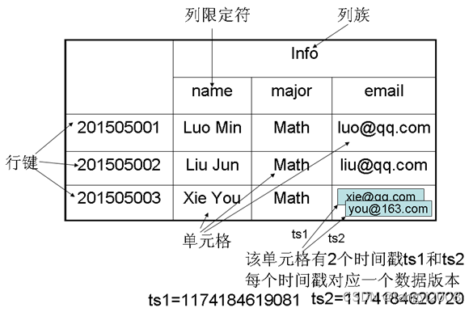

实时数据处理⭐️⭐️⭐️⭐️

主要围绕Spark Streaming和Flink进行学习
Spark streaming的基本架构以及工作流程
Spark streaming的基本调优
Flink的基本架构以及工作流程
Flink的基本调优
Hbase的基本架构
Kafka消息队列

黑马HBase存储：https://www.bilibili.com/video/BV14y4y1r7yK/?spm_id_from=333.337.search-card.all.click&vd_source=89ddf71eb38188bf588f77ea08dd93b4

HBase是一个稀疏、多维度、排序的映射表，这张表的索引是行键、列族、列限定符和时间戳，在进行数据存储的时，其采用key-value形式：Table + RowKey（升序） + ColumnFamily + Column + Timestamp --> Value

