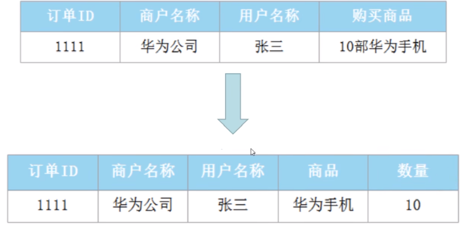

数据仓库建模方法理论⭐️⭐️⭐️⭐️⭐️

HBase (JavaAPl操作 +Phoenix）


数仓分层理论
星型模型、雪花模型、逆三泛式建模
连链表通用模板、开链，闭链，卡拉链
数据核验原理


数据湖存储：https://www.bilibili.com/video/BV1YK411f78Z?p=9&spm_id_from=pageDriver&vd_source=89ddf71eb38188bf588f77ea08dd93b4


电信用户行为分析： https://www.bilibili.com/video/BV1L24y1o7f7/?share_source=copy_web&vd_source=b0c3cad8671d1f2fa75d01a0a18e195c

在线教育项目：https://www.bilibili.com/video/BV1ef4y1B7KX?p=40&vd_source=89ddf71eb38188bf588f77ea08dd93b4


# 前言

## 为什么构建数据仓库

Java Web为什么需要大数据

**数据存储有瓶颈**：抖音平台的点赞、评论、私信、广告、浏览记录、商品数据、交易订单这些很多属于日志数据，而**关系型数据库一般不存储日志数据**（关系型数据库一般用于频繁的增删改查，而且存储日志数据导致数据量太大，MySQL存不下）

- 关系型数据库没有这种日志数据，无法进行**用户行为的分析**

**数据存储在互不兼容的系统中**：企业不同的业务平台系统，由于用户地域不同等原因，存放在不同数据库和不同类型的数据库中

**海量数据计算（查询）有瓶颈**：电影网站榜单、周月度排行，mysql不行

**实时场景计算有瓶颈**：实时交易数据，实时人数统计

**数据挖掘（推荐算法等）有瓶颈**：电商平台商品推荐实现

OLAP和OLTP的区别

- 事务处理，增删改频繁，需要较强的数据一致性和事务操作
- OLAP主要是查询，不关注数据一致性，需要快速的响应时间

为什么不在业务系统做数据分析

1. 干扰：数据分析会影响业务系统的效率,降低业务系统的处理性能
2. 数据源：分析系统的数据有可能来自多个业务系统和业务日志文件,比如来自财务系统,客户管理系统,订单管理系统，商城系统等
3. 数据模式：分析系统的设计模型和业务系统的设计模型是不一致的,针对于分析系统,我们会使用维度建模（保证查询速度）,对于业务系统，我们会使用ER建模（保证数据一致性，减少冗余）

数据仓库是大数据平台的基础

数据治理：将发散在各个web系统里的数据，进行集中和规范化，从而挖掘数据中的价值


## 数据库三范式

第一范式1NF：原子性，字段不可分

>表的字段，便于统计
>
>

第二范式2NF：有主键PK，**非主键字段依赖主键**

> 减少冗余
>
> 

第三范式3NF：非主键字段不能相互依赖

> 

范式级别越高，拆出来的表越多，有时候允许一定的数据冗余


## ER实体关系模型

用来为数据库设计表

> 1.抽象实体，2. 找出实体的关系，3. 找出实体的属性， 4. 画出ER关系图， 5. 设计数据库表，完善PK，FK字段
>
> 

# 数据仓库

## 定义

DW（data warehouse）：数据仓库是面向主题的、集成的（非简单的数据堆积）、相对稳定的、反应历史变化的数据集合,数仓中的数据是有组织有结构的存储数据集合,用于对管理决策过程的支持。


- 面向主题：要分析用户，需要用户的贷款信息、存款信息、风险评估信息，来自不同业务库的表数据

  

- 集成：不同字段的实体需要消歧、一致性

  - 数据仓库中不同系统对于性别字段，有不同的描述，如性别=男，Gender=man，Sex=nan

- 相对稳定的、反映历史变化的：不像关系型数据库，增删改后就没了数据记录，会保留下来变化日志


TiDB用来替代MySQL，用在OLAP中，但在大数据中用的非常少，后续技术选型中再说

## 发展历史

萌芽阶段1978-1988：需要将业务处理系统和分析系统分开，但还做不到

- 数据处理能力还不够，MySQL刚出来，Oracle还没出来

探索阶段1988：定义分析系统四部分，数据获取、数据访问、目录和用户服务

雏形阶段1988：IBM提出信息仓库及其规范，数据抽取、转换、有效性验证、加载、Cube开发、图像化查询工具（**ETL**，抽取、转换、加载）

确立阶段

- 1991： 比尔·恩门，数据仓库之父《building the data warehouse》，得到数据仓库，生成后续的表（数据集市）**按照范式建模，关联表的效率太低**

  

- 1994：拉尔夫·金博尔，《the data warehouse toolkit》，补充数据集市概念，多个数据集市构成数据仓库，按照**维度（反范式化）建模**，一个业务一个业务聚合，加快分析效率，但可能存在各个数据集市的数据不一致，集成关联出问题

  

  维度建模主要面向数据分析（OLAP）而不是增删改查（OLTP，RDB的操作），包含**事实表和维度表**

  - 事实表：包含维度列（面向的对象）和度量列（用以统计聚合）；列数据只存代号，不存名称，从而减少内存开销，加快表的关联；fact开头表示

    

  - 维度表：每个维度列都有对应的维度表，其将维度列对应代号，用来关联对应信息（维度表中的ID相当于主键）；dim开头表示

    

  - Cube开发：将维度列任意组合，进行度量列的统计查询

  - **维度建模的关键是把握需求，要对什么分组数据进行统计**，分组数据作为维度列，统计结果作为度量列

    - 事实表存放的记录，是不断增长的，如系统日志、销售记录，记录数远大于其他表，是数仓建模的核心
    - 事实表中分组的条件实际上就是维度表

  - 拉链表：解决事实中渐变维度发生变化的问题，通过时间来标记存储维度的每一种状态

    1. 先采集所有增量数据到更新表
    2. 将更新表的数据与老的拉链表数据进行合并，写入一张临时表
    3. 将临时表的结果覆盖到拉链表中

  - 全量表：不会经常发生变化的数据表，例如维度数据表，如组织机构信息、地区信息、服务商信息、数据字典等

  - 增量表：经常发生变化的数据表，例如业务数据、用户行为数据等

- 数据分析模型：包括星型模型、雪花模型

  - 星型模型：维度表存在一定的信息冗余（维度表里有嵌套维度），但只需要关联一层就能进行度量的分析查询，优先使用该模型

  

  - 雪花模型：一层维度表又分出更多层的维度表，数据冗余少，但进行度量的分析查询时要关联多层，效率低（属于范式建模）

  

  - 星座模型：两张事实表，存在共用的维度表，本质上是星型模型

  

  > 使用维度建模构建用户订单模型
  >
  > 

- 比尔·恩门提出CLF架构：数仓分层，不同层采用不同建模方式

  

## 数据仓库分层

DM层（数据集市层，或称**ADS数据应用层**）：基于DW上的基础数据，整合汇总成分析某**一个主题域的报表数据**，用来给ML、Web、运营等部门使用SQL去拉取数据

DW层：

- DWS层（数据服务层，或称**数据汇总层**）：按照主题业务组织主题宽表（拼接关联不同的维度表）,用于OLAP分析（如将订单表和产品表等关联）
  - 本质上是汇总，因为分组的详细信息被放到维度表了，因此需要将事实表和维度表进行拼接，如将时间维度表拿过来按照时间维度进行汇总
- DWM层（数据中间层）：对**通用的维度进行轻度聚合操作,**计算相应的统计指标,方便复用（如对某天用户的订单量）
- DWD层（**数据明细层**）：保证数据质量/ODS的基础上对数据进行**加工处理**，由原始数据进行处理，得到新的列，表达更广的业务信息（如根据ip列--》省份列）
- 存储格式：ORC
- 不区分全量，增量
- 创建DW()数据库，从ODS层中抽取每一张表的数据，创建到DW()的指定表

ODS层（操作数据层，或称**原始数据层**）：直接存放业务系统抽取过来的数据（不同数据源）,将不同业务系统**中的数据汇聚在同一个存储系统中**（不需要数据清洗）	

- 存储格式：AVRO
- 区分全量，增量
- 创建ODS数据库，根据数据在HDFS的数据目录创建分区表

<table>
  <tr>
    <td>
      
    </td>
    <td>
      
    </td>
  </tr>
</table>


补充说明

- 每层命名方式可能不同，但目的相同；DWM，DWS可能只有一个
  - 阿里美团的离线数仓规范是四层

- ODS存储原始数据，便于数据的溯源，检查聚合过程是否出错
- ODS、DWD都是**范式建模**的数据，DWM，DWS，DM层都是**维度建模的数据**
- 数据分层的好处
  - 简化分解问题：不同层次负责不同的功能定位
  - 减少重复开发，可以**复用数据**，DIM和DWS层可以抽取到通用的功能
  - 便于回溯：隔离原始数据，存在ODS层，可以对统计结果进行回溯，方便问题的定位
  - 规范化，统一的数据报表出口

数据库与数据仓库的区别


## 数据仓库实战

案例：某购物网站用户可以在pc端、ipad、手机app端、微信小程序登录购物网站进行购物，用户购物会产生一些订单、浏览商品、地域登录登出等日志数据。为方便后期分析用户日志数据和订单数据更好的辅助决策,设计数仓分层。

各层数据表的设计


表的存储

- 大部分公司使用Hive存储，其次是数据湖和Kafka、TiDB很少用	
- 使用数据采集技术进行离线或实时日志数据的采集

# 大数据架构

离线大数据架构

- Hive即都是基于HDFS的存储框架
- 基于批处理的计算框架
- 缺点：但没法处理流式数据的实时数据分析（今天只能处理昨天的数据）


Lambda架构（离线处理+实时链路）——传统实时开发

- 加入实时数据采集技术
- 使用Kafka进行数据存储
- 实时流式数据处理的计算框架
- 缺点：数据的重复处理
  - 实时处理层的**数据存在重复存储和计算**，可以通过建立数仓进行改进


Lambda架构（离线数仓+实时数仓）

- Kafka存放DM数据集市数据不方便对外提供数据服务，因为没法用SQL去拉取数据，因此一般会把DM直接存放在HBase、Redis、ES、MySQL中
- 缺点：
  - 需要开发两套一样的代码逻辑
  - 离线和实时同时运行，集群资源使用增多
  - 离线结果与实时结果往往不一致（实时计算出新一天的数据）
  - 批量计算的T+1可能在规定时间内算不完
  - 相同数据可能在离线和实时两层存两份，导致服务器存储压力大


Kappa架构（只构建实时数仓）

- 缺点
  - Kafka相对于HDFS，存储数据有一点的期限，过期数据将清空，不符合数仓不删除数据的原则，无法支持海量数据存储
  - **最致命原因**：Kafka存储数据是顺序append的，无法对之前的数据进行更新，从而保证数据正确性
  - 有时业务部门只需要从DM以下的存储层中获取中间数据，Kafka存储无法直接通过SQL进行数据拉取（需要借助Flink代码实现，比较麻烦），也即Kafka无法支持高效的OLAP查询分析
  - 无法复用数据血缘管理体系（没有SQL的schema概念），用来溯源某字段数据的正确性等


技术选型：

1. 公司刚上大数据或者公司业务没有实时场景——》传统离线大数据架构
2. 公司离线业务多，实时业务少——》Lambda1
3. 公司离线业务和实时业务都比较多——》Lambda2
4. 公司实时业务多，离线业务少——》Kappa纯实时数仓架构

> 绝大多数公司采用Lambda架构
>
> 互联网公司实时业务多采用**混合架构**
>
> - 绝大多数实时业务采用Kappa架构，关键核心业务（如指标计算，需要准确）使用进行离线全量计算的离线链路


湖仓一体实时数仓架构

- 使用Hudi、Iceberg等数据湖存储框架，也依赖于HDFS，支持SQL和数据更新，能在数仓任意层进行OLAP查询分析
  - 数据湖能解决Lambda架构的double存储（Hive），Kappa实时数据的更新、兼容SQL、海量存储问题（Kafka）
- 在Clickhouse存放DM比较多，


# 电信用户行为分析

业务介绍和企业价值

- 提供数据支持：比如上网时长、上网的用户人数、wifi/5G/4G占比等、每个网站的访问情况
- 助力行业发展预测

## 主要内容


基本原理

- 由于数据量的增多，需要更强的处理能力和来自不同的业务系统数据，需要将数据从统一从业务平台---》 大数据平台HDFS中，采集日志文件数据最好用的方式为Flume框架（一个业务系统对应一个Flume）
- 为了提高分析的效率，提高模块之间的复用性，将HDFS的数据进行**分层**再分析，分析查询的工具是Hive（Hive-on-Spark），本质上是建立Hive数仓
- 使用阿里开源工具DataX，将ADS的报表数据，同步到MySQL
- 最后从MySQL中，通过QuickBI进行数据的可视化

主要技术栈

- Hadoop基本环境搭建大数据环境的统一配置，HDSF分布式存储环境搭建， Yarn分布式任务调度
- MySQL数据库的安装和应用
- SpringBoot项目的日志生成生成程序的流程分析
- Flume日志采集到HDFS,并且完成shell脚本的编写
- Hive-on-Spark环境的搭建
- Hive的基本操作,外部表,分区表的创建,表数据的导入
- 数据仓库的分层架构 ODS--> DWD --> DWS --> ADS 数仓结构设计
- DataX技术从ADS同步数据到MySQL数据库
- QuickBI完成数据可视化处理

## 集群规划


其他Hadoop组件的配置类似前文，一台搞好分发至其他三台，这里需要多配一个历史服务器

### 历史服务器

- JobHistory用来记录已经finished的mapreduce运行日志,日志信息存放于HDFS目录中,默认情况下没有开启此功能,需要在mapred-site,xml中配置并手动启动。

- 配置需要在`mapred-site.xml`中加入两个属性，并分发给其他Hadoop服务器中

  ```xml
  <configuration>
      <property>
          <name>mapreduce.framework.name</name>
          <value>yarn</value>
      </property>
      
      <property>
      	<name>mapreduce.jobhistory.address</name>
          <value>hadoop01:10020</value>
      </property>
          <property>
      	<name>mapreduce.jobhistory.webapp.address</name>
          <value>hadoop01:19888</value>
      </property>
  </configuration>
  ```

- 启动：在node01中执行`mapred --daemon start historyserver`

- 执行WordCount的MR程序，可以看到历史信息被跟踪了

  


## 数据采集

日志json数据内容，后续将会用程序模拟生成


日志的数据，在业务系统中将会放在Redis数据库中

### Redis

在业务系统服务器中，下载源码压缩包tar.gz，解压后想要通过gcc编译库得到可执行文件，编译并安装

```bash
# 下载源码并解压
wget https://download.redis.io/redis-stable.tar.gz
tar -zxvf redis-stable.tar.gz

# 编译
yum install -y gcc g++ gcc-c++ make
cd redis-stable # ls可以看到没有bin/目录和可执行文件，在src/中将.c源文件
make MALLOC=libc # 指定编译库（修改默认编译库jemalloc，优化了内存碎片率），用以分配内存，libc是Linux系统自带的
mkdir -p /var/bigdata/server/redis
make PREFIX=/var/bigdata/server/redis install

# 配置
cd /var/bigdata/server/redis
mkdir {conf,data) # conf配置文件目录data数据存放目录 log日志文件目录
cd ../../bigdata/soft/redis-stable
cp redis.conf /bigdata/server/redis/conf/
cd /bigdata/server/redis/conf/
vi redis.conf
	bind 0.0.0.0 # 配置可以所有的地址都可以访问
	redisprotected-mode no #关闭保护模式
	daemonize yes# 后台启动运行
	dir ./data # 相关的数据和日志文件的存放目录
	dbfilename dump.rdb #数据文件存放
	logfile "redis.log" #指定logfile的文件名默认没有日志文件
```


- 编译完生成/bin，redis-server是服务端启动命令，其他分别用来做，性能测试、备份、备份、客户端启动命令、高可用


- 存放的备用文件和日志文件，启动Redis，会读取dump.rdb的数据

启动

1. `/bin/redis-server conf/redis.conf`

2. 查看 `netstat -ntlp`，Redis默认端口6379已经在监听

   

3. 也有可查看日志 `tail -100f data/redis.log`

   

关闭：`/bin/redis-cli shutdown`（关闭不成功，直接kill pid）


登录：`/bin/redis-cli`

导入Redis数据，将已有数据的/data/dump.rdb文件替换上去

> 注：[Redis常用命令](https://www.redis.net.cn/order/)
>
> keys *：查看所有键
>
> type + key：查看该键的值类型
>
> scard + key：若该key的值类型为set，使用scard命令获取值的条数
>
> Srandmember + key + cnt：若该key的值类型为set，使用命令取出cnt条值

在JAVA程序中，自动生成随机的日志数据，将写入Redis中，再从Redis中读取数据


- 修改web配置，application.properties

  ```properties
  # 生成日志的存放路径
  logPath=d:/log/behavior
  # redis数据库的连接地址 端口 密码spring.redis.host=localhost
  spring.redis.port=6379
  spring.redis.password=
  # web应用服务器的启动端口
  server.port=8080
  ```

- jar包和配置文件在同一目录，并在该目录下执行`java -jar XX.jar`，通过web方式访问接口，生成数据

  

生成结果：若干.log文件


### Flume

采集流程


安装、配置（在01中进行，分发到其他节点）、使用

1. 保证业务服务器有HDFS客户端，当前规划下，客户端节点不会启动JVM进程，但可以通过`hdfs dfs -命令`查看HDFS的文件信息

2. 安装源码文件tar.gz，其带有/bin目录和可执行文件，解压完直接可以用

   ```bash
   tar -zxvf apache-flume-1.9.0-bin.tar.gz -C /bigdata/server
   cd /bigdata/server
   ln -s apache-flume-1.9.0-bin flume
   ```

3. 配置flume基础环境

   

4. `flume-ng +`命令

5. 添加拦截器的JAVA程序（实现Interceptor接口），并保存至flume/lib目录

   - 功能一：处理标准的json格式的数据,如果格式不符合条件,则会过滤掉该信息
   - 功能二：处理时间漂移的问题,把对应的日志存放到具体的分区数据中（根据日志里的时间戳，将该日志文件存放在HDFS的该日期目录下，需要根据业务时间，而不是根据采集时间）

6. 配置flume采集环境的文件，设定source-channel-sink三结构的pipeline，保存至`jobs/log_file_to_hdfs.conf`路径

   

7. 运行

   ```bash
   # 前台运行
   bin/flume-ng agent --conf conf/ --name a1 --conf-file jobs/log_file_to_hdfs.confDflume.root.logger=INFO,console
   # 后台运行 保存日志
   nohup bin/flume-ng agent --conf conf/ --name a1 --conf-file jobs/log_file_to_hdfs.conf -Dflume.root.logger=INFO,console >/bigdata/server/flume/logs/log_file_to_hdfs.log 2>&1&
   ```

   - 2>&1 将标准错误输出重定向到标准输出的方式
   - 使用 `nohup` 命令和 `&` 符号可以将进程以后台方式运行，并且即使当前终端会话关闭，进程也会继续运行。
   
   

## 数仓建设

### 数仓建模

:star:结合业务逻辑进行数仓建模:star: 

ER建模，保证满足3NF

- 三张表：客户表C，账户表A，交易记录表T
- 满足关系：C:A=1:n; A:T=2:n


**维度建模**

- 事实表：根据交易记录表进行各维度的统计，使用“交易金额“作为各维度的度量
- 维度表：根据年月季，进行时间维度的统计
- 维度表：根据城市、省份、国家，进行地区维度的统计
- 维度表：根据客户账户，进行客户维度的统计


### 数仓环境Hive-on-Spark

Hive配置与Mysql元数据表创建

- 下载安装适配spark3版本的Hive，（默认的Hive不支持spark3，需要源码编译）

- 配置环境变量

- 修改Hive配置文件，hive-site.xml （不要有中文注释）

  - 元数据存储的数据库配置（使Hive连接到MySQL）
  - 数据文件存储目录（HDFS目录）
  - 启动thrift服务的配置
  - 客户端配置

- 在hive/lib/mysql*中存放mysql的jdbc驱动jar包

  

- 创建mysql数据库，元数据初始化 `schematool -initSchema -dbType mysql -verbose`

  

-  解决元数据的中文乱码问题，字符集统一为utf8

  ```mysql
  #设置注释中文乱码的问题在MySQL的元数据库设置
  alter table COLUMNS_V2 modify column COMMENT varchar(256) character set utf8;
  alter table TABLE_PARAMS modify column PARAM_VALUE varchar(4000) character set utf8; 
  alter table PARTITION_PARAMS modify column PARAM_VALUE varchar(4000) character setutf8;
  alter table PARTITION_KEYS modify column PKEY_COMMENT varchar(4000) character set utf8;
  alter table INDEX_PARAMS modify column PARAM_VALUE varchar(4000) character set utf8;
  ```

- 启动Hive客户端`/bin/hive`，插入一条数据（默认使用MR计算程序）

  

  

Spark配置

- 下载解压无Hadoop的Spark

  `tar -zxvf spark-3.0.0-bin-without-hadoop.tgz -C /bigdata/server`

- 添加到系统环境变量

- 修改配置 `conf/spark-env.sh`

  - Hadoop环境目录，YARN环境目录，Spark classpath

- 创建配置 `spark-default.conf`

  - 创建Spark日志存放目录`hdfs dfs -mkdir -p /spark/log`

  

- 分发配置

- 测试运行

  -  spark-submit 运行jar包

    ```bash
    spark-submit --class org.apache.spark.examples.SparkPi --master yarn \ examples/jars/spark-examples_2.12-3.0.0.jar 10
    ```

  - 进入spark的Scala API运行scala程序

    ```bash
    bin/spark-shell
    scala>sc.textFile("hdfs://hadoop01:8020/input/").flatMap(_.split(" ")).map((_, 1)).reduceByKay(_ + _).collect()
    # :	quit; 退出
    ```


Hive-on-Spark配置

1. 上传spark的jar包到HDFS

   ```bash
   hdfs dfs -mkdir /spark/jars
   cd hive/spark/
   hdfs dfs -put jars/* /spark/jars
   ```

2. 修改配置文件 hive/conf/hive-site.xml

   ```xml
   <property>
       <name>spark.yarn.jars</name>  <!--Spark依赖位置 8020与NN端口号一致-->
       <value>hdfs://node01:8020/spark/jars/*</value> 
   </property>
   <property>
       <name>hive.execution.engine</name> <!--Hive执行引擎-->
       <value>spark</value>
   </property>
   <property>
       <name>hive.spark.client.connect.timeout</name>
       <value>10000ms</value> <!--Hive和Spark连接超时时间-->
   </property>
   ```

3. 运行插入语句

   

客户端连接工具 hive/bin/hiveserver2执行文件用来启动服务

- 对应hive-site.xml中的客户端配置端口（10000端口），启动该服务

  ```bash
  mkdir /bigdata/server/hive/logs
  /nohup bin/hiveserver2 > /bigdata/server/hive/logs/hive.log 2>&1 &
  ```

- 查看10000端口是否被监听，服务是否启动成功 `netstat -nltp`

  

- 启动后使用/bin/beeline连接到客户端（输用户名、密码、jdbc连接）

  

- 使用Idea连接Hive

  

  

  可直接在idea中写sql

  

### 数仓分层

都是外部表，存在HDFS中

1. ODS层

   - 采用外部表+分区表存储原始日志数据

     - 存在两列，原始数据作为line列；dt分区列

     ```hive
     create database behavior;
     use behavior;
     drop table  if exists ods_behavior_log;
     create external table ods_behavior_log(
         line STRING
     )partitioned by (dt string)
     location 'behavior/ods/ods_behavior_log'; --HDFS中外部表的存储位置
     ```

   - 批量导入数据的脚本 `vim origin_to_ods_init_behavior_log.sh`

     ```shell
     if [ $# -ne 2 ]; then
     	echo "useage origin_to_ods_init_behavior_log sh start_date end_date'
     	exit
     fi
     EXPORT_START_DATE=$1
     EXPORT_END_DATE=$2
     i=$EXPORT_START_DATE
     while [[ $i < `date -d "+1 day $EXPORT_END_DATE" +%Y-%m-%d` ]] do
     	SQL="load data inpath 'log数据目录/$i' into table behavior.ods_behavior_log(dt='$i');
     	hive -e "$SQL"
     	i=`date -d "+1 day $i" +%Y-%m-%d`
     	done
     ```

     - 输入开始日期和结束日期，循环其中的每一天执行hiveSQL语句`hive -e +sql`

     - `date`: 一个用于显示或设置系统日期和时间的实用工具。

       `-d "+1 day $i"`: `-d` 选项用于指定要操作的日期，`"+1 day $i"` 表示在 `$i` 的基础上加上一天。这样，`date` 命令将返回 `$i` 的下一天的日期。

       `+%Y-%m-%d`: `+` 后面的参数用于指定日期的输出格式。`%Y` 表示四位数的年份，`%m` 表示两位数的月份，`%d` 表示两位数的日期。因此，`+%Y-%m-%d` 表示输出的日期格式为 `YYYY-MM-DD`。

       综合起来，`date -d "+1 day $i" +%Y-%m-%d` 命令会将变量 `$i` 的值解释为日期

     - 添加用户权限，`chmod u+x origin_to_ods_init_behavior_log.sh`

   - 执行 `origin_to_ods_init_behavior_log.sh 2022-08-08 2022-08-09`

   - 查看执行结果

     

2. DWD明细层：
   - 需求：1. 由IP地址得到城市； 2. 访问URL清洗，取出查询关键字
   - 自定义UDF函数，生成jar包，上传至HDFS
   - 在HIVE中注册UDF函数
   - 创建外部分区表DWD；结合UDF函数和动态分区，从ODS表中插入数据到DWD中
3. DWS汇总层
   - 和DWD完全一样的内容，直接创建+动态分区插入
4. 维度表：通常仅仅DWS的时间，地区字段不够细致，想要更加细分的时间和地区信息，作为分组依据
   - 时间维度表：增加字段，第几周、一周中的第一天、一年中的第几天、一年中的第几季度、年份、是否为周末、节假日类型
   - 地区维度表：增加字段，城市、省份、所属区域划分
5. ADS应用表：将DWS汇总表和维度表进行join，得到宽表
   - 用户地区分布统计表
   - 用户访问网站统计表


## 数据可视化

### DataX

同步：先将ADS层的表数据从HDFS中导入到MySQL

- 使用`python /bin/datax.pyjob/ads_user_city.json` 同步数据

- 先创建Mysql的表结构

- 修改`ads_user_city.json`文件的读写参数

  - 读：修改HDFS的ADS表的存储目录

  - 写：Mysql的写入列等

### QuickBI

- 买 0.08元
- 添加MySQL数据源（公网地址）
- 添加数据集，需要转成平台需要的数据格式（维度）
  - 字段、过滤器

-QuickBI或superset


# 工业项目


