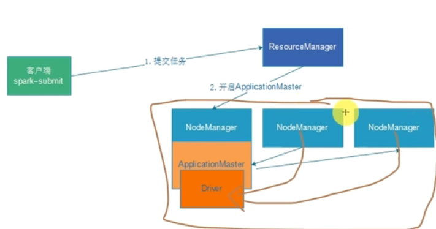
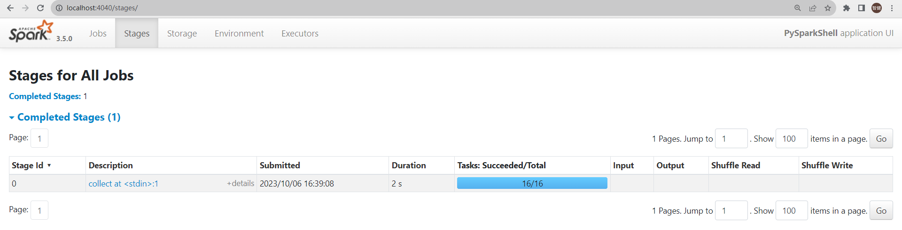
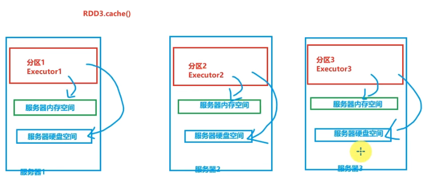
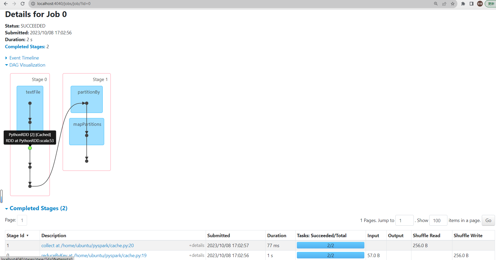
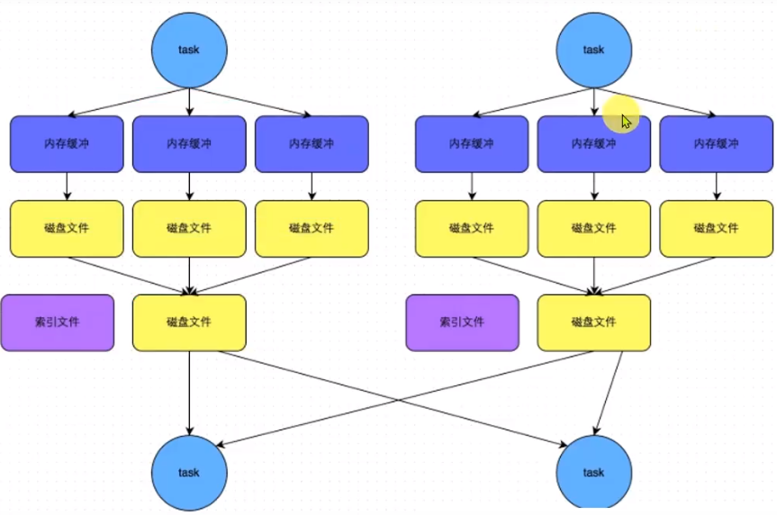

离线数据处理⭐️⭐️⭐️⭐️⭐️

主要围绕Hive，Spark的学习
Hive的基本架构以及工作流程
Hive的基本调优
Spark的基本架构以及工作流程
Spark的基本调优
数据倾斜的处理


Hive： https://www.bilibili.com/video/BV1BS4y1w7FR/?p=2&share_source=copy_web&vd_source=b0c3cad8671d1f2fa75d01a0a18e195c

马士兵Spark：https://www.bilibili.com/video/BV1Tg411Y7pr?p=1&vd_source=89ddf71eb38188bf588f77ea08dd93b4

黑马pyspark：https://www.bilibili.com/video/BV1Jq4y1z7VP?p=146&spm_id_from=pageDriver&vd_source=89ddf71eb38188bf588f77ea08dd93b4

# Spark

MapReduce的升级，分布式内存计算框架

- 替换MR的计算，结合Hadoop已有的HDFS存储和YARN调度，可以实现更好的大数据开发框架
- （批流式）内存迭代计算（ 内存要求高、贵，但中间运算留在内存，算的快、通信/IO时延小）
- 编程范式不局限于Map和Reduce，**算子多**，复杂任务可以直接算，不像MR，需要串联多个MR程序，磁盘读取时延大
- 以线程方式启动，任务启动快


- 通用性强：统一分析引擎，离线处理 SQL计算+（实时）流式计算+机器学习+图计算

  - Spark Core：运行基础，数据抽象RDD，有5大分析语言的API，进行离线数据批处理
    - 类MR开发方式，擅长对非结构化数据进行处理
    - 场景：ETL

  - **SparkSQL**：可以解决所有场景的分布式计算（MR、HiveSQL、Flink）
    - 类HiveSQL开发方式，对数仓中的**结构化数据**（表）进行处理，但**也能处理**非结构和半结构数据（DSL函数+RDD算子）
    - 场景：统计分析、离线计算、实时计算
    - +StructureStreaming模块可以进行数据的流式计算
  - SparkStreaming：提供数据的流式计算（StructureStreaming后来的，基于SparkSQL，性能更好）
  - MLlib：分布式模型完成ML计算
  - GraphX：分布式模型完成图计算

  

- 运行方式多，数据源多

  - local 本地模式 单机模式：一个进程，里面多个线程来模拟分布式（主从角色）。性能不够，一般用在开发测试阶段，下面的都是生产环境的部署方式
  - standalone 集群模式：各个角色是多个**独立进程**（直接运行在Linux系统），组成集群环境
  - Hadoop YARN 集群模式：各个角色运行在YARN的**容器内部**，组成集群环境
  - Kubernetes 容器集群：各个角色运行在Kubernetes 的**容器内部**，组成集群环境
  - 云服务模式 云平台模式：AWS，阿里云 弹性MR框架，快速构建集群，得到分布式计算集群

  

## 角色与部署

与YARN非常类似，角色包括资源管理和任务运行，两类都服从主从结构

逻辑架构

- 资源管理：Master集群资源管理+Worker单机资源管理
- 任务运行：Driver单个任务管理+Executor单个任务执行（干活的）

local 部署

- 一个JVM进程的多个线程模拟集群角色，`local[N]`表示有N个Worker线程完成计算，`local[*]`将根据CPU核数设置线程数

  >CPU核心数与JVM进程、线程的关系：
  >
  >- JVM线程是JVM进程的执行单元，每个 JVM 线程都会被映射到OS的一个原生线程。原生线程是由OS调度和执行的
  >- 操作系统将原生线程映射到物理 CPU 核心上进行执行（能独立执行指令并处理计算任务）
  >- CPU 核心的数量决定了可以同时执行的原生线程的数量。intel 发明了超线程技术，CPU 核心数与最大线程数之间的关系为1：2， 通常很多线程池设计将，最大线程数设计成2 * N + 1,N 为CPU 核心数。

- 资源管理的主从Master和Worker是两个JVM进程（进程名为`Worker`和`Master`）

- 任务执行的Driver也是JVM进程（对应一个客户端进程`SparkSubmit`），Executor不是独立的，由该JVM进程内的线程提供计算能力

standalone 部署（可本地伪分布式，可完全分布式）

- 完全版的集群环境，各个角色是单独的进程；多个Master和多个Worker，多个Driver，多个Executor任务

- 资源管理：Master和Worker角色以独立进程的形式存在,并组成Spark运行时环境(集群)
- 任务执行
  - Driver角色有两种部署方式：
    1. Client部署：与客户端作为一个进程`SparkSubmit`的线程存在
    2. Cluster部署：在某个Worker节点上以一个进程方式启动
  - Executor角色以进程（进程名为`CoarseGrainedExecutorBackend`）运行在Worker节点中，启动多个线程Task执行任务
- 主节点Master进程：管理整个集群资源、托管运行各个任务的Driver
- 从节点Workers进程：管理当前机器的资源，分配资源给运行Executor（Task）


standalone-HA模式

- 一个**Master会有单点故障**的问题，"Spark Standalone HA" 指的是在使用 Spark Standalone 集群时，采用了一些方法来保证其高可用性（HA ，High Availability），即在发生故障或节点宕机的情况下，集群可以继续正常运行，以保证系统的稳定性和可用性。

- 如何解决这个单点故障的问题，Spark提供了两种方案:

  1. 基于文件系统的单点恢复(Single-Node Recovery with Local File System)--只能用于开发或测试环境。
  2. 基于zookeeper的Standby Masters(Standby Masters with ZooKeeper)--可以用于生产环境。
     - ZooKeeper提供了一个Leader Election机制,利用这个机制可以保证虽然集群存在多个Master,但是**只有一个是Active的**（占有临时路径）,其他的都是Standby。
     - Worker会先和ZooKeeper通讯，询问哪个Master是活跃的，并得到地址，和active的Master通讯，形成可用的集群。
     - 当Active的Master出现故障时,另外的一个Standby Master（持续监听临时路径）会被选举出来，占有临时路径，Worker找到新的Master
     - 由于集群的信息,包括Worker, Driver和Application的信息都已经持久化到文件系统,因此在切换的过程**中只会影响新Job的提交**,对于**正在进行的Job（程序）没有任何的影响**。加入ZooKeeper的集群整体架构如下图所示。

  

- 配置：修改`spark-env.sh`中，注释掉固定Master ，配置基于ZooKeeper的url（三台机器的ZooKeeper集群），ZooKeeper临时节点路径

### spark-on-yarn 部署

local作为本地测试，standalone生产环境也不用，生产环境主要用后面三种

- 企业服务器资源有限，默认都会有Hadoop集群（包括了YARN集群），再单独准备standalone的集群，资源利用率不高，还会抢占资源，产生冲突，多数情况下，会将Spark运行到YARN集群中


- YARN本身是一个资源调度框架,负责对运行在内部的计算框架进行资源调度管理.作为典型的计算框架, Spark本身也是直接运行在YARN中,并接受YARN的调度的

- 所以,对于Spark On YARN,无需部署Spark集群（还有什么ZooKeeper）,**只要找一台服务器,充当Spark的客户端**,即可提交任务到YARN集群中运行（提高了资源利用率，方便管理）

角色

- 不要Spark的Master，由YARN的ResourceManager担任Master角色，管整个集群

- 不要Spark的Worker，由YARN的NodeManager担任Worker角色，管单台机器

- Driver角色运行在**YARN容器内**或**提交任务的客户端进程**（对应两种运行模式）YARN本身的ApplicationMaster依然存在，没有代替Spark的Driver

  > 1. AM用来和其他角色通信询问需要/有多少资源
  > 2. 监听任务进展、启停Executor进程
  > 3. 容错：当出现故障或任务失败时，它会重新分配任务或请求更多的资源，以确保应用程序的正常执行。

- 真正干活的Executor运行在YARN容器内

- Spark只管**任务运行**层面（运行到YARN的容器内部），不管**资源管理**（全给YARN管了，集群管家和单机管家），只剩Driver和Executor
  - 先开一个Driver和AM的容器，AM先知道Driver的容器个数，再询问RM，资源够了，开工作进程的容器
  - 资源交给YARN，计算交给容器，内部跑的都是Spark代码


### Driver的两种运行模式

和standalone架构存在的位置一样

- 相同点：先启动AM所在的容器，再由AM与Driver沟通，由RM和NM开出Executor容器；由于Driver启动位置不同，会产生执行顺序和节点管理上的区别）

- Client模式：Driver运行在**客户端进程**中,比如Driver运行在spark-submit（pyspark  spark-shell）程序的进程中

  - 单机的Executor要和YARN外部客户端的Driver通讯，成本要高
  - 受客户端进程影响，不够稳定
  - 优点：**直接可以看到输出日志**（测试时好用）

  

  - 提交任务的详细流程（客户端启动Driver->RM->NM上的AM->Driver->RM->NM上的Executor->Driver）

    1. Driver在任务提交的本地机器上运行, Driver启动后会和ResourceManager通讯申请启动ApplicationMaster;
    2. 随后ResourceManager分配Container,在合适的NodeManager上启动ApplicationMaster,此时的ApplicationMaster的功能相当于一个ExecutorLaucher，需要再向Driver询问，需要向ResourceManager申请多少资源，才可以启动Executor;
    3. ResourceManager接到ApplicationMaster的资源申请后会分配Container,然后ApplicationMaster在指定分配资源的NodeManager上启动Executor进程;
    4. Executor进程启动后会**向Driver反向注册**, Executor全部注册完成后，Driver开始执行main函数
    5. 之后执行到Action算子时,触发一个Job,并根据宽依赖开始划分Stage,每个Stage生成对应的TaskSet,之后将Task分发到各个Executor上执行。

    

- Cluster模式：Driver运行在**YARN容器内部**和ApplicationMaster在同一个容器内

  - 时延短：Driver和Executor在集群内通信，少经过网关（集群内部都是内网，不用跨网段，**用于生产环境**）
  - 更稳定：Driver运行NM节点上，由Yarn管理，如果出现问题, yarn会重启AM(Driver)
  - 缺点：翻日志时，需要进入容器的内部，才能看到Driver的控制台输出

  

  - 提交任务的详细流程（客户端->RM->NM上的AM->AM启动相同NM上的Driver->RM->NM的Executor->NM上的Driver）

    

  

###  运行

脚本使用

- `bin/pyspark`：得到一个Local Spark环境,可以运行Python代码去进行Spark计算,类似Python自带解释器）可运行python代码和spark代码，调用spark API进行spark计算
  - 直接有了sparkcontext对象能用，下面的IDE使用需要先通过API生成该对象

- `bin/spark-shell`：进入scala交互解释器环境

- `--master local[1]`：指定master 参数，local模式运行，只给一个线程进行工作

- `--master spark://10-24-17-107:7077`：指定master 参数，standalone模式运行

- `--master yarn`：指定master 参数，yarn模式运行

- `bin/spark-submit --master local[*] ***.py`：本地多线程运行python程序（需要调用spark的API），并提交给spark执行任务，执行完spark程序关闭（不是交互式的执行任务）

- `--deploy-mode [client | cluster]`，Driver的部署方式，默认都是客户端部署，便于调试

- 性能参数：指定6个executor，每个executor吃掉1核CPU，2G内存

  - `--executor-memory 2g`

  - `--executor-cores 1`

  - `--num-executors 6`

    > 查看CPU核数：`cat /proc/cpuinfo | grep processor | wc -l`
    >
    > 查看内存大小：`free -g`


端口和运行层次关系

- 7077：通讯端口，用于将客户端连接到集群
- 4040：表示当前任务监控页面
  - Spark的任务在运行后,会在**Driver所在机器绑定到4040端口**,提供当前任务的监控页面供查看
  - 同时运行多个spark程序，会有端口冲突，此时4040顺延
  - 退出spark driver程序，没有该任务监控页面了
- 8080：**Master角色(进程)的WEB端口**，用以查看当前Master(集群)的状态
  - 程序运行完，也会**持续存在**（守护进程），可查看Master集群的状态
- 18080：默认是历史服务器的端口,由于每个程序运行完成后,4040端口就被注销了，在以后想回看某个程序的运行状态就可以通过历史服务器查看
  - 历史服务器长期稳定运行（守护进程）,可供随时查看被记录的程序的运行过程.

- 使用pyspark连接到standalone集群，使用

  - `pyspark --master spark://localhost:7077`，有集群管理、客户端和Executor四个角色进程

  - 其中localhost或者10-24-17-107是Master的运行节点主机名（`spark-env所配置`）

    

  - ```python
    >>> sc.parallelize([1,2,3,4,5]).map(lambda x: x*10).collect()
    [10, 20, 30, 40, 50]                                                           
    ```

    4040查看到正在执行的客户端，对应Application的执行情况

    

    8080查看到集群内所有的东西

    

  - 层级关系：

    - 一个客户端程序对应一个Application
    - 一个Job子任务也会对应多个阶段Stage去运行
    - 一个Stage会有多个Task，由Executor去执行数量不等的Task

    

- 查看一个wordcount程序的DAG

  ```python
  >>> sc.textFile('/home/ubuntu/pyspark/words.txt').flatMap(lambda line:line.split(" ")).map(lambda x: (x, 1)).reduceByKey(lambda a, b: a + b).collect()
  [('hadoop', 2), ('', 2), ('zzj', 2), ('spark', 1)] 
  ```

  


## 客户端开发

[参考配置1](https://blog.csdn.net/tangyi2008/article/details/123109198)

[参考配置2](https://blog.csdn.net/malingyu/article/details/127431625)

```bash
vi ~/.bashrc
export SPARK_HOME=/home/ubuntu/spark
export PATH=$SPARK_HOME/bin:$PATH
export PYTHONPATH=$SPARK_HOME/python/lib/py4j-0.10.9.7-src.zip:$SPARK_HOME/python/lib/pyspark.zip:$PATHONPATH
export PYSPARK_PYTHON=/home/ubuntu/anaconda3/envs/pyspark/bin/python 
export PYSPARK_DRIVER_PYTHON=/home/ubuntu/anaconda3/envs/pyspark/bin/python 
```

- `PYTHONPATH`：pyspark的java依赖

- `PYSPARK_PYTHON`：Executor上的python环境

- `PYSPARK_DRIVER_PYTHON`：Driver上的python环境

- 保证spark框架的python版本和虚拟环境的python版本相同

- 保证spark的py4j版本和虚拟环境中的py4j、pyspark版本相同

- [下载python源码压缩包](https://pypi.org/project/py4j/#files)，使用 `pip install XXX.tar.gz`

  | Hadoop | spark | python | py4j     | pyspark | Hive  |
  | ------ | ----- | ------ | -------- | ------- | ----- |
  | 3.3.6  | 3.5.0 | 3.9.18 | 0.10.9.7 | 3.4.1   | 3.1.3 |

使用pyspark库，写好spark程序，再给`bin/pyspark`标准Spark框架下进行分布式运算

spark实现wordcount流程及其API

1. 获取SparkContext对象，作为执行环境入口

   ```python
   master = 'local[*]' # 指定local模式
   appName = 'WordCountHelloWorld'
   conf = SparkConf().setAppName(appName).setMaster(master)
   sc = SparkContext(conf=conf)
   
   # 如果直接按下面这样写，程序能运行，但没有4040的Job执行情况UI 没法看Stage
   # sc = SparkContext(master='local[*]', appName='test')
   ```

2. 读入数据 `sc.textFile`

3. 输入数据处理 `.flatMap(lambda line: line.split(" "))`
4. map成元组 `.map(lambda x: (x, 1))`
5. reduceByKey进行shuffle和合并 `.reduceByKey(lambda a, b: a + b)`
6. 输出 `.collect()`


- 使用`spark-submit`作为客户端指定python脚本 进行提交`$SPARK_HOME/bin/spark-submit --master local[*] wordcount.py`
  - 若要更换为分布式场景
    - 需要注释掉python脚本中的 `.setMaster(master)`的local模式，否则会依据该脚本的运行模式执行计算程序
    - 此外还要保证计算的文件都能被不同节点访问到（建议存放在HDFS中），**单机怎么好像没法处理相对路径文件**
  - 如果还有本地依赖文件，需要设置  `--py-files 单个Python文件或者压缩包`，分布式场景下需要每个Executor运行节点的python环境都有安装该库
  - 本地电脑如果可以连同生产环境的集群可以采用IDE提交方法，否则需要采用该客户端提交方法
- 如果是在IDE中运行提交
  - 在使用yarn分布式集群时，需要在Python脚本中指定环境变量，而如果是使用`spark-submit`提交则不需要设置，会自动找到（`os.environ[HADOOP_CONF_DIR]=XX`）
    - 其中需要配置 `HADOOP_CONF_DIR`和`YARN_CONF_DIR` 为 `$HADOOP/etc/hadoop`
  - 设置 `os.environ['PYSPARK_PYTHON'] = $PYSPARK_PYTHON`，或在pycharm或系统中设置该环境变量
  - 如果还有本地依赖文件，需要设置将其上传 `conf.set("spark.submit.pyFiles",本地依赖文件路)径或压缩包`
  - :happy:**集群环境下，IDE中能直接对python第三方库进行提交，不知道第一种方式为什么不行`-py-files`设置了都不行**：没有指定`PYSPARK_PYTHON`和`PYSPARK_DRIVER_PYTHON`的python环境都有改第三方库


采用standalone提交后，有打印结果，可以知道Driver是Client部署的


>local模式下，8088的web ui看不到该应用的情况；分布式集群模式下提交才看得到

### 代码执行分析

1和6由Driver执行；2-5由不同机器上的Executor执行

- 大多数的算子是需要将处理结果交给Driver进行结束（非RDD的）
- 用的是一份代码，给一个Driver和不同机器上的不同Executor执行RDD代码，每个Executor处理HDFS中的一段数据
- Driver启动后开始任务调度（分配Executor）


Spark是JVM框架，由SCALA编写，原生运行在JAVA/SCALA平台。为了支持Python，又不破坏Spark本身的运行时架构，加入了Driver端的JVM Py4j模块+Executor端的pyspark守护进程，用以支持Python

- 在Driver端，python的Driver代码（1和6），通过Py4j模块，翻译成JVM代码，变成原生的JVM Driver，与Executor进行交互（这是由于Driver代码很少，很容易兼容过去）。**Driver端通过翻译由JVM运行**
- 在Executor端，算子API很多，不容易通过模块将python的Executor代码（2-5）转换为原生的JVM Executor代码。Driver将操作指令发给JVM Executor，再通过本机的pyspark守护进程将指令发送给python进程去运行。**Executor端通过转发，由Python解释器执行**


## RDD编程

### 五大特性

Spark Core提供数据模型RDD，提供分布式计算所需的1. 分区控制；2. shuffle控制；3. 数据存储、序列化、发送；4. 数据计算API ... 

Dataset：存数据的数据集合

- 如Python的内置数据结构list dict

Distributed：数据是分布式存储的

- list dict都是本地集合，由一个进程管理，RDD的数据是跨机器，跨进程的

Resilient：RDD的数据可以存储在内存或者磁盘，可以伸缩扩容


1. RDD是有分区的 a list of partition
2. 计算方法会作用到每个分片 split（分区上）
3. RDD之间有相互依赖关系（lineage，血缘关系）
   - 一个rdd通过算子，生成新的rdd
   - :star: 血缘关系是Spark实现容错性的关键。当RDD的某个分区数据丢失时，Spark可以通过血缘关系重新计算该分区数据，而无需重新加载和处理整个数据集，从而实现数据的恢复。
4. KV型RDD可以有**分区器**
   - KV型RDD即为（k, v）二元元组，v为数值型；
   - 分区器同MR中使用Hash（默认）或自定义分区器的分区操作
5. RDD数据的读取会就近读取
   - 计算向数据移动：RDD的分区规划，会尽量靠近数据所在服务器
   - 确保并行计算前提下，尽量采用本地读取，而不是通过网络IO拉取数据
   - 若Executor所在节点没有数据，但需要并行度需要该Executor运行，则数据会走IO拿到数据

RDD视角下的WordCount运行程序

- Driver设置并行度->RDD分区数

- textFile()读取数据生成每个分区的RDD

- 每个RDD分区，通过flatMap算子，map进行RDD的转换

- redueByKey根据默认的Hash分区器，进行相同分组数据的汇总结果

- 将结果通过collect发送给Driver

  

### 算子

创建RDD：

- `.parallelize(iter, 分区数)` 本地集合变为分布式数据集合（RDD）

- `.collect()` 分布式集合（RDD）变为本地集合

- `.textFile(文件路径，分区数)` 读取文件创建

- `.wholeTextFile(文件路径，分区数)`小文件读取专用，尽可能使用少量分区读取数据。返回是元组RDD

  > 小文件数量太多，会构建很多分区，导致shuffle变多，性能变差

算子：分布式集合对象上的API称为算子，本地对象的API叫做函数/方法

- RDD的算子分为1. Transformation转换算子，**返回的还是RDD**；2. Action动作算子，返回的不是RDD。**转换算子相当于构建执行计划（懒加载），只有遇到动作算子，才开始执行**

  - 动作算子的结果没法再有输入RDD的操作（包括转换算子，.collect()等动作算子）

- 转换算子

  - `map(map逻辑函数)`，操作后由于不同分区都要执行，最后collect()，因为多线程或分布式网络传输的影响，顺序会不一样，除非使用排序保证一样

  - `flatMap(map逻辑函数)`，执行`map`再解除嵌套

  - `reduceByKey(针对V的聚合逻辑函数)`，针对KV型RDD，先按照K分组，再先组内聚合，后组间聚合，聚合逻辑为叠加式的

    

  - `mapValues(针对V的map逻辑函数)`，针对KV型RDD，只对V进行map操作

  - `groupByKey()`，`groupby(分组逻辑函数)`，针对KV型RDD进行分组，前者处理二元元组根据K分组，只保留V集合；后者不一定是二元元祖，根据分组函数逻辑，分组后保留原始RDD数据格式

  - `filter(是否过滤逻辑函数)`，True表示保留，False表示过滤

  - `distinct()`，不管类型只要第一层的元素一样，就去重

  - `rdd1.union(rdd2)`，关联两个RDD，得到并集，不会去重，不管类型

  - `rdd1.join(rdd2)`，`rdd1.leftOuterJoin(rdd2)`，`rdd1.rightOuterJoin(rdd2)`。针对二元元组RDD，固定按照K作为条件进行join

  - `rdd1.intersection(rdd2)`，得到交集

  - `glom()`，将RDD的数据按分区进行嵌套

  - `rdd.sortBy(排序逻辑函数, 是否升序排，分区数)` 分区在不同节点上时，可能分区内有序，分区间还是无序的，设置分区数为1，能保证有序

  - `rdd.sortByKey(是否升序排，分区数，key的处理函数)`，只根据KV型RDD，按照K和K的转换排序

- 动作算子，

  - `.countByKey()`，针对KV型RDD，统计K出现的次数，返回python的defaultdict对象
  - `.collect()`，将RDD各个分区的数据，统一收集到Driver中，形成python的List对象。注意可能在Driver中产生过多数据，使Driver的内存撑爆
  - `.reduce(聚合逻辑函数)`，不要求KV型RDD，直接返回
  - .`fold(初始值, 聚合逻辑函数)`，对每个分区内集合进行聚合，每次聚合（组内聚合，组间再聚合）都要加上初始值（很少用）
  - `.first`，取出RDD中的第一个元素 
  - `.take(N)`，取出RDD中前N个元素，包装成List对象。只能降序最大
  - `.top(N)`，取出RDD中最大的N个元素，包装成List对象（使用内置的排序比较器）
  - `.count()`，计算RDD中的元素个数
  - `.takeSample(是否允许重复，抽样出几个，随机数种子)`，为了存放大数据的RDD，不全放到Driver中来。重复指的是位置的重复
  - `.takeOrdered(N, 排序比较逻辑函数)`，比`.top(N)`灵活，但也默认取函数变换后最大的前N个
  - `rdd.foreach(map逻辑函数)`
    - 类似`map`，但无返回值，也不会对RDD产生变化，只能用来看看`map`的效果
    - 处理的顺序和程序执行顺序相关的
    - **处理速度快**：直接在Executor节点进行输出，不必传输到Driver处汇报结果；这在分治增删改分布式的数据表是很高效
  - `rdd.saveAsTextFile(存放的文件目录路径)`
    - 存放的目录也可以是HDFS目录
    - 该路径不能有重复
    - 会按照RDD的分区数，空的也要存放
    - **处理速度快**：也直接由Executor操作，不需要向Driver汇报

- 专门用于分区操作的算子

  - `.mapPartitions(map逻辑函数)`，转换算子，相对于`.map()`一次传一个元素；后者**一个分区的数据一次传输成迭代器对象**，再挨个处理，即**每个分区数据的网络IO从多次变为一次**
  - `.foreachPartition(map逻辑函数)`，动作算子，`.mapPartitions`和`,foreach()`的特点结合
  - `.partitionBy(几个分区, 分区逻辑函数)`，转换算子，针对KV型RDD，分区逻辑函数返回每个K对应的int类型分区编号
  - `rdd.repartition(N)`，转换算子，返回N个分区的新RDD
    - 一般调成1个分区
    - 改分区会影响并行计算，因为**影响了内存迭代的并行管道数量**
    - shuffle是性能瓶颈，加分区会增加shuffle，**尽量不要加分区**
    - 该算子其实是调用的`.coalesce(N, True)`算子
  - `rdd.coalesce(N, 是否允许shuffle)`，默认不允许增加分区导致的shuffle增加

> 【注】：.groupByKey()和.reduceByKey()的区别
>
> - 功能+区别
> - **后者是分区组内先相同K聚合，再shuffle分组到各个分区，相同K聚合，减少了传输的数据量**
>
> - 前者只分组，要想聚合，需要再所有数据shuffle分组好，再各自聚合
> - 要想分组聚合，直接用.reduceByKey()，不要先.groupByKey()再聚合
>
> 
>
> 

### 持久化技术

缓存：RDD数据是过程数据

- 在遇到动作算子后，前面的RDD都会从内存中消失，这是为了省内存空间
- 如果要服用之前的RDD对象，会根据血缘依赖关系，重新执行转换得到
  - 因此，需要通过缓存来便于复用之前的RDD	


- 每个分区的数据会缓存到**自己机器的内存或磁盘中**（分散存储），而不是存在HDFS中

  

- 缓存的不安全性

  - RDD放在内存中，可能数据还是会没了；没法存HDFS，存在单点故障

  - 缓存一旦丢失，只能重新计算重新缓冲，缓存需要保留血缘关系，重新生成RDD（血缘关系存在哪？ 缓存？）

    

缓存API

- 需要声明将将需要复用的RDD进行缓存

- 有多种缓存、持久化的方式，一般建议使用`.persist(StorageLevel.MEOMERY_AND_DISK)`，放到硬盘

  - `.cache()`

  - `.persist(StorageLevel=XXX)`，参数选择为`StorageLevel`类的对象

    ```python
    class StorageLevel(
        useDisk: bool, # 缓存到磁盘
        useMemory: bool, # 缓存到内存
        useOffHeap: bool, # 堆外系统内存
        deserialized: bool, # 以序列化的形式进行存储，当需要使用 RDD 时会进行反序列化
        replication: int = 1 # 缓存的副本数
    )
    StorageLevel.NONE = StorageLevel(False, False, False, False)
    StorageLevel.DISK_ONLY = StorageLevel(True, False, False, False)
    StorageLevel.DISK_ONLY_2 = StorageLevel(True, False, False, False, 2)
    StorageLevel.DISK_ONLY_3 = StorageLevel(True, False, False, False, 3)
    StorageLevel.MEMORY_ONLY = StorageLevel(False, True, False, False)
    StorageLevel.MEMORY_ONLY_2 = StorageLevel(False, True, False, False, 2)
    StorageLevel.MEMORY_AND_DISK = StorageLevel(True, True, False, False)
    StorageLevel.MEMORY_AND_DISK_2 = StorageLevel(True, True, False, False, 2)
    StorageLevel.OFF_HEAP = StorageLevel(True, True, True, False, 1)
    StorageLevel.MEMORY_AND_DISK_DESER = StorageLevel(True, True, False, True)
    ```

    - 没有前三个都为True的，前两个为True，内存不够再溢写到磁盘


- 无缓存

  

  

  - 有两个子任务，Stage相同，都需要读取数据转换得到rdd3

- 有缓存

  

  

  - 第二个任务，读入的数据量不一样了，说明使用了缓存的rdd3数据，并且执行速度也快了

checkpoint，相对于缓存，是安全的持久化技术 

- 保存在磁盘，没法存在内存中

- 集中存储到HDFS等高可用文件系统中

- 不需要保存血缘关系

- 与缓存的对比

  |         | 缓存                                                     | checkpoint                                             |
  | ------- | -------------------------------------------------------- | ------------------------------------------------------ |
  | 安全性  | 分区越多，风险越大；不支持写入HDFS，写入不可靠           | 风险和分区数无关，写入HDFS，是高可靠存储               |
  | 性能    | 支持内存存储，读取性能好；直接在分区中写入，写入并行度高 | 磁盘集中写入，设计网络IO，并行度低；磁盘读取，性能也低 |
  | lineage | 保存                                                     | 不保存                                                 |
  | 使用    | 轻量化使用，保留小数据                                   | 保留耗时操作数据和大数据                               |

- API使用

  1. 设置开启，`sc.setCheckpointDir(HDFS的存放目录)`

  2. 将指定的RDD数据进行存储，`rdd.checkpoint()`

  3. 最终保存该程序ID目录下的该RDD

     

  - job2的Stage：开头直接从checkpoint中读取RDD，不保留前置血缘关系

    

### 广播变量

Driver内的python本地集合，如果需要给分布式节点中Executor进行处理，需要通过序列化+网络IO，依次发送给这些Executor进程的多个分区map子线程，由于一个进程内的线程资源其实是共享的，将会导致资源的浪费


使用广播变量，能判断Executor进程是否有了该本地集合对象，有了直接去用，不从Driver处传输了

API使用：

1. 封装本地集合对象，`broadcast = sc.broadcast(本地集合对象)`
2. 在map逻辑函数中使用该广播变量 `broadcast.value`

> **广播变量**将对**本地集合对象**作为全量数据进行网络IO，相对于将其作为**分布式RDD**的比较如下
>
> - 如果本地集合对象比较小，可以减少在进行map计算中的网络IO传输
> - 如果本地集合对象大，将其存放成分布式RDD对象具有优势

### 累加器

分布式场景下，Driver定义的变量，可以在不同节点运行时累加给该变量

- 原理：进程在不同节点是隔离的，通过网络RPC维护一个全局变量
- **注意**该累加变量不会以为动作算子的输出导致依赖关系的重新计算，可能需要再使用动作算子前持久化

## 内核调度

:trumpet::trumpet::trumpet::trumpet: 重点

### DAG

RDD的转换和动作输出，涉及Job和Action的关系

- 一个**Action**算子对应一个子任务**Job**，对应一个**DAG**
- 一个程序对应一个**Application**
- Spark在运行时，会生成带有RDD**分区**关系的DAG，每个分区在DAG中的转换称为内存迭代的**管道**，不同管道并行计算，互不干扰（shuffle，如`. reduceByKey`算子时需要交互）
- **DAG的作用就是描述任务执行流程，从而协助DAG调度器构建Task的分配（任务调度）**

宽窄依赖和阶段划分

- 窄依赖：父RDD的一个分区，**全部**将数据发给子RDD的一个分区，不管一个子RDD是否接收多少个父    RDD数据
- 宽依赖：父RDD的一个分区，将数据发给子RDD的**多个**分区，宽依赖也直接称为**shuffle**
- 阶段划分：根据DAG，从后向前，遇到宽依赖就划分出一个阶段
  - 保证**每个阶段内都是窄依赖**，阶段间通过shuffle操作交互

### 内存迭代计算

一个窄依赖形成的**管道**，需要由一个线程去执行，从而避免在不同节点的不同线程执行同一个Task时，需要通过网络IO拉取数据，以此提高执行效率

在一个管道内执行任务的线程称为一个**Task**，各个Task之间互不干扰，**各个线程在各自的内存中并行计算**

- Task是线程概念

shuffle过程中，才走的网络的IO，而且如果执行不同Task的线程运行在**同一个Executor进程上**，根据内存地址得到RDD数据也不用走网络

- **分布式并行和单节点全内存计算的权衡**，并行的优先级大于使用全内存
- Spark对一个任务，采用**全局的唯一的一个分区并行度**，否则父分区数少于子分区数，必然产生宽依赖，造成阶段划分和shuffle，影响性能


> 面试题：Spark如何做内存计算（DAG、Stage阶段划分）
>
> - Spark会根据RDD数据的转换，产生**DAG**图，作为逻辑上的数据转换图
> - DAG图会基于**分区和宽窄依赖关系划分阶段**
> - 一个阶段的内部是**窄依赖**，窄依赖内如果形成父RDD分区和子RDD分区前后1:1的对应关系，就可以形成一个内存迭代计算的**管道**
> - 一个内存迭代的管道就是由Executor进程的**一个子线程在内存中执行任务计**算，称之为Task
>
> 面试题：Spark为什么比MapReduce快 （编程模型、算子交互）
>
> - MR算子匮乏，一个任务要串联多个map和reduce，多个MR串联都需要通过磁盘交互数据
> - Spark算子多，而且计算是尽量基于内存迭代的（窄依赖内，阶段间shuffle大部分是网络IO）

### 并行度设置 

相关概念：

- 并行：多核处理器，每个CPU核心同时（同一时刻）处理多个不同的任务

- 并发：一个处理器在一个同一时刻只能处理一条指令，但多个进程指令被快速的轮转执行，宏观上同一时刻执行多个任务

- Executor中的多个线程处理一个Task，一个线程对应一个CPU核心

  |      | Executor | 线程(Task) | CPU核数 |
  | ---- | -------- | ---------- | ------- |
  | 并发 | 1        | N          | M(<=N)  |
  | 并行 | 1        | N          | M(>N)   |

  尽量保证提高分配的CPU核数，从而提升并行度，**RDD分区数量默认等于并行度，设置了并行度，才会有分区规划（DAG Scheduler根据task数量、core等进行规划），分区数直接影响了并行度**

  - spark提交任务配置的Executor数设置与并行度设置没有关系，但Executor少了也会影响并行能力

如何设置并行度：`"spark.default.parallelism=100"`，以下方式，优先级上往下降低

- 在代码中设置 `conf.set("spark.default.parallelism", "100")`

- 客户端提交参数中设置 `bin/spark-submit -conf spark.default.parallelism=100` 

- 在配置文件中设置 

  ```bash
  vi conf/spark-defaults.conf
  	spark.default.parallelism 100
  ```

建议设置的并行度：集群内CPU总核心的2-10的整数倍

- 充分利用集群资源，并**减少每个Task要处理的数据量**
- 由于阶段划分，Task数量要多于并行度，多余CPU总核心数保证**快完成的任务能投入到新的Task**
- 太少了，CPU空闲、资源浪费；太多了，Spark**调度困难**

### 任务调度

由Driver完成Task的分配，由Worker生成Executor执行任务，汇报给Driver中的Task scheduler

DAG scheduler调度器：逻辑DAG的产生--->带有分区关系的DAG--->逻辑Task分配

- **分解DAG，得到逻辑Task分配**：根据代码逻辑DAG、并行度，得到带有分区关系的DAG和Task，再根据要交互的Task关系和Executor数......**规划Task在哪个Executor的哪个线程运行**

- Executor数一般设置为节点数，一个节点开一个Executor，从而提升并行性能
  - 一个节点多个Executor进程，进程间的通信没法走内存，而是走本地回环网络（不是走交换机的网络），还是会比较慢。仍然需要通过操作系统提供的网络协议栈来完成通信。进程间通信的数据通过网络套接字（socket，见网络io模型）或**共享内存**等机制进行传输。
  
  - 同一Executor进程的Task线程通信，使用**共享内存**，直接访问到数据的内存地址
  
    > 共享内存
    >
    > - 共享内存是一种在同一台计算机上的进程间进行通信的机制，它通过共享一块内存区域来传递数据。
    >
    > - 在共享内存通信中，进程可以将数据写入共享内存区域，其他进程可以直接从该内存区域读取数据。这样可以实现高效的数据传输，因为进程直接访问共享内存，无需通过操作系统的网络协议栈。
    > - 共享内存通信通常需要使用同步机制，如锁和信号量，以确保多个进程之间对共享数据的安全访问。这是因为多个进程同时访问共享内存可能导致竞态条件和数据一致性问题。

Task scheduler调度器：--->将Task分配给指定的Executor并监控其工作

- 根据DAG调度器的规划结果，再对应的Worker节点上启动这些Executor执行Task，并监管执行情况


### 层次概念关系总结

1. 一个Spark-Context由Driver产生，可以运行多个Application
2. 一个Spark程序代码运行时，默认会在客户端Client上，部署产生一个Driver，并启动一个Application
3. Application内部根据RDD的依赖关系和Action算子执行，可以有多个Job
4. 一个Job对应一个DAG，会基于宽窄依赖划分不同的阶段
5. 由DAG调度器根据DAG和设置的并行度等，生成带有分区关系的DAG，并得到逻辑上的多个并行的内存迭代管道和线程级的多个Task，以及这些Task需要执行在哪些个Executor中
6. 一个Job被划分出来的Task，被称为这个Job的Taskset

## SparkSQL

最终目标：SparkSQL整合Hive完成离线数据的增删改查创建

- 处理海量结构化数据的Spark模块，前面的RDD可以不是结构化数据
- SparkSQL支持SQL、统一数据源访问的API、兼容Hive、语法简单，可以完成SQL的自动优化，大量用于业务数据的离线开发、数仓建设、科学计算、数据分析
- 当前最火的分布式SQL计算框架，超过早期基于Hive的分布式SQL计算框架（Hive-on-MR/Spark），新兴的还有impala、presto
  - impala和presto都是基于C，presto性能最好，但不好调优和与其他大数据组件不兼容


- Hive火在12年，Spark官方基于Spark1.0的内存迭代计算框架，模仿Hive分布式SQL计算引擎，但Hive是针对MR计算框架优化的，spark水土不服
  - SparkSQL性能比Hive好（内存迭代）；能支持SQL和代码混合执行，Hive纯SQL执行；但Hive有元数据管理（metastore），Spark没有

- 发展出SparkSQL，采用**二维表格式的数据结构**（便于SQL处理），并随着Spark的内存迭代优化不断优化
  - 支持泛型的JVM使用**Dataset**数据结构（JAVA、SCALA）；python使用没有泛型的**DateFrame**（R、Python、JAVA、SCALA）；两者性能差不多

pandas的DataFrame、RDD、SparkSQL的DataFrame的区别

|                     | 数据结构           | 运行环境 |
| ------------------- | ------------------ | -------- |
| pandas的DataFrame   | 二维表             | 单机本地 |
| RDD                 | 任意结构           | 分布式   |
| SparkSQL的DataFrame | 二维表+RDD其他特性 | 分布式   |

程序执行入口：`SparkSession`，Spark2.0后`SparkSession`对象可以作为**统一的编程入口**


### DataFrame编程

二维表的行、列、表结构（列名、列类型、列约束），DataFrame对象的组成包括，

- 列信息：StructField

- 表结构的描述：StructType，包含多个列信息

- 行数据对象：Row

  - 每条数据在DF中就是Row对象
  - 类似字典的取值方法

- 列数据对象：Column，包含列信息和列数据。

  - 通常使用`pyspark.sql.functions`提供的计算函数（大多输入Column对象，返回Column对象），用于对Column对象的转换，最后使用`df.select(Column对象)`获取转换结果

  > `Row和Column`对象的值无法直接获取，因为它只是一个描述操作的逻辑对象。


```python
struct_type = StructType().add('id', IntegerType(), False).
						  .add('name', StringType(), True).
                          .add('age', IntegerType(), False)
```

创建DF的多种API，可以使用`StructType()`对象或字符串格式来指定列信息

1. rdd对象通过`.toDF()`
2. SparkSession对象的`spark.createDataFrame()`，输入参数可以为RDD对象（二维结构的RDD），也可以是Pandas的DF对象、也可以是字典或列表（[('Alice', 1)]，默认作为第一列和第二列）
3. 不同数据源的统一读取方式`spark.read.format(数据源类型).schema(StructType|String).load(数据源路径)`，还可以通过`.option()`可选项，通过(K, V)给定键值对，配置分隔符，数据库连接信息等信息
   - 数据源类型包括 text、csv、json
   - 字符串类型的shema要求格式为`.schema("name STRING, age INT")`，不是列表格式

**DSL（领域特定语言）风格增删改查：**

- `df.select(多个Column对象)`，返回某些列，或Column对象后运算后出现的新列

- `df.where(列属性值条件)`和`df.filter(列属性值条件)` ，条件为某列与某个值的比较，或直接用字符串表示 'K>V'

- `df.groupBy(Column对象).聚合函数()`，该API得到的分组结果不是DF，但有聚合函数方法，可以变回DF

- `df.withColumn(列名，列对象)`，该列对象往往包含列操作，将结果返回给新赋给的列名（可以覆盖已有的列）

- `df.withColumnRenamed(列名1，列名2)`，替换列名1为列名2

- `df.orderBy(列名, ascending=)` 按照某列排序

- `df.first()`，返回第一个Row对象，Row对象可**用列名获取值**

- `df.join(df2, on=''|['', ''], how=)` 可选择join的列和内外连接

- `df.persist(StorageLevel.XX)和df.unpersist()`  DF是特殊的RDD，但其也满足过程性，**在执行 SQL 查询、调用聚合函数、输出结果等时会销毁**，下次调用会根据血缘关系重新生成，因此也需要进行持久化

- `.agg()`，对分组对象进行使用多个聚合函数得到多个列

- `.alias("avg_rank")`，Column对象更换列名

- `.substr(start, len)`，Column对象对每个字符串元素截取

  > 输入的Column对象也可以直接为列名

- 窗口函数 `from pyspark.sql.window import Window`

  1. 定义窗口函数的分组排序 

     `windowSpec = Window.partitionBy(分区列).orderBy(F.desc(排序列)`

  2. 定义窗口函数的赋值函数 （赋值分区排序后数据当前行的列值）

     `df.withColumn(新列名,F.赋值函数.over(windowSpec))`

     - 赋值当前行**指定某列**的前/后第x行的列值：`F.lag(列, x) / F.lead(列, x)`
     - F.rank() F.row_rank() F.dense_rank() **F.percent_rank() 表示各行分位数**
     - 分桶序号，均匀分层x个桶 `F.ntile(x)`

     

SQL风格：

- 创建临时表或全局表（相当于关系数据表）
  - 临时表只能在一个SparkSession中可使用
  - 全局表可以跨不同的SparkSession中使用，查询时需要加上前缀`global_temp.表名`
- `spark.sql(SQL语句)`，返回DF对象

两种风格，DSL风格每步都有中间结果可以查看；后者简单逻辑写起来简单，复杂逻辑不好写

- 比如SQL必须用窗口函数，得到不分组下的聚集结果生成重复值的一列，而DSL的函数编程直接能获取该值，用于查询哪行有这个值

DF的数据处理、写入等API

- 去重：`dropDuplicates(XX)`
- 缺失值处理：`fillna(*args, **kwargs)`、`dropna(*args, **kwargs)`
- `df.write.mode(XX).format(XX).option().save(路径)`，支持写出多种数据format；追加、覆盖等mode
- JDBC连接时的注意点
  - 需要将提前把mysql8的驱动jar包复制到python解释器的pyspark库的pyspark/jars目录下
  - 在`.option(K,V)`中必须加入连接的URL、创建的表、用户名、密码
  - URL中`jdbc:mysql://113.31.116.219:3306/bigdata?userSSL=false&Unicode=true`，其中建议加入字符串`userSSL=false`不通过SSL安全协议，确保能连接；`Unicode=true`确保传输中不出现乱码
  - `.save()`不需要再添加目录信息，空参数
  - DF中的表结构信息shema会帮助生成Mysql创建表语句
  - `read.format('jdbc')`和`write.format('jdbc')`的`option(K,V)`完全一样

自定义函数：自定义函数用于对DF按列操作（SparkSQL Hive），pyspark只支持UDF

- UDF：输入一个值，输出一个值（使用最多），对列操作后返回列对象
  1. `spark.udf.register(名字, 函数, 返回类型)`，可用于SQL和DSL风格
  2. `F.udf(函数, 返回类型)`，可用于DSL风格
- UDAF ：聚合函数，输入多个值（一列），返回一个结果值
  - Pyspark实现的SparkSQL不支持，**只能通过DF-》RDD，再由RDD算子实现**
- UDTF（Table-generating）：输入一个值，输出多个值（一列多行）


### Shuffle的分区数量

- 在SparkSQL中不同Stage之间的Shuffle默认的分区数是200，集群下CPU核心够多（超过2倍是合适的），但在local下压力比较大，一般设置为2/4/10
- 设置该参数
  - 配置文件`conf/spark-defaults.conf`， `spark.sql.shuffle.partitions 2`
  - 客户端提交参数中设置: `bin/spark-submit --conf "spark.sql.shuffle.partitions=2"`
  - 代码中设置SparkSession对象： `SparkSession.builder.config("spark.sql.shuffle.partitions", "2")`

- 该参数与设置RDD并行度的参数是独立的

### 执行流程

SparkSQL可以对代码进行优化；RDD的执行流程不行

- **DF是二维表结构，可以针对结构进行优化；RDD的数据结构不固定，无法提前优化**
- SparkSQL DF的优化依赖于Catalyst优化器

DF和SQL代码将被转化为RDD的执行计划，再同RDD执行流程一样通过调度器交由集群执行


Catalyst的优化过程 （3,4是主要的两个优化方法）


1. 生成抽象语法树AST

2. 标记AST，得到元数据，便于优化和物理计划的生成

3. 断言/谓词（predicate）下推（行过滤）

   SQL中的语句是先join后条件过滤，执行计划将是先过滤再join

   

4. 列值裁剪（列过滤）

   SQL的执行顺序select前是from; where; group by; having; ，from中表的列不一定都要select，可以判断下是不是不需要某些列，从而在读取时直接在内存中不要，减少传输和处理量

   - csv/json等一行行存储记录的，会读完一行，再丢掉该列
   - parquet是列式存储格式，每个列单独存储，可以在读取时，就直接不读该列，适合列值裁剪

   

5. 将逻辑执行计划AST转化为物理执行计划

6. 基于物理执行计划，转化为RDD代码

7. RDD的执行和任务调度

> 如何吟唱：
>
> 1. 提交SparkSQL代码
> 2. 基于catalyst优化器优化SparkSQL代码为RDD代码，包括
>    1. 基于SparkSQL代码生成AST
>    2. 标记AST元数据，便于优化和物理计划生成
>    3. 基于谓词下推和列值裁剪等优化方法，**将不需要的行和列在读入内存和join之前过滤掉**
>    4. 将最终的AST转化为物理执行计划
>    5. 将执行计划转化为RDD代码
> 3. 基于SparkSession创建Driver执行环境入口
> 4. DAG调度器规划逻辑任务，包括DAG生成、宽窄依赖和Stage划分、构建管道，使得每个线程在一个管道内执行任务
> 5. Task调度器将任务分配到具体的Executor工作节点上启动线程执行任务，并监控执行情况

### SparkOnHive

SparkSQL本身直接执行SQL风格代码时，select-from不知道表在哪里，表中的列是什么，因为没有元数据管理服务metastore

SparkOnHive：借助Hive的metastore，不用再基于DF创建视图，可以直接写SQL，再由SparkSQL执行


- 首先启动hive的metastore服务，

  - `hive/conf/hive-site.xml`中配置metastore的访问地址 （需开启hive metastore的9083端口）

    - 后台启动hive的metastore服务（默认9083端口）：`nohup bin/hive --service metastore 2>&1 >> /var/export/hive/ metastore.log & ` 

  - 也可以后台启动hive的Thrift服务（默认10000端口）：`nohup bin/hiveserver2 --hiveconf hive.server2.thrift.port 10001 2>&1 >> /var/export/hive/hive.log & `，用于客户端连接Hive数据库，查看表的信息

    >bin/hiveserver2 等价于  bin/hive --service hiveserver2 

- 配置spark/conf下创建`hive-site.xml` ，配置连接hive的metastore的访问地址和数据存储位置

- 此时可以直接从`$SPARK_HOME/bin/spark-sql`中交互式运行SQL

- 也可以在IDE中，对sparksession对象配置`.config("spark.sql.warehouse.dir", 'XX').config('hive.metastore.uris', 'thrift:XXX:9083').enableHiveSuppot()`.，分别表示默认的创建表路径和hive的metastore位置

  - 此时有将DF写入到hive表的方法：`df.write.mode('overwrite').saveAsTable('库.表', 保存的文件存储类型，一般是parquet)`

**分布式SQL执行引擎**

- 类似Hive的对外服务**HiveServer2**，使客户端工具连接到Hive；直接写SQL的方式将结果写入到HDFS

- 在SparkOnHive基础上，将Spark提供的**ThriftServer**服务启动，就可以开启守护进程，**便于普通用户**连接，并通过客户端工具（navicat DBeaver datagrip（DG） heidisql等）或者JDBC风格的SQL代码（需要pyhive库），进行普通数据库的增删改查，而不需要管Spark、DF、RDD这些

  - 连接字符串：`jdbc:hive2://113.31.116.219:10000`

  
  
  ```bash
  $SPARK_HOME/sbin/start-thriftserver.sh -hiveconf hive.server2.thrift.port=10000 --hiveconf hive.server2.thrift.bind.host=XX --master local[*]
  
  # 为了安装pyhive包需要安装一堆linux软件,执行如下命令进行linux软件安装:
  yum install zlib-devel bzip2-devel openssl-devel ncurses-devel sqlite-devel readline-devel tk-devel libffi-devel gcc make gcc-c++ python-devel cyrus-sasl-devel cyrus-sasl-plain cyrus-sasl-gssapi-y
  # 安装好前置依赖软件后,在pyspark虚拟环境下安装pyhive包
  pip install-i https://pypi.tuna.tsinghua.edu.cn/simple pyhive pymysql sasl thrift thrift_sasl
  
  netstat -nltp | grep 10000 # 查看10000端口是否启动成功
  ```
  

> 小结SparkSQL使用方式：
>
> 1. .py .jar使用 spark-submit 提交
>    - ETL
> 2. **启动ThriftServer，类似Hive的HiveServer2**
>    1. PyHive：Python连接SparkSQL服务端，提交SQL语句
>    2. JDBC：JAVA连接SparkSQL服务端
>    3. spark-sql -f + .sql或者.hql文件 ，用以运行SQL文件， 类似hive -f
>    4. $SPARK_HOME/beeline：交互式命令行，一般用于测试
>
> 踩坑：
> 
> - 两处配置，hive/conf/hive-site.xml和spark/conf/hive-site.xml中的 `hive.server2.thrift.port` `hive.server2.thrift.bind.host`  一个10000，一个10001，客户端工具使用jdbc拒绝连接spark
> - 将两处端口设置都删除，启动`/spark/sbin/start-thriftserver.sh`，客户端jdbc能连成功，但` --hiveconfig hive.server2.thrift.port` 设置端口无效，默认就是10000端口，只能额外在spark的hive-site.xml中设置成其他端口（保证一个默认10000，一个配成其他端口，可同时连接两个数据库）

### 调优

1. 窗口函数不指定分区导致的警告 *No Partition Defined for Window operation! Moving all data to a single partition, this can cause serious performance*
   - 看看能否不用窗口函数
   - 权衡扩大或缩小分区数/并行度，带来的Shuffle网络传输和性能提升

2. AQE

   - 开启AQE`spark.sql.adaptive.enabled=true`，自动进行**动态合并shuffle分区（减少分区），处理数据倾斜；小表join自动转广播join策略；shufflejoin中的动态增加分区，处理数据倾斜**

   - 包含了 `set spark.sql.autoBroadcastJoinThreshold`;大表 JOIN 小表，小表做广播的阈值（默认10Mb，表示小表的大小）

     - 集群内存和网络带宽较好，并且连接的小表的大小较大，可以适当增加阈值（很大的阈值，可以表示禁用广播），以便更多的表可以被广播连接；否则减小阈值

       `spark.conf.set("spark.sql.autoBroadcastJoinThreshold", "100m")`

   - 动态分区调整：自动剪裁分区数据、处理分区数据倾斜

     ```shell
     set hive.exec.dynamic.partition=true; // 是否允许动态生成分区
     set hive.exec.dynamic.partition.mode=nonstrict; // 是否容忍指定分区全部动态生成
     set hive.exec.max.dynamic.partitions = 100; // 动态生成的最多分区数
     ```

3. executor能力

   - `set spark.executor.memory;`  executor用于缓存数据、代码执行的堆内存以及JVM运行时需要的内存
   - `set spark.yarn.executor.memoryOverhead;`  Spark运行还需要一些堆外内存，直接向系统申请，如数据传输时的netty等。
   - `set spark.sql.windowExec.buffer.spill.threshold; `
     - 当窗口操作的中间状态数据超过该阈值时，Spark 会将部分数据溢写到磁盘，以释放内存空间。溢出到磁盘的数据将以临时文件的形式存储，并在需要时进行读取
     - 当用户的SQL中包含窗口函数时，并不会把一个窗口中的所有数据全部读进**内存**，而是维护一个**缓存池**，当池中的数据条数大于该参数表示的阈值时，spark将数据写到**磁盘**，并在需要时进行读取，以释放内存空间
   - `set spark.executor.cores;` 单个executor上可以同时运行的task数

4. **算法造成递归调用深度过大 java.lang.StackOverflowError **

   提交时设置`-conf spark.driver.extraJavaOptions=-Xss4m` 增加JVM堆栈内存

## Shuffle

类似MR的Shuffle的分组传输，Shuffle过程分为Map端（提供数据）和Reduce端（接收数据）

- Spark会在一个Executor节点上开辟多个线程执行多个Task，执行完需要进行Shuffle传输时，会使用ShuffleManager在Buffer中生成需要传输到Reduce端block file

- HashShuffleManager：默认每个Task线程都会产生Reduce端分区数这么多个Buffer，用以传输给对应的分区，这会产生大量的block file和网络IO

  

  - **优化**：同一个Executor中的多个Task线程，在内存缓冲中进行归并，共享Buffer，将归并结果溢写到磁盘中，再进行网络IO

    > 此处的归并可能是`reduceByKey(reduce逻辑函数)`的数据量的减少，等同于MR的combiner调优；也可能就是简单的数据合并，但最终都会减少网络IO的次数，提升性能

    

- SortShuffleManager：Spark1.2推出，类似MRshuffle前的环形缓冲区排序溢写操作

  - 排序的作用SortShuffleManager 在 Shuffle 过程中负责对数据进行排序，以优化数据的分发和聚合操作
    - 通过排序数据，SortShuffleManager 可以确保具有相同键的数据项被聚合在一起，从而**提高 Reduce 阶段的效率**。此外，排序还**有助于数据的压缩和存储优化**。

  1. 对每个Task的不同分区数据，达到一定数量后分别进行排序再写到Buffer和磁盘文件中，但最终不同分区的磁盘文件，会合并成一个磁盘文件，并生成一个**索引文件**
  2. 将磁盘文件和索引文件全部发给下游Task，用以shuffle后的分区能拉取对应分区的文件

  

  - 优化：bypass，判断是否不需要排序，没必要排序，减少开销直接写入磁盘文件

    - 判断触发条件：不是聚合类的shuffle算子（如reduceByKey）**且** shuffle map task数量小于某个参数值`spark.shuffle.sort.bypassMergeThreshold=200`

    

总结：

1. 对比HashShuffle，SortShuffle可以减少更多的磁盘文件，以节省网络IO的开销（SortShuffle通过对各个待转发分区的磁盘文件合并来减少磁盘文件的生成）
2. 两类shuffle都要经过内存缓存区溢写磁盘的场景，这是在宽依赖中无可避免的；而spark的内存迭代主要在窄依赖中，要尽量减少宽依赖的磁盘交互以提升性能

### SparkSQL中的Shuffle

- 在SparkSQL中不同Stage之间的Shuffle默认的分区数是200，集群下CPU核心够多（超过2倍是合适的），但在local下压力比较大，一般设置为2/4/10
- 设置该参数
  - 配置文件`conf/spark-defaults.conf`， `spark.sql.shuffle.partitions 2`
  - 客户端提交参数中设置: `bin/spark-submit --conf "spark.sql.shuffle.partitions=2"`
  - 代码中设置SparkSession对象： `SparkSession.builder.config("spark.sql.shuffle.partitions", "2")`

- 该参数与设置RDD并行度的参数是独立的

## 新特性

Spark3.0 主要更新的是SparkSQL，其次是SparkCore，性能比Spark2.4提高了2x

### AQE

DAGScheduler的执行计划可能不理想，因为存在不准确的数据统计信息和对成本的错误估算

- 读入的数据量
- 网络IO成本

使用AQE（自适应查询执行）在运行过程中调整执行计划，动态优化，包括**动态合并shuffle 分区；小表join自动转广播join策略；shufflejoin中的动态增加分区，处理数据倾斜**

动态合并shuffle分区

- 动机：shuffle后不同分区需要处理数据量差距很大，造成数据倾斜，影响并行计算

- 解决方法：将数据量小的多个分区，合并成一个分区进行处理，保证数据均衡

  <table>
    <tr>
      <td>
        
      <td>
        
      </td>
    </tr>
  </table>

动态调整join策略

- 动机：join过程中，发现经过Catalyst处理后（各种行列裁剪），实际上需要join的表是个小表，数据量很少
- 解决方法：将小表作为广播变量，执行广播BroadCastHashJoin 操作

> 补充Spark的ShuffleHashJoin、SortMergeJoin、BroadCastJoin三种join方式
>
> 给定要join的两张表，分为build table和probe table，给定join的列名key
>
> HashJoin：
>
> - 单机算法，复杂度O(N+M)
> - 首先对于build table的记录，根据key进行hash，得到一个hash table，保存该记录
>   - hash table存在内存缓冲中，存不下放磁盘
> - 然后对于probe table的记录，同样根据key进行hash，映射到hash table中，检查join条件
> - 检查条件成功，则完成join在一起
>
> ShuffleHashJoin：
>
> - 针对两张表都比较大，不好广播小表的情况
>
> - 按照key，**借助额外的shuffle操作**，将两张表相同key的记录放在一个分区中，再按照HashJoin，完成join
>
>   - 是否在shuffle中sort，根据Spark Shuffle的设置
>
> - 单个分区join的复杂度为 O(2n+2m)
>
>   
>
> SortMergeHashJoin：
>
> - 类似ShuffleHashJoin，但在shuffle后的各个分区中，对两张表进行Sort，再对排好序的两张表，使用双指针+Hash判断遍历一遍，就可完成join
>
> - 单个分区join的复杂度为 O(nlog(n) + mlog(m) + n + m)
>
>   
>
> BroadCastHashJoin：
>
> - **ShuffleHashJoin和SortMergeJoin都要借助Shuffle的磁盘IO**
> - BroadCastHashJoin针对小表数据，将小表收集到Driver中，**广播到每个Executor节点的内存中**，在需要join的时候，每个分区直接从内存中读数据，完成Join操作
> - 减少了磁盘IO，每个大表可以得到全量的小表数据，而不是分区的小表，后续减少了合并所需的开销
>
> join代价排序 broadcast hash join < shuffle hash join < sort merge hash join

动态优化倾斜join

- 动机：针对join过程中，表中某个Key所占用的数据特别多，则在Shuffle过程中或在一个分区中占用很多数据，从而造成数据倾斜，影响并行计算

- 解决方法：对过多数据的分区进行**增加分区**操作，保证每个分区的数据量差不多；同时，对于另一个表，也要多出分区进行join

- 触发条件：该分区大小大于中位数分区大小*某个系数（默认10） 且 大于 阈值大小（默认256MB）

  `分区大小>spark.sql.adaptive.skewjoin.skewedPartitionFactor (default-10) * "median partition size(中位数分区大小)"`

  `分区大小>spark.sql.adaptive.skewjoin.skewedPartitionThresholdinBytes (default=256MB)`

使用

- AQE的上述三种优化，可以单独设置参数进行开启；但一般就直接开启AQE，开启全部自动优化

  `spark.sql.adaptive.enabled=true`

- 性能提升效果

  

### 动态分区裁剪(DPP)

对比Catalyst在join前的谓词下推是静态的，可以在运行时进行join前的谓词下推

在数仓星型模型模型中很常用：星型模型中，一个事实表需要join任意个维度表，**维度表中的条件过滤，可以作用于事实表中从而裁剪事实表的行**，从而减少从事实表中读取的分区


### Koalas库

针对Python的支持

Python在Spark中用的很多， 开发Koalas库，**实现Spark的Pandas API**，从而代替pyspark，处理分布式的Pandas DataFrame。直接用Pandas的API，跑的是Spark

目前Koalas已经对Pandas集成了80%


## 总结


## MLlib

Transformer、Evaluator、Pipeline三大模块

基于RDD或者DF进行数据操作


### 基于矩阵分解的协同过滤

https://zhuanlan.zhihu.com/p/28577447?group_id=881547532893851649&utm_id=0


针对一个评分$r_{ui}$，学习该用户的隐藏向量$p_u$和该item的的隐藏向量$q_i$


目标函数：
$$
\min _{q^{*}, p^{*}} \sum_{(u, i) \in K}\left(r_{u i}-b_{u i}-q_{i}^{T} * p_{u}\right)^{2}+\lambda *\left(\left\|q_{i}\right\|^{2}+\left\|p_{u}\right\|^{2}+b_{u}^{2}+b_{i}^{2}\right)
$$
求解梯度（没有偏置项$b_{ui}$）：负梯度方向进行交替迭代（ALS，交替最小二乘）

- $\alpha$为学习率、$\lambda$为正则强度
  - 偏置项$b_{ui}$增加了与user和item无关的信息进行梯度更新，计算时相当于$q_i、p_u$增加一维

$$
\nabla q_i = -2 (r_{ui}-q_i^Tp_u)p_u+ \lambda_1 q_i = -\alpha((r_{ui}-q_i^Tp_u)p_u + \lambda q_i)\\
\nabla p_u = -2 (r_{ui}-q_i^Tp_u)q_i+ \lambda_1 p_u = -\alpha((r_{ui}-q_i^Tp_u)q_i + \lambda p_u)\\
q_i = q_i + \nabla q_i = q_i+\alpha((r_{ui}-q_i^Tp_u)p_u + \lambda q_i) \\
p_u = p_u + \nabla p_u = q_i+\alpha((r_{ui}-q_i^Tp_u)q_i + \lambda p_u)
$$

增加隐反馈（隐式偏好信息源、用户特征信息源），以布尔值作为特征向量，求和加入到预测$r_{ui}$中

- 隐式偏好：购买或浏览历史
- 用户特征：性别、年龄组、邮政编码、收入水平

框架实现

1. 封装API的输入格式
2. 封装模型，.fit()
3. 评估
4. 推荐结果

> 注意模型和Spark的参数调优
>
> - ALS模型设计多次聚合迭代，带来的联接或者嵌套，会**造成递归调用深度过大**
> - java.lang.StackOverflowError，设置-conf spark.driver.extraJavaOptions=-Xss4m 增加JVM堆栈内存
>
> [常见的Spark报错 参数调优](https://blog.csdn.net/weixin_40829577/article/details/120428653)

# Hive

本质是作为一个将SQL转换成MapReduce的任务进行运算的客户端工具，MR再从HDFS中返回SQL查询结果


- 字段元数据存在数据库中
- 查询语言称为HQL，与SQL非常类似


优点：

1. 免去写MR，开发效率提高
2. 适合处理大数据

缺点：

1. 执行延迟比较高，小数据处理，不如直接在MySQL中存数据，查数据
2. SQL没法处理While，Hive也没法处理迭代式计算
3. 能转成MR的能力有限
4. 粒度较粗，调优比较困难


## 架构

客户端

- 通过Hive shell命令行连接；JDBC/ODBC，通过JAVA访问（需要通过Thrift中间件）；比较少会通过浏览器web接口访问

元数据库 metastore

- 元数据包括表名、表所属数据库（默认数据库为default）、表的拥有者、列/分区字段、表的类型（是否为外部表）、表数据的所在目录（外部表的数据存在HDFS中，需给出HDFS中的目录；内部表存在Hive本地目录中）

  >关系型数据库中的数据表类型主要有以下几种：
  >
  >1. 普通表（Regular Table）：这是最常见的表类型，用于存储和组织数据。普通表由行和列组成，每一行表示一个记录，每一列表示一个数据字段。
  >2. 临时表（Temporary Table）：临时表是在会话期间临时创建的表，用于存储临时数据或中间结果。它们可以在会话结束时自动销毁。
  >3. 视图（View）：视图是基于一个或多个表的查询结果，以虚拟表的形式呈现。视图不存储实际的数据，而是根据定义时的查询动态生成数据。
  >4. 分区表（Partitioned Table）：分区表将数据按照某个列的值进行分区，将数据分散存储在不同的分区中。这样可以**提高查询性能和管理大型数据集的效率**。
  >5. 分桶表（Bucketed Table）：分桶表是将数据分散存储在固定数量的桶（buckets）中。数据通过分桶函数映射到不同的桶中，每个桶存储一部分数据。分桶表通常是为了**提高查询的并行度**，而不是为了数据组织或过滤。
  >6. 外部表（External Table）：外部表是关系型数据库中的一种特殊类型，它与数据库管理系统的存储引擎解耦。外部表的数据存储在数据库之外，例如在文件系统或对象存储中。数据库通过外部表与外部数据进行关联和查询，而无需将数据复制到数据库内部。

- 一般采用MySQL存放元数据和内部表数据

Hive的Driver

- 解析器（SQL Parser）：将SQL字符串转成抽象语法树**AST**，检查语法问题、表是否存在、字段是否存在。一般是通过第三方工具库完成，如ANTLR
- 编译器（Physical Plan）：将AST编译生成**逻辑执行计划**
- 优化器（Query Optimizer）：对逻辑执行计划进行优化（选择右表，是否缓存，是否拉取外部数据...）
- 执行器（Execution）：把逻辑执行计划转成MR/Spark（优先会看能不能转成Spark计算引擎）


## 底层文件存储类型

https://blog.csdn.net/resin_404/article/details/106639736

1. TextFile
   行存储，直接存储文件，数据量级大，磁盘开销大，
   优点：数据操作方便，直接使用put上传数据文件，并且可以直接使用cat 查看HDFS上的文件内容

2. SequenceFile
   行存储，含有键值对的二进制文件，数据量级大，对于Hadoop生态系统之外的工具不适用，需要通过text文件转化加载。
   优点：可压缩、可分割，优化磁盘利用率和I/O

3. .rcfile
   行列式存储，先将数据按行分块，同一个record在一个块上，避免读一条记录需要读多个block；然后块数据列式存储
   缺点：加载时性能消耗较大，需要通过text文件转化加载；读取全量数据性能低（扫描的数据块多效率低 ）
   优点：可压缩，高效的列存取；查询效率较高。

4. orcfile
   列式存储，优化后的rcfile，存储方式和 rcfile 相同
   优点：压缩快,快速列存取 ,效率比rcfile高 ，上层presto查询引擎和orc格式兼容性较好
   缺点：查询引擎不支持 impala 只能用hive查询数据

5. parquet
   列存储，Parquet仅仅是一种存储格式，和语言、平台无关，并且不需要和任何一种数据处理框架绑定，通常使用的查询引擎和计算框架都已适配，并且可以很方便的将其它序列化工具生成的数据转换成Parquet格式。
   优点：

   1. 支持多种（几乎大部分）查询引擎，计算框架，数据模型
   2. 可以使用更多的压缩算法
   3. 很好的支持： hive，spark，hadoop streaming,mapreduce,impala
   4. 查询性能和压缩比虽然没有ORC高但是已经达到相对满意的程度了

6. AVRO：

   自带schema，创建表时不用再写字段和类型

## 建表语句

hive的建表语句

```hive
CREATE [TEMPORARY] [EXTERNAL] TABLE [IF NOT EXISTS] [db_name.]table_name(
    co11Name co11Type [COMMENT col_comment],
    co21Name co12Type [COMMENT col_comment],
    co31Name co13Type [COMMENT co1_comment],
    co41Name co14Type [COMMENT col_comment],
    co51Name co15Type [COMMENT col_comment]
    )
[PARTITIONED BY (col_name data_type ...)]
[CLUSTERED BY (col_name...) [SORTED BY (col_name ...)] INTO N BUCKETS]
[ROW FORMAT row_format] 
    row format delimited fields terminated by 'XX'
    lines terminated by 'XX'
[STORED AS file_format]
[LOCATION hdfs_path]
TBLPROPERTIES
```

- external：外部表类型
  - 内部表、外部表、临时表
- partitioned by：分区表结构
  - 普通表、分区表、分桶表（`clustered by` 分桶结构）
- `row format`：指定分隔符
  - 列分隔符：\001
  - 行分隔符：\n
- `stored as`：指定文件存储类型
  - ODS：AVRO
  - DWD：ORC
- `location`：指定表对应的HDFS地址
  - 默认：/user/hive/warehouse/数据库名/表名
- `tblproperties`：指定一些表的额外特殊配置属性

Hive的插入语句

```hive
insert [overwrite] [into] table user_info
values ('101', '男', '1990-01-01'),
       ('102', '女', '1991-02-01'),
```

- `overwrite` 表示先清空再追加，而不是直接追加 ；`into` 表示直接追加
- `values` 后接一条条的记录，也可以是 `select` 的结果

## Hive源码编译

以Hive on Spark环境为例，学习Hive的源码编译和组件中间的兼容性问题如何解决

- Hive和Hadoop兼容
- Hive和Spark兼容
- 使用git/github、maven进行源码编译

1. 安装Hive和Hadoop环境，选择版本都为3.1.3

    https://hive.apache.org/general/downloads/ Hive官网显示：This release works with Hadoop 3.x.y

   集群规划：

   

   

   - Hadoop环境没有问题，可以进行MR运算

   - 启动Hive客户端报错，`NoSuchMethodError`存在版本冲突。可以查到这是`Guava`类库函数调用

     

   - 进入Github中Hive3.1.3版本的仓库，在`pom.xml`中查看到`guava`类的引入版本为19.0` <guava.version>19.0</guava.version>`；而在Hadoop3.1.3版本的仓库中，在`hadoop/hadoop-project/pom.xml`中可以看到引入的`guava`类版本为` <guava.version>27.0-jre</guava.version>`。故可以猜测存在版本的不一致，导致存在低版本的`guava`方法与高版本的不兼容

     <table>
       <tr>
         <td>
           
         </td>
         <td>
           
         </td>
       </tr>
     </table>

   - 而在Hadoop3.1.2的对应`guava`类版本为` <guava.version>11.0.2</guava.version>`；在Hadoop3.1.3的提交记录中可以看到，这个大版本的更新是连带issue被解决的

     

   - 选择升级3.1.3中Hive的guava版本，而不是降级Hadoop为3.1.2，承受漏洞风险

2. 拉取Hive源码，配置环境

   - 需要在Linux上编译Hive源码，并为了方便使用idea maven的图形化构建工具，装一个Linux的GUI

   - 装上JDK、maven、idea、git、

   - 在GUI中打开一个终端，在idea安装目录下启动idea `/bin/idea.sh`，配置maven

   - 选择“Get from VCS”，从版本控制系统获取 `https://github.com/apache/hive.git`或者国内的`https://gitee.com/apache/hive.git`

     

   - 切换到指定分支，并创建自己的分支

     <table>
       <tr>
         <td>
           
         </td>
         <td>
           
         </td>
       </tr>
     </table>

   - 在官网找到使用maven进行编译打包的命令 `mvn clean package -Pdist -DskipTests -Dmaven.javadoc.skip=true`，在idea的Terminal终端中进入maven根目录运行。可以成功编译当前版本下的maven

     

3. 修改源码，重新打jar包，解压替换原来的Hive目录

   - 在`pom.xml`中修改`guava.version`， 再重新加载依赖

     ```xml
     <guava.version>19.0</guava.version>
     <guava.version>27.0-jre</guava.version>
     ```

   - 此时再进行编译打包，会发生报错

   - 根据官网的函数描述可能要改很多过时的函数，修改很麻烦

   - 选择使用补丁文件，git apply该补丁文件进行一次性修改；或者点击idea中的交互界面

     

   - 可以成功编译打包，将安装包解压到原来的Hive安装目录中，修改目录名，复用环境变量，将原来Hive目录下的配置文件`hive-site.xml`和MySQL驱动jar包（使能访问MySQL中的元数据信息），cp到当前Hive目录中

     

     ```bash
     tar -zxvf apache-hive-3.1.3-bin.tar.gz -C /opt/module/
     mv hive hiveback
     mv apache-hive-3.1.3-bin hive
     cd hive
     cp /opt/module/hiveback/conf/hive-site.xml ./conf/
     cp /opt/module/hiveback/lib/mysql-connector-java-5.1.27-bin.jar ./lib/
     ```

   - 此时能成功进入到Hive的客户端

     

4. 直接进行数据表的创建，记录的插入都能成功，这是因为Hive客户端默认是直接通过JDBC连接到MySQL，获取元数据没出错的

5. 修改连接到MySQL的方式，通过metastore服务作为中间件连接，此时会出现异常报错

   - 修改metastore服务相关的配置项，设置访问metastore服务的地址

     ```xml
     <property>
         <name>hive.metastore.uris</name>
         <value>thrift://hadoop102:9083</value> 
         <description>Thrift URI for the remote metastore. Used by metastore client to connect to remote metastore.
         </description>l 
     </property>
     ```

   - 在一台hadoop102作为Hive客户端，另一台hadoop102启动metastore服务

     ```bash
     hive --service metastore # 本地启动metastore服务
     hive # 启动客户端
     hive (default)> insert into table student values(1, 'abc')
     ```

     - 记录能插入，**但统计任务失败**

       

       

   - 查看日志`tail -500 /tmp/用户名/hive.log`，关键是`ClassCastException`，导致的统计任务失败

     

6. 在apache官网上可以找到该问题所提issue以被解决，列出了修复好的Hive版本

   

   - 可以直接在idea的git中找到历史提交记录，搜索issue号，选择最新的提交记录，和上面一样通过生成patch，导入的方法修复问题

     

   - 在idea中可以有更便捷的做法，直接选择"Cherry-Pick摘樱桃"就能达到打补丁再导入的效果

     

   - 重新编译打包，再解压到Hive目录中，设置metastore服务连接MySQL，测试insert语句，发现没有问题

7. 为Hive配置Spark引擎

   - 配置3.1.3版本的Spark环境，在Hive创建Spark的配置文件

   - 执行insert语句，发现报错`ClassNotFoundException`，猜测是Hive和Spark版本不兼容，Spark没有`AccumulatorParam`类

     

     

     

8. 将Hive源码中对Spark的依赖升级为3.1.3，再编译打包，发布到Hive目录

   - 修改Hive源码中的`pom.xml`，修改Spark版本号，需要同步修改Scala版本，否则后来者会不兼容，maven重新加载依赖

     ```xml
     <spark.version>3.1.3</spark.version><scala.binary.version>2.12</scala.binary.version><scala.version>2.12.10</scala.version>
     ```

   -  同样使用patch补丁文件，apply patch，再重新编译打包，发布到Hive目录，执行insert

     

     


hive-on-spark：核心组件是Hive,只是把运行的执行引擎替换为了Spark内存计算框架，提高的程序运行的效率

- Hive完成数据的存储、sql解析、sql 优化，
- spark完成程序的计算和执行

spark-on-hive：核心组件是Spark,只是把Spark的的数据存储使用Hive以及元数据管理使用Hive, Spark负责SQL的解析并且进行计算

- spark: sql解析， sql语句优化， sql执行
- hive: 提供元数据的存储 元数据服务 metastore

[https://pypi.org/project/py4j/#files]: 
[https://blog.csdn.net/tangyi2008/article/details/123109198]: 	


