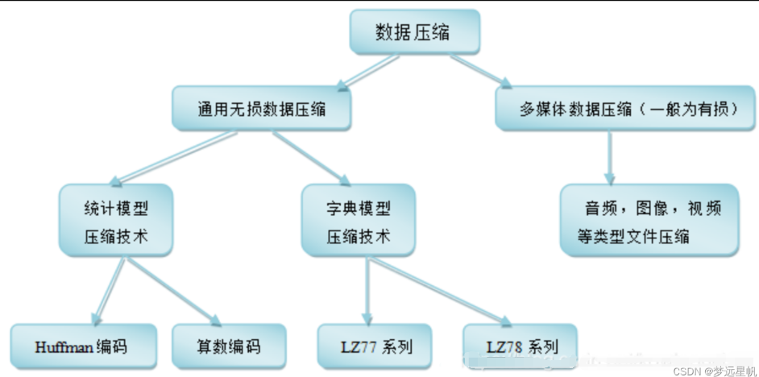
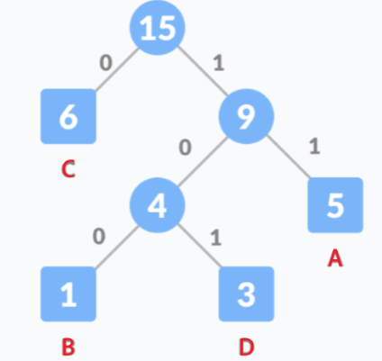
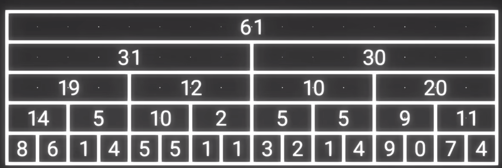
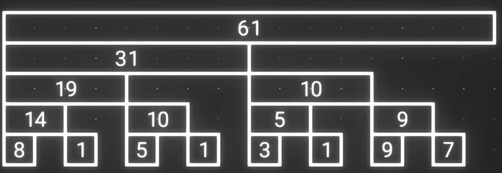
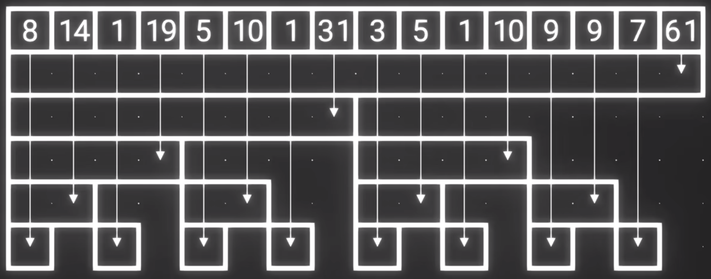
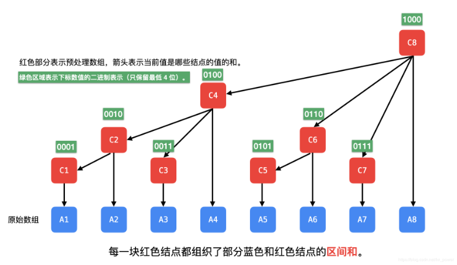

算法与SQL⭐️⭐️⭐️⭐️⭐️
Leetcode热门100题
在线编程热门100题
剑指offer的67题
leetcode的SQL练习


# 分治思想

- 存储数据范围为1-1w的列表，并在O(4)复杂度中查找数x
  - 将该列表元素根据hashcode模4分成2500类的集合，对x的hashcode模4， 在取余的结合中遍历

- 分治思想也出现在了
  - Redis集群
  - ElasticSearch
  - Hbase
  - HADOOP生态无处不在

- 归并排序


# 压缩算法



[字典压缩](https://blog.csdn.net/qq_45637260/article/details/126639481?ops_request_misc=%257B%2522request%255Fid%2522%253A%2522169287457616800213032252%2522%252C%2522scm%2522%253A%252220140713.130102334.pc%255Fblog.%2522%257D&request_id=169287457616800213032252&biz_id=0&utm_medium=distribute.pc_search_result.none-task-blog-2~blog~first_rank_ecpm_v1~rank_v31_ecpm-1-126639481-null-null.268^v1^koosearch&utm_term=%E5%AE%9E%E7%8E%B0LZW%E5%AD%97%E5%85%B8%E5%8E%8B%E7%BC%A9%E7%AE%97%E6%B3%95&spm=1018.2226.3001.4450)：基于滑动窗口，得到重复串的映射表

哈夫曼编码

- 如果我们通过转换成ASCII码对应的二进制数据将字符串 BCAADDDCCACACAC 通过二进制编码进行传输，那么**一个字符传输的二进制位数为 8bits**，那么总共需要 120 个二进制位；而如果使用哈夫曼编码，该串字符可压缩至 28位。

- 核心思想：统计字符出现的频率，出现频率越大，编码长度越小（高频字符进行短编码）；通过构建带权的哈夫曼树得到编码符号；树的构建为频率小的在左，大的在右；删掉最小的两个，和拿来再取最小的两个；两条边赋为0 1，路径为字符编码

  - 因为哈夫曼树是**带权路径长度最短的树**，权值较大的节点离根节点较近。而带权路径长度是指：树中所有的叶子节点的权值乘上其到根节点的路径长度，这与最终的哈夫曼编码总长度成正比关系的。

  

- 发送方要把**字符占用的比特**（一个字符8bits）和字符对应的**频率占用的比特**，连同编码结果都发送过去，从而便于解码

- 哈夫曼编码的不足：无法逼近香农提出的熵极限

  - 由出现概率计算信息熵x，熵表示平均每个符号用 x 个 bit 表示。

    > “AABABCABAB”整段字符一共 10 个字母，压缩极限为 10 * 1.361 = 13.61 个 bit，约等于 14 个 bit，而采用哈夫曼编码时，我们只压缩到了 15 个 bit。

算数编码(Arithmetic Coding)

- 核心思想：
  - 为了使最终二进制编码更短，就需要使得最终目标区间的范围更大。
  - 为了使最终目标区间的范围更大，就需要赋予高频字符更大的区间，低频字符更小的区间。

- 算法编码流程：“AABABCABAB”，A B C三个字符的出现概率分别为0.5 0.4 0.1

  - 按照字符串中每个字符的出现概率进行区间划分，[0,1)区间开始取目标区间，当前字符的目标区间是上一个选定区间下再取当前字符的出现概率（递归）

    | 当前字符 | 当前目标区间      |
    | -------- | ----------------- |
    | A        | [0, 0.5)          |
    | A        | [0, 0.25)         |
    | B        | [0.125, 0.225)    |
    | A        | [0.125, 0.175)    |
    | B        | [0.15, 0.17)      |
    | C        | [0.168, 0.17)     |
    | A        | [0.168, 0.169)    |
    | B        | [0.1685, 0.1689)  |
    | A        | [0.1685, 0.1687)  |
    | B        | [0.1686, 0.16868) |

  - 最终的目标区间中**选一个二进制表示最短的小数**（不知道该怎么选）

    > 从 [0.1686, 0.16868) 选一个二进制表示最短的小数。这里我们选定 0.16864013671875，二进制为：0.00101011001011，去掉整数位 0 以及小数点后，最终的二进制编码为 00101011001011，bit 长度为 14 位，比哈夫曼编码要更短 1 位。
    >
    > 小数转二进制：小数点后除2取整数
    >
    > 小数二进制转十进制小数：小数点后乘2的-i次求和

- 算法解码流程：先转成十进制小数，再一次根据目标区别从左到右递归转换成字符


# 树状数组







将n个元素的原始数组，保存奇数序号和元素前缀和，可以组成n个元素的新数组即构造出了树状数组



- 树状数组组织成的树是有层级的，序号二进制表示的最低位 1 后面的 0 的个数正好决定了当前结点在第i层，表示$2^i$段和（层数从下到上计）

- 这样组织数据，从叶子结点到父结点是可以通过一个叫做 lowbit 的函数计算出来，并且可以知道小于等于当前下标的同一层结点的所有结点

  - 负数的二进制等价于取反再加1；x与上-x得到只保留一个1的二进制，从而表示

  - ```lisp
    lowbit(x) = x & (-x) = x & (~x+1);
    ```

  - 计算前7个元素的前缀和，只需要累加树状数组中 0111 + 0110 + 0100 + 0000，对应序号7 6 4中存储的元素的和，表示当前值+2段和+4段和得到前7段和。复杂度立马从7个元素累加，变为3个元素累加

  - 任何前k段和可以拆解为由$2^i$段的和组成，只需要找到存储在树状数组中的这几段值，累加即可，查找过程只需消掉lowbit(i)表示的$2^{lowbit(i)}$段

  - 原始数组第i个元素更新值，需要把包含这个元素的$2^k$段累计和进行更新，对应添上lowbit(i)

  - ```java
    public class FenwickTree{
        
    	private int[] tree;
        private int len;
    
        public FenwickTree(int n) {
            // 空树状数组
            this.len = n;
            tree = new int[n + 1];
        }
        public FenwickTree(int[] nums) {
            // 原始数组转化为树状数组
            this.len = nums.length + 1;
            tree = new int[this.len + 1];
            for (int i = 1; i <= len; i++) {
                update(i, nums[i]);
            }
    	}
    
        public int query(int i) {
            // 从右到左查询
            int sum=0;
            while(i>0){
                sum += tree[i];
                i -= lowbit(i);
            }
        }
        public void update(int i, int delta){	
            // 从下到上更新
            while (i <= len){
                tree[i] += delta;
                i += lowbit(i);
            }
        }
        public static lowbit(i){
            return i & (-i);
        }
        
    }
    
    ```
    
    