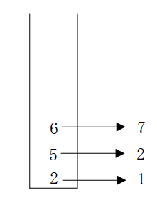

算法与SQL⭐️⭐️⭐️⭐️⭐️
Leetcode热门100题
在线编程热门100题
剑指offer的67题
leetcode的SQL练习


LeetCode 热题 100 

1. 108 最长连续序列
2. 和为 K 的子数组
3. [76. 最小覆盖子串](https://leetcode.cn/problems/minimum-window-substring/)
4. [41. 缺失的第一个正数](https://leetcode.cn/problems/first-missing-positive/)
5. [48. 旋转图像](https://leetcode.cn/problems/rotate-image/)
6. [240. 搜索二维矩阵 II](https://leetcode.cn/problems/search-a-2d-matrix-ii/)
7. [438. 找到字符串中所有字母异位词](https://leetcode.cn/problems/find-all-anagrams-in-a-string/)

# 排序

## 快速排序

思想：

- 属于交换排序，原地将不大于当前数pivot的放到左边，不小于pivot的放到右边
- 关键是交换和双指针的移动顺序，保证最后赋值的地方k就是第k大的pivot
  - 初始状态：赋值pivot，交换左右的值
  - 移动左指针，保证左指针的值不大于pivot，否则退出后**赋值给右指针的值**
  - 移动右指针，保证右指针的值不小于pivot，否则退出后**赋值给左指针的值**
  - 递归左右两边

复杂度：

- 时间复杂度O(nlogn)，最差退化为冒泡的O(n^2)
- 空间复杂度O(logn)，即递归次数（深度），最差是顺序的没法分治，退化为O(n)，需要递归n
  - 快排并没有开辟空间，但是使用了递归，递归会开辟栈帧
  - 递归算法的空间复杂度 = 每次递归的空间复杂度 * 递归深度
  - 每次递归所需要的空间大小都是一样的而且就算是第N次递归，每次递归所需的栈空间也是一样的，所以每次递归中需要的空间是一个常量，并不会随着n的变化而变化，每次递归的空间复杂度就是O(1)
  - 每次递归所需的空间都被压到调用栈里（压栈），所以快速排序的空间复杂度就是递归算法的空间复杂度 = 每次递归的空间复杂度O(1) * 递归深度

```python
def quicksort(l, r):
    if l >= r:
        return
    pivot = nums[l]
    nums[l], nums[r] = nums[r], nums[l]
    i, j = l, r # i j为移动的指针；l,r为递归的数组边界
    while i < j:
        print(i, j)
        while i < j and nums[i] <= pivot:
            i += 1
        nums[j] = nums[i]
        while i < j and nums[j] >= pivot:
            j -= 1
        nums[i] = nums[j]
    nums[i] = pivot
    print(nums)
    quicksort(0, i-1)
    quicksort(i+1, r)
```


## 堆排序

思想（以升序为例）：

- 使用数组建完全二叉树

- 每次维护一个大顶堆，每个父节点比他的左右孩子节点值要大，则为大顶堆

- 固定堆顶元素到最后，把最后一个元素替换到堆顶，再次维护大顶堆

- 左为初始建好的大顶堆；右为交换首尾元素，需进一步从堆顶调整（因为下面都是大顶子堆）

  

实现：

```python
class Solution(object):
    def heap_sort(self, nums):
        i, l = 0, len(nums)
        self.nums = nums
        # 构造大顶堆：从最后一个非叶子节点开始倒序遍历找孩子
        for i in range(l//2-1, -1, -1): 
            self.build_heap(i, l) 
        # 调整大顶堆：从根开始遍历找孩子，边界是j
        for j in range(l-1, -1, -1):
            # 每次堆排结果先交换根节点和尾节点
            nums[0], nums[j] = nums[j], nums[0] 
            self.build_heap(0, j)

        return nums

    def build_heap(self, i, l): 
        """构建大顶堆"""
        nums = self.nums
        left, right = 2*i+1, 2*i+2 ## 左右子节点的下标
        large_index = i 
        if left < l and nums[i] < nums[left]:
            large_index = left

        if right < l and nums[left] < nums[right]:
            large_index = right
 
        if large_index != i:
            nums[i], nums[large_index] = nums[large_index], nums[i]
            # 递归更新交换后的子堆
            self.build_heap(large_index, l)

```

复杂度：时间复杂度，O(nlogn)；空间复杂度，原地O(1)

- 建堆：从最后一个非叶节点开始，需要遍历所有元素，O(n)
- 调整堆：每次从根开始找一半O(logn)，循环(n-1)次，时间复杂度O((n-1)logn)

应用：海量数据中最大的TopK个元素，仅需要维护大小为K的小顶堆

- 每次把堆顶最小的元素A，替换为新来的比A大的元素B，这样遍历完完整数据，堆内的K个元素就是最大的K个
- 复杂度：O(K) + O(nlogK)，当K远小于n时，复杂度接近O(n)

# BST

删除二叉搜索树中的（值为val的）节点，返回根节点

递归的删除：

- 找到val的位置，将val右子树的最小值节点作为新的根节点successor，返回给当前根successor

- 为了递归完成后的root还是原来的root，遍历查找val时，需要左右孩子的递归返回值给root的左右子树

  ```python
      def deleteNode(self, root: Optional[TreeNode], key: int) -> Optional[TreeNode]:
          if not root:
              return None
              
          if root.val > key:
              root.left = self.deleteNode(root.left, key)
          elif root.val < key:
              root.right = self.deleteNode(root.right, key)
          # 递归到叶节点
          elif root.left is None or root.right is None:
              root = root.left if root.left else root.right
  
          elif root.val == key:
              successor = root.right
              while successor.left:
                  successor = successor.left
              successor.right = self.deleteNode(root.right, successor.val)
              # 先递归找到successor.right 再successor.left = root.left 否则破坏了右子树的最小值
              successor.left = root.left
              return successor
  
          return root
  ```

  


# 分治思想

- 存储数据范围为1-1w的列表，并在O(4)复杂度中查找数x
  - 将该列表元素根据hashcode模4分成2500类的集合，对x的hashcode模4， 在取余的结合中遍历

- 分治思想也出现在了
  - Redis集群
  - ElasticSearch
  - Hbase
  - HADOOP生态无处不在

- 归并排序


# 压缩算法


[字典压缩](https://blog.csdn.net/qq_45637260/article/details/126639481?ops_request_misc=%257B%2522request%255Fid%2522%253A%2522169287457616800213032252%2522%252C%2522scm%2522%253A%252220140713.130102334.pc%255Fblog.%2522%257D&request_id=169287457616800213032252&biz_id=0&utm_medium=distribute.pc_search_result.none-task-blog-2~blog~first_rank_ecpm_v1~rank_v31_ecpm-1-126639481-null-null.268^v1^koosearch&utm_term=%E5%AE%9E%E7%8E%B0LZW%E5%AD%97%E5%85%B8%E5%8E%8B%E7%BC%A9%E7%AE%97%E6%B3%95&spm=1018.2226.3001.4450)：基于滑动窗口，得到重复串的映射表

哈夫曼编码

- 如果我们通过转换成ASCII码对应的二进制数据将字符串 BCAADDDCCACACAC 通过二进制编码进行传输，那么**一个字符传输的二进制位数为 8bits**，那么总共需要 120 个二进制位；而如果使用哈夫曼编码，该串字符可压缩至 28位。

- 核心思想：统计字符出现的频率，出现频率越大，编码长度越小（高频字符进行短编码）；通过构建带权的哈夫曼树得到编码符号；树的构建为频率小的在左，大的在右；删掉最小的两个，和拿来再取最小的两个；两条边赋为0 1，路径为字符编码

  - 因为哈夫曼树是**带权路径长度最短的树**，权值较大的节点离根节点较近。而带权路径长度是指：树中所有的叶子节点的权值乘上其到根节点的路径长度，这与最终的哈夫曼编码总长度成正比关系的。

  

- 发送方要把**字符占用的比特**（一个字符8bits）和字符对应的**频率占用的比特**，连同编码结果都发送过去，从而便于解码

- 哈夫曼编码的不足：无法逼近香农提出的熵极限

  - 由出现概率计算信息熵x，熵表示平均每个符号用 x 个 bit 表示。

    > “AABABCABAB”整段字符一共 10 个字母，压缩极限为 10 * 1.361 = 13.61 个 bit，约等于 14 个 bit，而采用哈夫曼编码时，我们只压缩到了 15 个 bit。

算数编码(Arithmetic Coding)

- 核心思想：
  - 为了使最终二进制编码更短，就需要使得最终目标区间的范围更大。
  - 为了使最终目标区间的范围更大，就需要赋予高频字符更大的区间，低频字符更小的区间。

- 算法编码流程：“AABABCABAB”，A B C三个字符的出现概率分别为0.5 0.4 0.1

  - 按照字符串中每个字符的出现概率进行区间划分，[0,1)区间开始取目标区间，当前字符的目标区间是上一个选定区间下再取当前字符的出现概率（递归）

    | 当前字符 | 当前目标区间      |
    | -------- | ----------------- |
    | A        | [0, 0.5)          |
    | A        | [0, 0.25)         |
    | B        | [0.125, 0.225)    |
    | A        | [0.125, 0.175)    |
    | B        | [0.15, 0.17)      |
    | C        | [0.168, 0.17)     |
    | A        | [0.168, 0.169)    |
    | B        | [0.1685, 0.1689)  |
    | A        | [0.1685, 0.1687)  |
    | B        | [0.1686, 0.16868) |

  - 最终的目标区间中**选一个二进制表示最短的小数**（不知道该怎么选）

    > 从 [0.1686, 0.16868) 选一个二进制表示最短的小数。这里我们选定 0.16864013671875，二进制为：0.00101011001011，去掉整数位 0 以及小数点后，最终的二进制编码为 00101011001011，bit 长度为 14 位，比哈夫曼编码要更短 1 位。
    >
    > 小数转二进制：小数点后除2取整数
    >
    > 小数二进制转十进制小数：小数点后乘2的-i次求和

- 算法解码流程：先转成十进制小数，再一次根据目标区别从左到右递归转换成字符


# 树状数组


将n个元素的原始数组，保存奇数序号和元素前缀和，可以组成n个元素的新数组即构造出了树状数组


- 树状数组组织成的树是有层级的，序号二进制表示的最低位 1 后面的 0 的个数正好决定了当前结点在第i层，表示$2^i$段和（层数从下到上计）

- 这样组织数据，从叶子结点到父结点是可以通过一个叫做 lowbit 的函数计算出来，并且可以知道小于等于当前下标的同一层结点的所有结点

  - 负数的二进制等价于取反再加1；x与上-x得到只保留一个1的二进制，从而表示

  - ```lisp
    lowbit(x) = x & (-x) = x & (~x+1);
    ```

  - 计算前7个元素的前缀和，只需要累加树状数组中 0111 + 0110 + 0100 + 0000，对应序号7 6 4中存储的元素的和，表示当前值+2段和+4段和得到前7段和。复杂度立马从7个元素累加，变为3个元素累加

  - 任何前k段和可以拆解为由$2^i$段的和组成，只需要找到存储在树状数组中的这几段值，累加即可，查找过程只需消掉lowbit(i)表示的$2^{lowbit(i)}$段

  - 原始数组第i个元素更新值，需要把包含这个元素的$2^k$段累计和进行更新，对应添上lowbit(i)

  - ```java
    public class FenwickTree{
        
    	private int[] tree;
        private int len;
    
        public FenwickTree(int n) {
            // 空树状数组
            this.len = n;
            tree = new int[n + 1];
        }
        public FenwickTree(int[] nums) {
            // 原始数组转化为树状数组
            this.len = nums.length + 1;
            tree = new int[this.len + 1];
            for (int i = 1; i <= len; i++) {
                update(i, nums[i]);
            }
    	}
    
        public int query(int i) {
            // 从右到左查询
            int sum=0;
            while(i>0){
                sum += tree[i];
                i -= lowbit(i);
            }
        }
        public void update(int i, int delta){	
            // 从下到上更新
            while (i <= len){
                tree[i] += delta;
                i += lowbit(i);
            }
        }
        public static lowbit(i){
            return i & (-i);
        }
        
    }
    
    ```
    
    

# 滑动窗口

代码模板：虫取法，左右双指针遍历数组。左指针不动，右指针后移；**区间内不满足情况了**，右指针不动左指针后移

- 如果窗口的大小不是固定的，判断不满足区间的情况需要额外使用变量记录（求和、计数）
- 额外的变量可能是字典{K, V}，用V来记录窗口内K出现的次数，直接判断字典值，代替循环判断的复杂度

```python
def findSubArray(nums):
    left, right = 0, 0
    var = 0 # 窗口是否满足条件的中间判断变量
    res = 0 # 遍历过程中每次窗口中的值  子数组/串 个数/长度
    while right < len(nums):
        var := f(nums[right]) # 根据右指针值更新中间判断变量
        while var 不符合条件: # 更新右指针前 更新不符合条件的左指针
            var := f2(nums[left]) # 根据左指针值跟新中间判断变量 使之能继续
            left += 1
        res := f3(right, left) # 得到当前窗口的结果
        right += 1
    return res
```

时间复杂度，窗口的移动只会对数组的每个元素遍历两次，因此只需要线性的O(n)时间复杂度、和O(1)空间复杂度


# 单调栈

**跟寻找当前位置临近元素的方法都可以想到用栈来存元素**

维护一个栈，栈内元素从栈底开始是严格递增/递减的

应用：找出数组中任意元素左右两边最近且比它小的元素位置（**Next Greater/Smaller**）

- 遍历一遍数组，当前元素比栈顶元素大，push到栈中；**否则pop栈顶元素，返回答案：**该元素的左右比他小的最近元素即为当前元素和栈顶第二个元素（栈里头可以存放下标，或者题目不要求返回下标，直接存放数组元素）；另外，遍历完毕后，栈内若还有元素，pop栈顶元素，只有左侧存在栈顶第二个元素是比他小的，右侧没有

- 时间复杂度O(n)，不需要多次找

- 示例：

  - 输入： arr = [3,4,1,5,6,2,7]

  - 返回：{[-1, 2], [0, 2], [-1, -1], [2, 5], [3, 5], [2, -1], [5, -1]}

    <table style="display: flex; justify-content: center;">
      <tr>
        <td>
          
        </td>
        <td>
          
        </td>
      </tr>
    </table>

- 反之找到比他大的话，维护一个入栈递减的单调栈


[示例2](https://leetcode.cn/problems/trapping-rain-water/description/)：


- 转换为找到当前位置i，比height[i]大的next左边界l和右边界r
  - 计算左右边界的高度，同时为了避免重复，需要减去当前height[i]得到位置i之上的面积
  - $area = (r-l-1)*(min(height[l], height[r]) - height[i])$

- 遍历寻找左右边界的过程是维护**栈底到栈顶递减**的单调栈

[示例3](https://leetcode.cn/problems/0ynMMM/description/)：


- 转换为**计算当前位置i的最大矩形面积**，再取最大
  - 找到最近的比height[i]小的左边界l 和右边界r，则中间一段为最大结果
  - 当前位置i的最大矩形面积：$area = height[i]* (r-l-1)$
- 遍历寻找左右边界的过程是维护**栈底到栈顶递增**的单调栈

[示例4](https://leetcode.cn/problems/PLYXKQ/description/)：二维数组的寻找next左右边界


- 核心是连续的矩形，当前列位置连续1的高度不大于左右位置连续1的高度
  - 以每行为x轴的话, 那从x轴往上连续的1就是高度
  - 遍历逐行计算高度，记录next左右边界
  - 根据**示例3**中计算当前位置i的最大矩形面积的方法得到最大全为1的矩形

```
1 0 1 0 0
2 0 2 1 1
3 1 3 2 2
4 0 0 3 0
```


# 单调队列

维护一个队列，满足队头到队尾是非严格的单调关系

- 可用来寻找滑动窗口中的最大值

  - 队头为最大，逐窗口进队，出窗口出队
  - 避免出队后，重复寻找该窗口内的次小值

  

