大数据架构底层核心技能⭐️⭐️⭐️⭐️

JAVA：Java高级(虚拟机JVM、多线程&高并发、网络通信IO）

PYTHON

SCALA

SQL以及基本调优，主要是Hive SQL


HiveSQL： https://www.bilibili.com/video/BV1og4y1w7W3/?p=108&share_source=copy_web&vd_source=b0c3cad8671d1f2fa75d01a0a18e195c


# JAVA 

```java
public void func(int... args){} // int... 表示可以传递任意多个int作为args，args会变成数组，类似python中的**
```

`volatile`关键字

- 可见性（Visibility）：当一个线程修改了一个`volatile`变量的值时，**这个新值对其他线程是立即可见**的。换句话说，当一个线程修改了`volatile`变量的值，它会立即将该值刷新到主内存，使得其他线程可以看到最新的值。
- 禁止指令重排序（Ordering）：`volatile`变量的读写操作具有禁止指令重排序的效果。编译器和处理器**不能对`volatile`变量的读写操作进行重排序**，这样可以确保变量的读写操作按照代码的顺序执行。
  - **读写操作的重排序**指的是编译器或处理器在执行指令时，可能会改变原始代码中读写操作的顺序，以优化程序执行效率。重排序的目的是通过重新排列指令的执行顺序来提高指令级并行性和处理器的利用率，从而加快程序的执行速度。

`final`关键字，用于修饰类、方法和变量不可修改

- 修饰类，该类不可被继承
- 修饰方法，该方法不可被重载
- 修饰变量，

## JDK JRE JVM

Java程序是运行在JVM([Java虚拟机](https：//so.csdn.net/so/search?q=Java虚拟机&spm=1001.2101.3001.7020))上的，在开发程序之前要配置Java开发环境，而配置环境要做的就是JDK的安装和配置。

三者的大致结构是这样的，简单来说就是JDK包含JRE，JRE又包含JVM的关系。如下图所示：

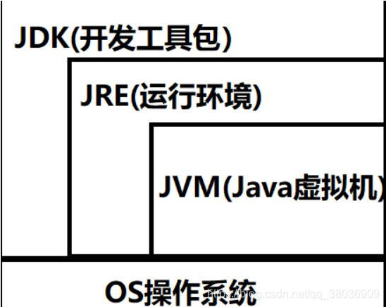

- JDK：Java Development Kit 是Java的标准开发工具包，普通用户只需要安装 JRE来运行 Java 程序。而程序开发者必须安装JDK来编译、调试程序。它提供了编译、运行Java程序所需的各种工具和资源，包括Java编译器、Java运行环境JRE，以及常用的Java基础类库等，是整个JAVA的核心。
- JRE：Java runtime environment 是运行基于Java语言编写的程序所不可缺少的运行环境，用于解释执行Java的字节码文件。也是通过它，Java的开发者才得以将自己开发的程序发布到用户手中，让用户使用。JRE中包含了Java virtual machine（JVM），runtime class libraries和Java application launcher，这些是运行Java程序的必要组件。与大家熟知的JDK不同，JRE是Java运行环境，并不是一个开发环境，所以没有包含任何开发工具（如编译器和调试器），只是针对于使用Java程序的用户。
- JVM：Java Virtual Machine 是Java的虚拟机，是JRE的一部分（JVM=JRE的bin）。它是**整个java实现跨平台的最核心的部分，负责解释执行字节码文件，是可运行java字节码文件的虚拟计算机**。所有平台的上的JVM向编译器提供相同的接口，而编译器只需要面向虚拟机，生成虚拟机能识别的代码，然后由虚拟机来解释执行。


## JAVA的类、接口、泛型

类用于描述具体的对象和实现具体的功能，而接口用于定义规范和行为契约，以便实现类来实现和提供具体的功能。

类提供了更具体和具有实现细节的功能，而接口更加抽象和灵活，可以用于实现多个类之间的共享行为。

泛型的好处是在编译的时候**检查类型安全**，并且所有的强制转换都是自动和隐式的， 以提高代码的重用率。 

- 不加`<String>`指定List的存放数据的类型，会无法加入字符串元素，因为默认只能加`Object`对象，只能接收父类，不能接收子类对象

  ```java
  // 编译时报warning 但可以运行
  public class HelloWorld {
      public static void main(String[] args) {
  		java.util.ArrayList list = new java.util.ArrayList();
  		list.add("Java Programming"); 
  		list.add(123);  
  		list.add(true); 
  		for (Object o ： list){
  			System.out.println(o);
  		}
  	}
  }
  // 指定泛型 编译也没问题 但没法再加其他类型的元素
  public class test {
      public static class ShowUncheckedWarning {
          public static void main(String[] args) {  
              java.util.ArrayList<String> list = new java.util.ArrayList<String>();
              list.add("Java Programming");
          }
      }
  }
  ```

- 泛型类：使用引入类型作为类的全局对象

  ```java
  public class Person<T> {
      private T t;
  
      public Person(T t) {
          this.t = t;
      }
  
      public String toString() {
          return "参数的类型是：" + t.getClass().getCanonicalName();
      }
  }
  
  package Generic;
  
  // 继承父类的泛型 子类就可以与父类一起共享类型参数
  public class Teacher<T， S> extends Person<T> {
      protected T t;
      private S s;
  
      public Teacher(T t) {
          super(t);
      }
  
      public void set(T t， S s) {
          this.t = t;
          this.s = s;
      }
  }
  ```

- 泛型接口：其实和泛型类功能上差不多，以下是一个具体的例子

  ```java
  public interface Factory<T> {
      public T create();
  }
  public class Car {
  }
  public class Computer {
  }
  
  public class CarFacotry implements Factory<Car> {
      @Override
      public Car create() {
          System.out.println("装载发动机！");
          System.out.println("装载座椅！");
          System.out.println("装载轮子！");
          return new Car();
      }
  }
  public class ComputerFactory implements Factory<Computer> {
      @Override
      public Computer create() {
          System.out.println("装载主板！");
          System.out.println("装载CPU!");
          System.out.println("装载内存");
          return new Computer();
      }
  }
  ```

  

- 泛型方法：为方法声明一个类型参数，通过`.newInstance()`反射方法，创建返回实例

  ```java
  import java.util.Date;
  
  public class Factory {
      //    定义泛型方法
      public <T> T generator(Class<T> t) throws Exception {
          return t.newInstance();
      }
  
      //  使用泛型方法
      public static void main(String[] args) throws Exception {
          Date date = new Factory().generator(Date.class);
          System.out.println(date);
      }
  }
  ```

  泛型确保了类型的准确性 ，可以使用该方法生成任何继承自Object类的实例。 然前提是该类有无参构造方法。

- 反射机制

  - 优点
    - 增加程序的灵活性，可以在运行的过程中动态对类进行修改和操作
    - 提高代码的复用率，比如动态代理，就是用到了反射来实现
    - 可以在运行时轻松获取任意一个类的方法、属性，并且还能通过反射进行动态调用
  - 缺点
    - 反射会涉及到动态类型的解析，所以JVM无法对这些代码进行优化，导致性能要比非反射调用更低。
    - 使用反射以后，代码的可读性会下降
    - 反射可以绕过一些限制访问的属性或者方法，可能会导致破坏了代码本身的抽象性和安全性


## JAVA数组排序

https：//blog.csdn.net/m0_59408612/article/details/131824320

https：//blog.csdn.net/qq_41030039/article/details/100176410/

`Arrays.sort(数组arr， int formIndex（起始位置）， int toIndex（终止位置)`

使用`Collections.reverseOrder()`参数进行降序时，数组不能是基本数据类型（String不是基本数据类型）

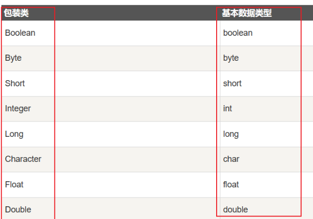

```java
// int类型的一维数组 降序时需要装箱为Integer的包装类
Integer[] boxedArray = Arrays.stream(arr).boxed().toArray(Integer[]：：new);
Arrays.sort(boxedArray， Collections.reverseOrder());
```

## 重载排序

`a`也不能是基本数据类型，需要时一个类

```java
Arrays.sort(a， new Comparator<Integer>() {
    @Override
    public int compare(Integer o1， Integer o2) {
        return o2 - o1;
    }
});
// 降序
Arrays.sort(a， new Comparator<Integer>() {
    @Override
    public int compare(Integer o1， Integer o2) {
        return o2 - o1;
    }
});
```

lambda表达式

```java
Arrayssort(intarr， (Integer a， Integer b)->{return a-b;});
Arrays.sort(strs， (String first， String second) ->
{
    if(first.length() < second.length()) return -1;
    else if(first.length() > second.length()) return 1;
    else return 0;
});
```

如果排序比较器太长，单独写成一个类，再声明对象传入给sort()

1. **内部比较器：** 需要比较的对象必须实现Comparable接口，并重写compareTo(T o)方法，表明该对象可以用来排序，**否则不能直接使用**Arrays.sort()方法。

   ```java
   public class Employee implements Comparable<Employee> { 
           // 比较此对象与指定对象的顺序  
       
       // get set 成员属性
       
       @Override  
       public int compareTo(Employee o) {  
           // 比较员工编号，如果此对象的编号大于、等于、小于指定对象，则返回1、0、-1  
           int result = this.id > o.id ? 1 ： (this.id == o.id ? 0 ： -1);  
           // 如果编号相等，则比较薪资  
           if (result == 0) {  
               // 比较员工薪资，如果此对象的薪资大于、等于、小于指定对象，则返回1、0、-1  
               result = this.salary > o.salary ? 1 ： (this.salary == o.salary ? 0 ： -1); 
           }  
           return result;  
       }   
   }
   ```

   ```java
   	public static void main(String[] args) {  
           List<Employee> employees = new ArrayList<Employee>();  
           employees.add(new Employee(2， 5000));  
           employees.add(new Employee(1， 4500));  
           employees.add(new Employee(4， 3500));  
           employees.add(new Employee(5， 3000));  
           employees.add(new Employee(4， 4000));  
           // 内部比较器：要排序的对象要求实现了Comparable接口 ，直接传入该对象即可
           Arrays.sort(employees);  
           System.out.println("通过内部比较器实现：");  
           System.out.println(employees);  
   	}
   ```

2. **外部比较器**： 需要自己写一个比较器实现Comparator接口，并实现compare(T o1， T o2)方法，根据自己的需求定义比较规则。**使用外部比较器这种方式比较灵活**，例如现在需求是按照员工编号和薪资进行排序，以后可能按照姓名进行排序，这时只要再写一个按照姓名规则比较的比较器就可以了。

   ```java
   class EmployeeComparable implements Comparator<Employee> {  
       // 不需要对象预选有比较方法，要用到再定义比较器
       @Override  
       public int compare(Employee o1， Employee o2) {  
           // 比较员工编号，如果此对象的编号大于、等于、小于指定对象，则返回1、0、-1  
           int result = o1.getId() > o2.getId() ? 1 ： (o1.getId() == o2.getId() ? 0 ： -1);  
           // 如果编号相等，则比较薪资  
           if (result == 0) {  
               // 比较员工薪资，如果此对象的薪资大于、等于、小于指定对象，则返回1、0、-1  
               result = o1.getSalary() > o2.getSalary() ? 1 ： (o1.getSalary() == o2.getSalary() ? 0 ： -1);  
           }  
           return result;  
       }  
   } 
   public class TestEmployeeCompare {  
   	public static void main(String[] args) {  
           List<Employee> employees2 = new ArrayList<Employee>();  
           employees2.add(new Employee(2， 5000));  
           employees2.add(new Employee(1， 4500));  
           employees2.add(new Employee(4， 3500));  
           employees2.add(new Employee(5， 3000));  
           employees2.add(new Employee(4， 4000));  
           // 外部比较器：自定义类实现Comparator接口  ，需要传入自定义比较器类
           Arrays.sort(employees2， new EmployeeComparable());  
           System.out.println("通过外部比较器实现：");  
           System.out.println(employees2);  
       }  
   }
   ```

   

## 字符串正则

- 匹配字符串中的**数字**：`\d`
  示例：`String regex = "\\d";`
  
- 匹配字符串中的**字母**：`\p{Alpha}`
  示例：`String regex = "\\p{Alpha}";`
  
- 匹配字符串中的**空格**：`\s`
  示例：`String regex = "\\s";`
  
  ```java
  // 连续空格的字符串按"\\s+"切割后 会得到一个空字符串元素 按"\\s"切割后会有多个空字符串元素
  String[] data = s.split("\\s+");
  ```
  
  
  
- 匹配字符串中的**单词**：`\w`
  示例：`String regex = "\\w";`

- 匹配字符串中的**非单词字符**：`\W`
  示例：`String regex = "\\W";`

- 匹配字符串中的**任意字符**：`.`
  示例：`String regex = ".";`

- 匹配字符串中的**重复字符**：`+`
  示例：`String regex = "a+";`

- 匹配字符串中的**特定字符集合**：`[]`
  示例：`String regex = "[abc]";`

- 匹配字符串中的**数字范围**：`[0-9]`
  示例：`String regex = "[0-9]";`

使用`.matches`方法和`Pattern`类

```java
import java.util.regex.*;

public class Main {
    public static void main(String[] args) {
        String input = "Hello， World!";

        // 使用 matches() 方法进行匹配
        boolean isMatch = input.matches("Hello.*");
        System.out.println("匹配结果： " + isMatch); // true

        // 使用 Pattern 和 Matcher 进行匹配
        Pattern pattern = Pattern.compile("World");
        Matcher matcher = pattern.matcher(input);
        boolean isFound = matcher.find(); // true
        System.out.println("查找结果： " + isFound);
    }
}
```


# 网络通信

## IO模型

读取文件的模型：在发起读取文件的请求时，应用层会调用系统内核的I/O接口。

阻塞/非阻塞

- 前者应用层调用阻塞IO，一直等到系统内核从磁盘读取完数据并返回给应用层，应用层（才用获得的数据进行）继续加下来的操作。**请求者被挂起无法执行其他操作**
- 后者应用层调用非阻塞IO，系统内核会立即返回（虽然还没有文件内容的数据），应用层并不会被挂起，它可以做其他任意它想做的操作。（至于文件内容数据如何返回给应用层，这已经超出了阻塞和非阻塞的辨别范畴。）。**请求者可以执行其他操作**
- 阻塞和非阻塞关注的是等待任务完成时请求者的状态。

同步/异步（系统内核获取到的数据到底如何返回给应用层）

- 前者应用层不管处于何种状态，都需要自己去向系统内核问询，数据是否读取完毕
- 后者应用层无需主动向系统内核问询，在系统内核读取完文件数据之后，会主动通知应用层数据已经读取完毕
- 同步和异步关注的是任务完成消息通知的机制

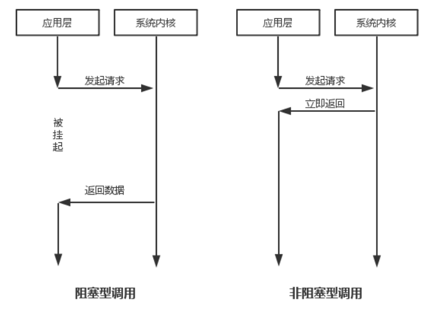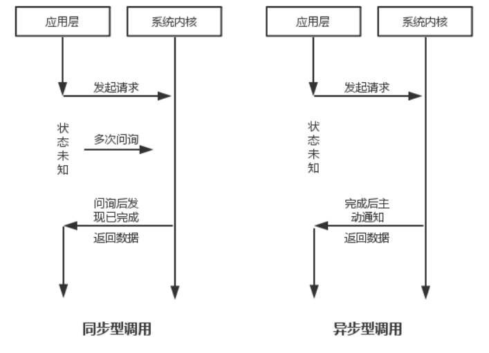


**BIO同步阻塞模型**

- 一个连接对应一个处理线程，如果服务端使用单线程进行处理，后续连接将会一直阻塞

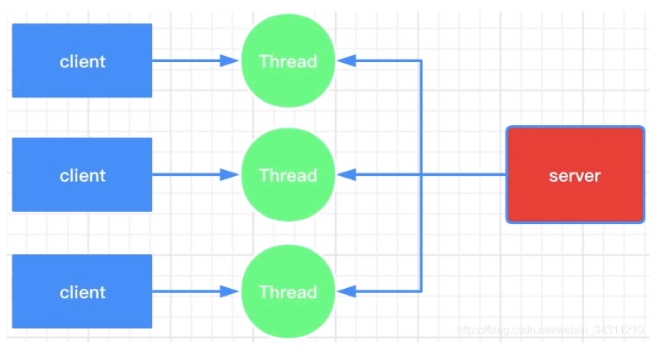

- 缺点：.accept()方法和.read()方法都会带来阻塞，会造成线程资源的浪费；连接数过多造成服务器压力过大，可采用线程池勉强解决
- BIO适用于连接数少且固定的架构，这种模式对服务器资源要求较高，但程序复杂度低

**NIO同步非阻塞模型**

- Channel、Buffer、Selector三大组件。Channel是建立C和S双向读写的通道，代替输入和输出的Stream读，写数据写在Buffer中；客户端想要连接时需要在Selector上注册Channel，Selector轮询Channel上的状态，状态满足则给服务端调用
  - Channel上的的C请求连接状态和C/S请求读状态
- 非阻塞：**把阻塞以轮询方式转移到了Selector，使用单个线程来处理多个连接，而不像BIO多个线程处理多个连接，阻塞时浪费线程**（即多路复用）
  - selector轮询发现有连接请求状态，说明有C连接到S了-->给S去.accept()连接，不影响后续代码
  - selector轮询发现有读请求状态，说明C/S的写入数据写好了-->C/S .read()读取数据，不影响后续代码
- 多通道带来的串行/并行处理请求
  - 单线程串行处理：按照轮询顺序，把状态OK的Channel挨个进行处理
  - 多线程并行处理：Selector每遍历到一个状态OK的Channel，直接创建一个线程去处理（**涉及到CPU的调度**，哪个先执行不知道）
- 水平触发和边缘触发：当前读事件（Channel中的数据发生了变化）通知后，服务端是否将数据从Buffer中全部读取，若没有，前者将会一直通知，一直触发读事件的方法，直到Buffer中的数据读完；后者Channel中一次数据变化只会通知一次，只响应一次读事件方法

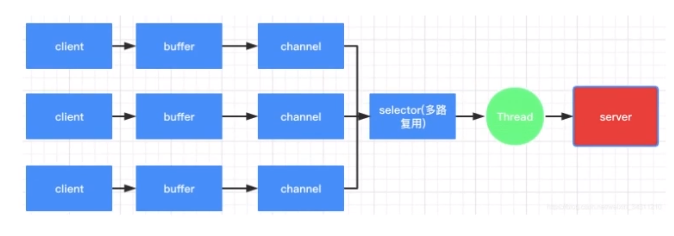

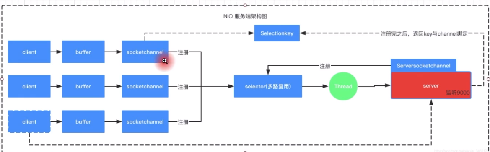

- 常用多路复用实现的API

  |          | select | poll   | epoll(jdk 1.5及以上) |
  | -------- | ------ | ------ | -------------------- |
  | 操作方式 | 遍历   | 遍历   | 回调                 |
  | 底层实现 | 数组   | 链表   | 哈希表               |
  | IO效率   | O(n)   | O(n)   | O(1)                 |
  | 最大连接 | 有上限 | 无上限 | 无上限               |

  - select和poll的实现，会遍历连接到服务器的所有客户端channel，会有大量无效的遍历；但后者客户端的连接数无上限 
  - epoll采用**消息通知机制**：当操作系统内核监测到一次I/O操作发生它如何具体地通知到哪个线程调用哪段程序
    - 某个客户端发送消息到服务器的时候，我们需要尽快知道哪个线程关心这条消息
    - epoll红黑树（注册+消息推送），可以帮助我们节省大量定位具体线程以及事件类型的时间
    - epoll是Linux操作系统的内部的网络IO实现，涉及到Linux内核函数实现，使用中断程序实现channel集合的添加和监听

**AIO异步非阻塞模型**

- 异步：不用主动轮询数据有没有，OS通知服务端程序启动线程处理（JDK7以上），AIO通过回调函数封装了NIO的了.accept()，.read()方法（Netty框架也封装了NIO的连接建立、事件注册感知和Buffer的flip等，对应channelActive方法和channelRead方法，只需要管收到什么数据，对数据进行业务逻辑开发）
- 一般用于连接数较多，且连接时间较长的应用
- 实现简单：服务端重载鉴定回调函数completed()，写业务逻辑代码即可，不需要循环进行轮询
- 使用多线程来模拟异步非阻塞

IO模型对比

|          | BIO      | NIO                    | AIO        |
| -------- | -------- | ---------------------- | ---------- |
| IO模型   | 同步阻塞 | 同步非阻塞（多路复用） | 异步非阻塞 |
| 编程难度 | 简单     | 复杂                   | 复杂       |
| 可靠性   | 差       | 好                     | 好         |
| 吞吐量   | 低       | 高                     | 高         |


## Netty

作为应用的底层通信组件：

- 大多数中间件和rpc框架的底层通信组件，如dubbo，rocket mq

- 游戏账号服务器和地图服务器之间的通信

- Hadoop、[Spark](https：//blog.csdn.net/u014445499/article/details/111048106)和序列化组件avro的rpc框架 之间的通信组件

  >使用Netty进行基于WebSocket协议的即时通讯（IM），请求、握手、通道的关系如下
  >
  >- 请求是客户端发起的初始 HTTP 请求
  >  - HTTP（Hypertext Transfer Protocol）是一种用于在客户端和服务器之间传输数据的协议。它是一种无状态协议，每个请求和响应都是相互独立的。HTTP 协议通常用于传输网页、图像、视频等静态资源。
  >- 握手是在请求和通道之间进行的一系列协商和协议步骤，确保客户端和服务器都支持 WebSocket，并建立双方之间的通信通道
  >  - WebSocket 是一种在单个 TCP 连接上进行全双工通信的协议。与 HTTP 不同，WebSocket 协议允许客户端和服务器之间进行实时的双向通信，而不仅仅是请求-响应模式。WebSocket 协议适用于需要实时交互和即时通信的应用程序，如聊天应用、实时游戏等。
  >- 通道是在 WebSocket 连接建立成功后，在客户端和服务器之间建立的双向通信通道。

封装了NIO的连接建立、事件注册感知和Buffer的flip等，对应处理器的channelActive方法和channelRead等方法，只需要管收到什么数据，对数据进行业务逻辑开发

优化了NIO，使用主从线程（池）模型（包含Selector）和ByteBuf（代替JDK自带的ByteBuffer）

### Reactor响应式编程模型

将IO事件分发给特定的处理器（dispatch to appropriate handler）使用Selecto使用epoll的内核函数进行于事件响应的编程模型

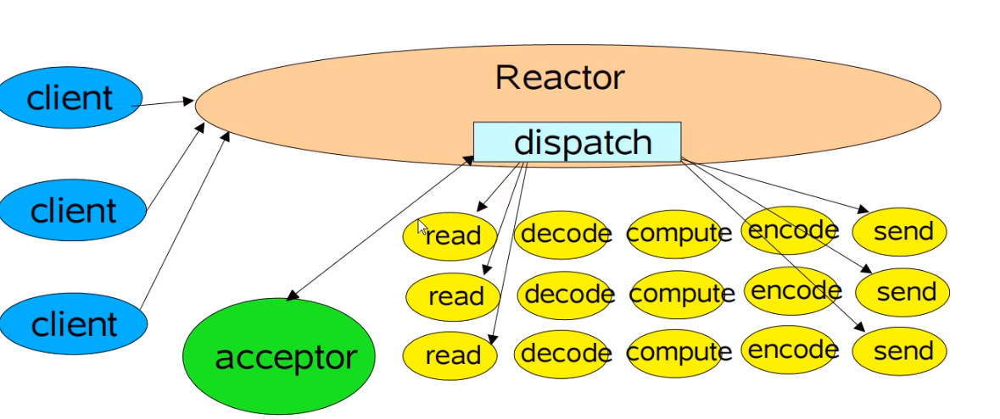

单个Reactor，可能无法处理过多的连接，使用主从多个Reactor，主Reactor，一般只有一个，专门做连接事件的响应；从Reactor做读写事件的响应，从Reactor有多个，专门处理该组的IO事件

- 一个Reactor对应一个JVM线程

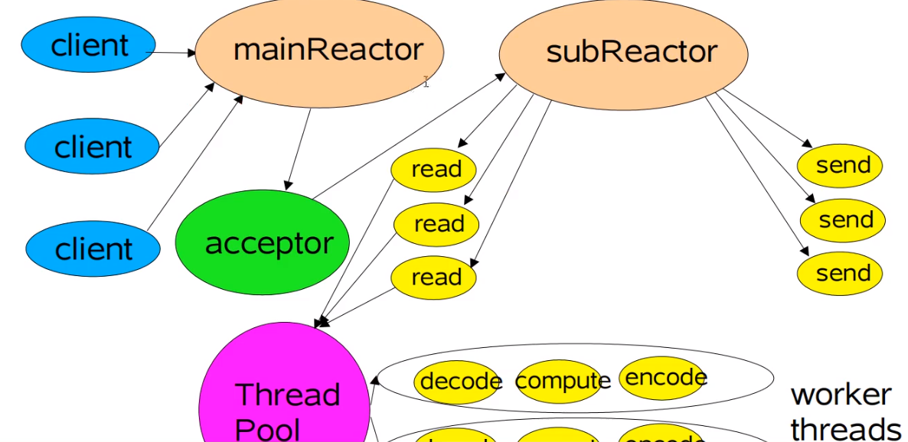

Netty的线程模型

- IO任务：accept（S）、connect（C）、read、write；非IO任务：注册、绑定
- NioEventLoop类内置selector，使用单个线程对多个客户端channel进行事件的响应；任务队列，支持异步提交任务，并从队列中取出任务异步执行
- 使用Pipeline，依次添加不同处理器，顺序执行，完成对channel中数据的的入站和出站操作

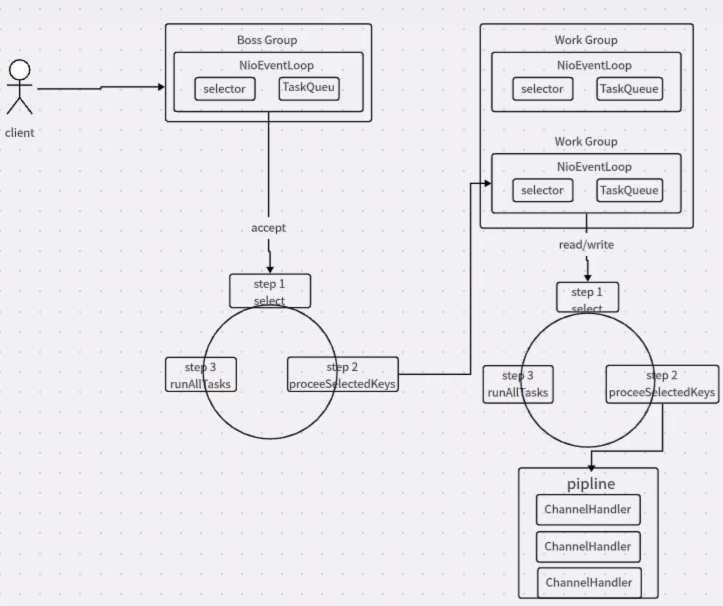

### ByteBuf

为什么需要Buffer

- 使用`FileInputStream`或者`FileOutputStream`类来文件读写，需要在用户态和内核态的切换，从而将数据从写入内核，再从内核复制到磁盘。频繁切换导致读写效率下降

  > 操作系统将内存分为用户空间和内核空间，用户空间是应用程序运行的环境，而内核空间是操作系统内核执行的环境。这两个空间具有不同的访问权限和保护机制。
  >
  > 访问权限：应用程序《--拷贝--》用户空间《--拷贝--》内核空间--拷贝--》磁盘
  >
  > 读和写都需要两次数据拷贝

- 使用Buffer，当Buffer中的数据达到8kb时才开始写入文件

  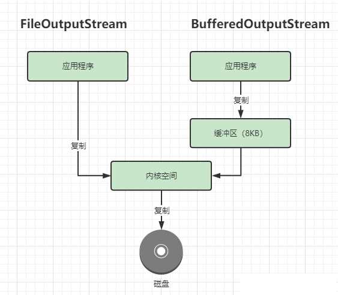

常用的Buffer就是JDK NIO类库提供的java.nio.Buffer（基本上每个基本的数据类型都有Buffer子类实现），维护三个主要的变量下标，实现读和写

- 初始化和`.clear()`指针下标复位

  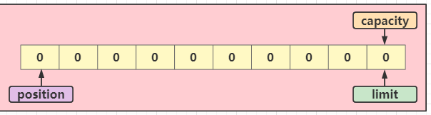

- 读模式`.get()`

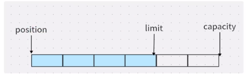

- 写模式`.put()` `Buffer.wrap()`

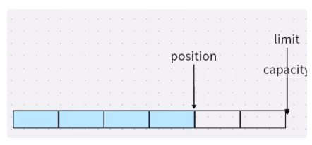

- 注意：**在任何情况下，都不能写入或读取超过`(limit - position)`个位置**

- 缺点：

  - 缓冲区长度固定，不能动态扩容和收缩

  - 需要手动调用`flip()`或`rewind()`方法进行读写模式切换（移动指针）（其中的`mark`标记变量，对应`reset()`方法，可以将读指针退回到该标记位置，有`mark <= position <= limit <= capacity`）

    ```java
    public final Buffer flip() {
        limit = position;
        position = 0;
        mark = -1;
        return this;
    }
    public final Buffer rewind() {
        position = 0;
        mark = -1;
        return this;
    }
    ```

  - API功能有限，需要手动实现

- 常见写法

  ```java
  ByteBuffer allocate = ByteBuffer.allocate(1024);
  // write
  allocate.put("zzj".getBytes());
  // read
  allocate.flip(); // 先切换为读模式
  ByteBuffer byteBuffer = allocate.get(allocate.remaining());
  System.out.println(new String(byteBuffer));
  ```


ByteBuf的改进

- 维护两个变量（writeIndex readIndex，读写指针下标），将缓冲区分为三个区域（可写区域、可读区域、可丢弃区域），读写时不需要翻转

  - 丢弃时，需要前移，维护性能比较差

  - 常用API

    ```java
    writeByte(int value)  // 写入一个字节。
    writeBytes(byte[] src) // 将字节数组中的数据写入到缓冲区。
    writeBytes(byte[] src， int srcIndex， int length) // 将字节数组中指定位置和长度的数据写入到缓冲区。
    writeInt(int value) // 写入一个整型值（4字节）。
    
    readByte() // 读取一个字节并返回。
    readBytes(byte[] dst) // 将字节数据从缓冲区读取到目标字节数组中。
    readBytes(byte[] dst， int dstIndex， int length) // 将指定长度的字节数据从缓冲区读取到目标字节数组的指定位置。
    readInt() // 读取一个整型值（4字节）并返回。
    ```

- 动态扩容

  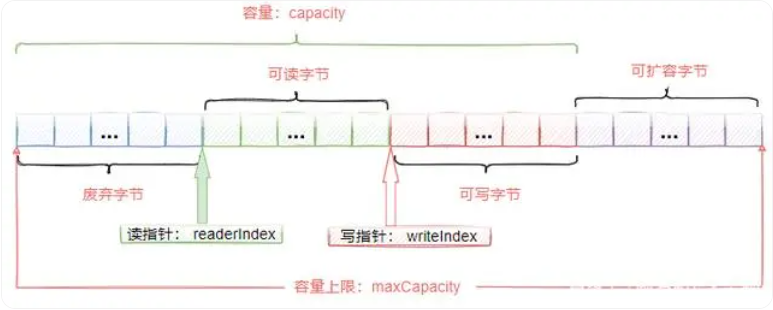

- 支持内存池（称为池化），可以加快效率和提高减少资源消耗（比普通的ByteBuf性能提高了数十倍）

  - 池化之后，只有首次创建对象会进行内存区域的`实例化` → `初始化`→`引用赋值`，默认大小16MB，以后使用的时候就直接使用首次创建的对象（**使用同一块内存空间**）就可以了

  - 初始化时，与ByteBuffer相同，有堆内内存和直接内存的分配；再根据是否池化有4种ByteBuf的初始化方式

    >堆内存和堆外内存：
    >
    >1. 基于堆内存 HeapByteBuf
    >
    >   ```java
    >   ByteBuf buffer=ByteBufAllocator.DEFAULT.heapBuffer(10);
    >   ```
    >
    >   内存分配和回收速度快，可以交由JVM进行回收
    >
    >   缺点是如果进行Socket的I/O读写，需要额外进行一次内存复制，将堆内存对应的缓冲区复制到内核Channel中，性能有一定的下降
    >
    >2. 基于直接内存（堆外内存）的DirectByteBuf（**默认情况下用的是这种**）
    >
    >   ```java
    >   ByteBufAllocator.DEFAULT.directBuffer(10);
    >   ```
    >
    >   - 堆外内存就是把内存对象分配在JVM堆以外的内存区域，这部分内存不是JVM管理，而是由操作系统来管理，这样**可以减少垃圾回收对应用程序的影响**
    >   - 内存分配和回收速度会慢一些，但是进行Scoket I/O读写时，减少了一内存复制，速度比堆内存快。
    >   - 缺点：由于缺少了JVM的内存管理，所以需要我们自己来维护堆外内存，防止内存溢出。
    >
    >HeapByteBuf和DirectByteBuf这两种内存分配方式各有利弊，比较推荐的做法是在I/O通信线程的读写缓冲区使用直接内存，在业务消息的编解码模块使用对内存分配方式。

- 零拷贝（零拷贝不是不拷贝，而是减少拷贝的次数）

  - 堆外本地内存+sendfile()内核函数：默认使用堆外本地内存创建，再底层调用了sendfile()内核函数（`FileChannel.transferTo()`函数），直接将文件缓冲区的数据发送到目标Channel（Socket），避免了文件数据的CPU拷贝过程。

  > [各种CPU零拷贝，提高性能的方法](https：//baijiahao.baidu.com/s?id=1769186849807925293&wfr=spider&for=pc)
  >
  > - 关键方法：
  >   - **用户态直接 I/O** ：使得应用进程或运行在用户态（user space）下的库函数直接访问硬件设备。只能适用于不需要内核缓冲区处理的应用程序，这些应用程序通常在进程地址空间有自己的数据缓存机制，称为自缓存应用程序，如数据库管理系统 就是一个代表。
  >   - **写时复制**：需要写操作的时候再拷贝，只是读操作没必要拷贝
  >   - **减少CPU拷贝次数**：
  >
  > 网络IO中的读写拷贝(read write系统调用)，整个过程需要两次DMA拷贝，两次CPU拷贝，四次上下文切换（用户空间<-->内核空间）。总共四次拷贝，四次切换。
  >
  > 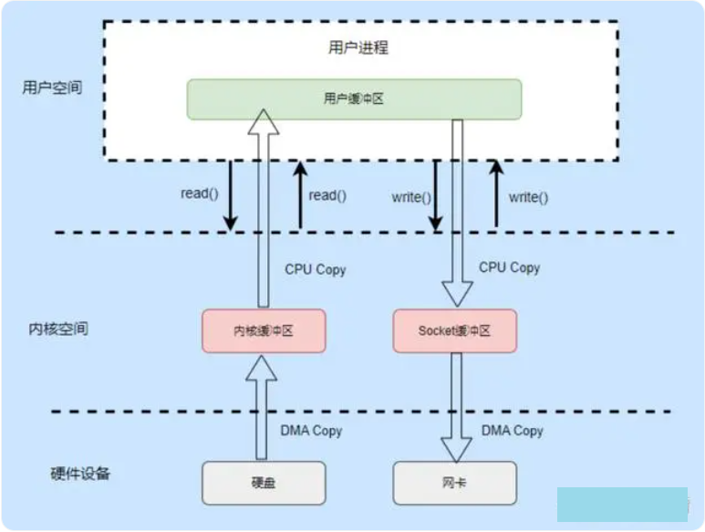
  >
  > - DMA拷贝：为了减少拷贝带来的CPU占用，产生了DMA技术，DMA 的全称叫直接内存存取（Direct Memory Access），**允许外围设备（硬件子系统）直接访问系统主内存的机制**。
  >
  > - 目前大多数的硬件设备，包括磁盘控制器、网卡、显卡以及声卡等都支持 DMA 技术。
  >
  > 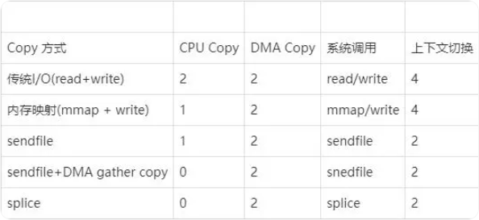
  >
  > - **Kafka**底层基于**java.nio**包下的**FileChannel.transferTo()**实现零拷贝。Kafka Server基于FileChannel将文件中的消息数据发送到SocketChannel。
  > - RocketMQ基于**mmap + write**的方式实现零拷贝。内部实现基于nio提供的java.nio.MappedByteBuffer，基于FileChannel的map方法得到mmap的缓冲区。

### 粘包和拆包

粘包/拆包：`writeAndFlush()`的数据，要等到缓冲区超过一定数量后才会传输，因此会造成原始写入数据的原本一行的分开了；或者原本分开的两行合并的情况。

在初始化新创建的`SocketChannel`的处理器链时，可以指定如何进行数据的转发

- 以下只需在服务端的pipeline中添加，分隔符为指定长度、换行符、自定义特殊字符

  - 固定长度：`pipeline.addLast(new FixedLengthFrameDecoder(16));`满16个字节进行转发

  - 遇到换行时转发：`pipeline.addLast(new LineBasedFrameDecoder(1024));`1024为最大字节数

  - 遇到自定义特殊字符时转发：

    ```java
    pipeline.addLast(new DelimiterBasedFrameDecoder(1024，
            Unpooled.wrappedBuffer("zzj".getBytes())));
    ```

- 自定义分割符

  1. 构建msg类，添加成员变量和函数

  2. 在服务端和客户端的pipeline中添加自定义的消息解码和编码的处理器，该处理器需要放在`channelActive()`和`channelRead()`的处理器之前 

     > 为什么客户端这 也要写在前面：客户端的pipleline执行，是从后向前执行的

  3. 在解码器的适当时机，将自定义的msg对象写入。常见做法是读取第一个字节表示的数据长度，再读取后面那么的数据进行处理

不同编码下的一个汉字、数字、字符所占用的字节数

|           | UTF8 | GBK  | ASCII    |
| --------- | ---- | ---- | -------- |
| 汉字      | 3    | 2    | 无法表示 |
| 数字      | 1    | 1    | 1        |
| 字母/字符 | 1    | 1    | 1        |

| 基本数据类型 | 字节数 |
| ------------ | ------ |
| int          | 4      |
| float        | 4      |
| double       | 8      |

- UTF-8 和 GBK 编码是变长编码，所以一个汉字的字节数可能会根据具体的字符而有所不同。上述的字节数是通常情况下的估计值，实际情况可能会有一些特殊字符需要占用更多的字节。
- 基本数据类型的所占字节数，将对应往`ByteBuf`数组对象中写入和读取时，`readIdx`和`writeIdx`的移动


# Python

## 装饰器

- 基本原理：为函数f1增加额外功能，装饰器本质是一个函数，输入f1，返回函数f2，使f1具备额外功能，感觉有点像是泛型

- 将装饰器函数add_func输入函数实参power_sum，得到新的函数，再输入power_sum的实参n；其等价于在原始函数power_sum上加入@add_func

  ```python
  def power_sum(n):
      ...
      return
  # 装饰器函数
  def add_func(target):
  
      def decorator(*args, **kwargs):
  
          start = time.time()
          res = target(*args, **kwargs)
          end = time.time()
          print(end-start)
          return res
  
      return decorator
  
  print(add_func(power_sum)(n))
  
  @add_func
  def power_sum_dec(n):
  	...
      return 
  print(power_sum_dec(n))
  ```

- 带参数的装饰器函数，add_2(precision)需要再套娃一层，带上各个参数；加上@add_2(precision)

  ```python
  def add_2(precision):
      def add_func(target): # 只能放函数形参
  
          def decorator(*args, **kwargs):
  
              start = time.time()
              res = target(*args, **kwargs)
              end = time.time()
              print(round(end-start, precision))
              return res
  
          return decorator
  
      return add_func
  
  print(add_2(precision)(power_sum_dec)(n))
  
  @add_2(precision)
  def power_sum_dec_args(n):
      return sum([i**2 for i in range(1, n+1)])
  print(power_sum_dec_args(n))
  ```

- 常用装饰器 `@cache`

  - 功能介绍：在cache的源码中，对cache的描述是：Simple lightweight unbounded cache. Sometimes called “memoize”. 翻译成中文：简单的**轻量级无限制缓存**。有时也被称为“记忆化”。

    ```python
    def cache(user_function, /):
        'Simple lightweight unbounded cache.  Sometimes called "memoize".'
        return lru_cache(maxsize=None)(user_function)
    ```

    - cache() 的代码只有一行，调用了 lru_cache() 函数，传入一个参数 maxsize=None。lru_cache() 也是 functools 模块中的函数，查看 lru_cache() 的源码，maxsize 的默认值是128，表示最大缓存128个数据，如果数据超过了128个，则按 LRU（最久未使用）算法删除多的数据。cache()将maxsize设置成None，则 LRU 特性被禁用且缓存数量可以无限增长，所以称为“unbounded cache”（无限制缓存）。

      > **LRU**（Least Recently Used）最久未使用算法，这也是函数名中有 lru 三个字母的原因。最久未使用算法的机制是，假设一个数据在最近一段时间没有被访问到，那么在将来它被访问的可能性也很小， LRU算法选择将最近最少使用的数据淘汰，保留那些经常被使用的数据。

    - cache() 是在Python3.9版本新增的，lru_cache() 是在Python3.2版本新增的， cache() 在 lru_cache() 的基础上**取消了缓存数量的限制**，其实跟技术进步、硬件性能的大幅提升有关，cache() 和 lru_cache() 只是同一个功能的不同版本。

    - lru_cache() 本质上是一个为函数提供缓存功能的装饰器，缓存 maxsize 组传入参数，在下次以相同参数调用函数时直接返回上一次的结果，用以节约高开销或高I/O函数的调用时间。

  - 应用场景

    在一些递归的代码中，存在反复传入同一个参数执行函数代码的情况，使用缓存可以避免重复计算，降低代码的时间复杂度。如第n个斐波那契数的递归函数形式，存在多个被重复计算的子问题，当进程需要计算多个斐波那契数时，存在更明显的重复计算。可以创建一个全部的字典或列表对象来当作“备忘录”，进行记忆化

    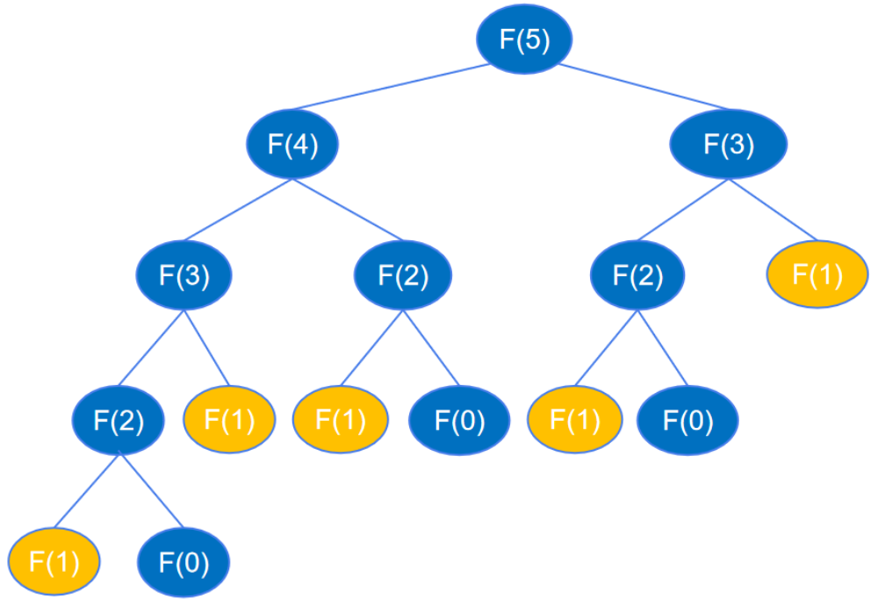

    ```python
    tmp_dic = {}
    
    def fb(n):
        if n==1 or n==2:
            return 1
        if n in tmp_dic.keys():
            return tmp_dic[n]
        tmp_dic[n] = fb(n-1)+fb(n-2)
        return tmp_dic[n]
    ```

    记忆化对比，时间复杂度从O(2^n)变为O(n)

    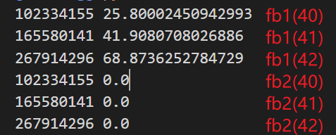

## 双端队列

collections.deque() （double end queue）继承自list，可实现循环队列和 两端插入和删除元素的O(1)复杂度

- `.appendleft(XX)` 左端插入
- `.popleft()` 左端删除
- `rotate(n)` 从右侧反转n步，如果n为负数，则从左侧反转，`d.rotate(1)` 等于 `d.appendleft(d.pop())`

## 堆

- 插入`heapq.heappush(__heap: list[_T@heappush], __item: _T@heappush)`
- Python 中 heapq 模块是小顶堆。实现 **大顶堆** 方法： 小顶堆的插入和弹出操作均将元素 **取反** 即可。
- 插入+调整的时间复杂度 O(logn)+O(logn)

# SQL

在自带的mysql数据库的增加用户，设置访问的主机权限；

创建数据库，添加用户在该数据库的增删改查权限

```sql
create user 'zzjian'@'localhost' identified by '密码';
update user set host='%' where user='zzjian';
FLUSH PRIVILEGES;
create database bigdata;
GRANT CREATE, DROP, SELECT, INSERT, UPDATE ON bigdata.* TO 'zzjian'@'%';
FLUSH PRIVILEGES;
show grants for 'zzjian'@'%';

## GRANT ALL PRIVILEGES ON *.* TO 'zzjian'@'%'; 赋予所有权限
```

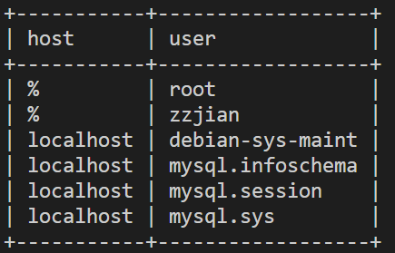

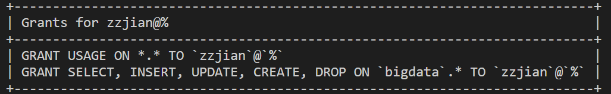

查看3306端口是否开通，`sudo vim /etc/mysql/mysql.conf.d/mysqld.cnf` 保证可以非本地连接数据库

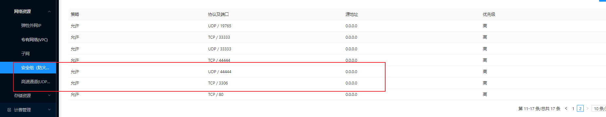


SQL的查询

1. 观察查询结果，是要处理from什么表，需不需要join 或者 in作为预先结果
2. 加分组或判断，使得到该查询结果
3. 写输出


数据：学生表、老师表、课程表、分数表

```sql
hive>
-- 创建学生表
DROP TABLE IF EXISTS student_info;
create table if not exists student_info(
    stu_id string COMMENT '学生id'，
    stu_name string COMMENT '学生姓名'，
    birthday string COMMENT '出生日期'，
    sex string COMMENT '性别'
) 
row format delimited fields terminated by '，' 
stored as textfile;

-- 创建课程表
DROP TABLE IF EXISTS course_info;
create table if not exists course_info(
    course_id string COMMENT '课程id'，
    course_name string COMMENT '课程名'，
    tea_id string COMMENT '任课老师id'
) 
row format delimited fields terminated by '，' 
stored as textfile;

-- 创建老师表
DROP TABLE IF EXISTS teacher_info;
create table if not exists teacher_info(
    tea_id string COMMENT '老师id'，
    tea_name string COMMENT '老师姓名'
) 
row format delimited fields terminated by '，' 
stored as textfile;

-- 创建分数表
DROP TABLE IF EXISTS score_info;
create table if not exists score_info(
    stu_id string COMMENT '学生id'，
    course_id string COMMENT '课程id'，
    score int COMMENT '成绩'
) 
row format delimited fields terminated by '，' 
stored as textfile;
```

## 简单查询

1. `count()`返回记录数 

   姓李的老师数量，返回别名

   - 模糊匹配：名字里带“山”：`where name like "%山%"`

   ```sql
   select count(*) li_count
   from teacher_info
   where name like '李%';
   ```

   参加考试的学生数

   ```sql
   select count(distinct stu_id) stu_num
   from score_info;
   ```

2. 排序

   04编号课程不合格的分数信息，按分数降序输出

   ```sql
   select *
   from score_info
   where course_id='04' and score<60
   order by score desc;
   ```

3. 多表连接与子查询

   数学不合格的学生信息和其数学成绩，按学号升序排列

   - 使用子查询：先知道数学对应的id，再在分数表查到数学不合格的学生id和数学分数返回表，与学生表按照学生id join起来，返回学生信息和数学成绩

     - **子查询出来的表，如果要获取其属性做select或join，一定要加个别名，表示定义了这张表**
   
   
     ```sql
     select s.*， t1.score
     from student_info s join (
         select stu_id， score from score_info 
         where course_id=(
             select course_id from course_info where course_info.course_name='数学'
         ) and score<60) t1 
         on s.stu_id = t1.stu_id
     order by s.stu_id;  # 默认asc 升序
     ```
   
   - 直接使用多表连接，可读性强，查询效率高，但子查询可以通过过滤减少多表连接时记录数
   
     ```sql
     select s.*， t1.score
     from student_info s 
     join score_info t1 on s.stu_id = t1.stu_id
     join course_info t2 on t1.course_id = t2.course_id
     where t2.course_name='数学' and t1.score<60
     order by s.stu_id;
     ```
   
   查询课程编号03且课程成绩在80分以上的学生学号、姓名和课程信息
   
   ```sql
   select s1.stu_id， s2.stu_name， c.*
   from score_info s1
   join course_info c on s1.course_id=c.course_id
   join student_info s2 on s1.stu_id=s2.stu_id
   where s1.course_id='03' and s1.score>80;
   
   # 子查询 先从成绩表中查到满足条件的学生学号 再与课程表、学生表连接
   select s1.stu_id， s1.stu_name， c.*
   from student_info s1
   join (
   	select stu_id from score_info where course_id='03' and score>80
   ) t on s1.stu_id=t.stu_id
   join course_info c on s1.course_id=c.course_id
   ```
   
   查询课程不同成绩相同的记录，返回学生编号、课程编号、成绩
   
   ```sql
   select s1.stu_id， s1.course_id， s1.score
   from score_info s1
   join score_info s2 on s1.stu_id=s2.stu_id and 
   					  s1.course_id<>s2.course_id and 
   					  s1.score=s2.score;
   ```
   
   查询学过课程编号01和02的学生，返回学号、姓名
   
   ```sql
   select s2.stu_id as `学号`， s2.stu_name as `姓名`
   from score_info s1
   join student_info s2 on s1.stu_id=s2.stu_id
   where s1.course_id='01' and s1.stu_id in (
   	select stu_id from score_info where course_id='02'
   );
   
   # 优化 先用子查询 把满足条件的学生返回，再join连接
   select s2.stu_id as `学号`， s2.stu_name as `姓名`
   from (
   	select stu_id from score_info
       where course_id='01' and 
       	  stu_id in (select stu_id from score_info where course_id='02')
   ) s1 join student_info s2 on s1.stu_id=s2.stu_id;
   ```
   
   


## 分组汇总

1. 分组求和

   查询课程编号02的总成绩

   - ⭐️注意：出现了聚合函数，不能将普通列也和聚合结果一起查询，除非这个列存在group by操作之后
   - 如果要返回`course_id`，必须要加`group by course_id`
   - 否则可以不用`group by course_id`，直接返回一个常量值，但不通用

   ```sql
   select course_id， sum(score) score_sum
   from score_info
   where course_id='02'
   group by course_id;
   
   select 02 course_id， sum(score) score_sum
   from score_info
   where course_id='02';
   ```

2. 分组查询

   查询各科成绩的最高和最低分，返回课程号、最高分、最低分

   ```sql
   select courese_id， max(score) max_score， min(score) min_score
   from score_info
   group by course_id;
   ```

   查询每门课程有多少学生参加了考试

   ```sql
   select course_id， count(stu_id)
   from score_info
   group by course_id;
   ```

3. 分组结果的条件查询

   查询平均成绩大于60分的学生的学号和平均成绩

   - 使用having + 聚合函数可用于聚合函数之后的判断，不能使用where+聚合函数的判断，其执行目标是查询结果集之前，执行顺序在gropu by和聚合函数之前
   - 一般的执行顺序：**from-->where-->group by -->having + 聚合函数 --- >select --> order**

   ```sql
   select stu_id， avg(score) score_avg
   from score_info
   group by stu_id
   having score_avg > 60;
   ```

   查询至少考了四门课程的学生学号

   ```sql
   select stu_id， count(distinct course_id) course_cnt
   from score_info
   group by stu_id
   having course_cnt >= 4;
   ```

   查询每门课程的平均成绩，结果按平均成绩升序排序，平均成绩相同时，按课程号降序排列

   ```sql
   select course_id， avg(score) score_avg
   from score_info
   group by course_id
   order by score_avg asc， course_id desc; 
   ```

   查询一共参加了三门课程且其中一门为语文的学生id和姓名

   ```sql
   # 多表连接
   select stu.stu_id， stu.stu_name
   from score_info s 
   join course_info c on s.course_id=c.course_id
   join student_info stu on s.stu_id=stu.stu_id
   where c.course_name='语文'
   group by s.stu_id
   having count(distinct s.course_id) = 3;
   
   # 子查询  先查出选了语文并且参加了三门课程的学生id
   select stu_id， stu_name 
   from student_info 
   where stu_id in 
   (
       select stu_id
       from score_info where course_id = 
       	(select course_id from course_info where course_name='语文')
       group by stu_id
       having count(distinct course_id)=3)
   );
   ```

   查询没有学全所有课的学生学号、姓名

   - 学生表 **左连接** 分数表，防止遗漏没有参与任何考试的学生
   - 同上，保证group by 学生学号姓名，否则无法select

   ```sql
   select s1.stu_id， s1.stu_name
   from student_info s1
   left join score_info s2 on s1.stu_id=s2.stu_id
   group by s1.stu_id， s1.stu_name
   having count(distinct course_id) < (
   	select count(distinct course_id) from course_info
   );
   
   # 优化：课程总数的子查询只执行一次
   select s1.stu_id， s1.stu_name
     student_info s1
   left join score_info s2 on s1.stu_id = s2.stu_id
   join (
       select count(distinct course_id) total_courses from course_info
   ) t on 1=1
   group by s1.stu_id， s1.stu_name
   having count(distinct s2.course_id) < t.total_courses;
   ```

   查询所有学生的学号、姓名、选课数和总成绩

   - 用到总成绩 需要进行groupby 分组聚合

   ```sql
   select s1.stu_id， count(course_id) course_cnt， sum(score) score_sum
   from student_info s1
   left join score_info s2 on s1.stu_id=s2.stu_id
   group by s1.stu_id， s1.stu_name;
   ```

   查询学过“李体音”老师**所有课**的学生学号、姓名

   ```sql
   select s1.stu_id， s1.stu_name
   from score_info s1， 
   join (
       select course_id， count(*) cnt， 
       from course_info where teacher_id=(
       	select teacher_id from teacher_info where teacher_name='李体音')
       group by course_id
   ) c on c.course_id=s1.course_id
   join student_info s2 on s1.stu_id=s2.stu_id
   group by stu_id
   having count(distinct c.course_id)=cnt;
   
   # 上面不知道对不对， 下面先查询课程表中'李体音'老师教的课程数，再判断该值与成绩表中按学生分组汇总课程数，最后返回学生表信息
   select stu_id， stu_name
   from student_info where stu_id in (
   	select stu_id from score_info group by stu_id 
   	having count(stu_id) = (select count(*) from course_info 
                               where teacher_id=(
                                   select teacher_id from teacher_info 
                                   where teacher_name='李体音')
                              )
   );
   ```

   查询学过“李体音”老师**任意一门**课程的学生学号、姓名

   - 和上面的类似， in 可以和 表连接达到right join的效果

     >`JOIN` 内连接：是一般化的关联操作，仅返回满足连接条件的匹配行
     >
     >`LEFT JOIN` 左（外）连接：保留了左表的所有行，并返回与左表满足连接条件的右表匹配行。
     >
     >`RIGHT JOIN` 右（外）连接：保留了右表的所有行，并返回与右表满足连接条件的左表匹配行。

   ```sql
   select stu_id， stu_name
   from student_info where stu_id in ( # not in则表示没有学过李体音教的课的学生
   	select distinct stu_id from score_info  
   	where course_id in (select course_id 
           from course_info where teacher_id=(
               select teacher_id from teacher_info where teacher_name='李体音'))
       group by stu_id
   );
   
   # 使用表连接 取代 in 
   select t1.stu_id， si.stu_name
   from
   (
       select stu_id from score_info si where course_id in
       (
           select
              course_id
           from course_info c
           join teacher_info t
           on c.tea_id = t.tea_id
           where tea_name='李体音'
       )
       group by stu_id
   ) t1 join student_info si on t1.stu_id=si.stu_id;
   ```

   查询与学号为001的学生至少有一门课相同的学生学号、姓名

   ```sql
   select stu_id， stu_name
   from student_info
   where stu_id in (
   	select distinct stu_id from score_info
       where stu_id<>'001' and course_id in (
           	select course_id from score_info where stu_id='001'
           )
   )
   ```

   查询学生的平均成绩，依次返回一个学生的学生名、课程名、课程成绩和平均成绩

   ```sql
   select s1.name， c.name， s3.score， s2.score_avg
   from student_info s1
   join (
   	select stu_id， avg(score) score_avg
       from score_info 
       group by stu_id， 
   ) s2 on s1.stu_id=s2.stu_id
   join score_info s3 on s1.stu_id=s3.stu_id
   join course_info c on c.course_id=s3.course_id
   order by s2.score_avg desc;
   ```

## 窗口函数

- 语法：

  ```text
  <窗口函数> over (partition by <用于分组的列名>
                  order by <用于排序的列名>)
  ```

  因为窗口函数是对where或者group by子句处理后的结果进行操作，所以**窗口函数原则上只能写在select子句中**。

  partition子句可以省略，省略就是不指定分组（**但此时若选择了order by X列， 将默认以相同X列取值的座位分区**），但是这一般会失去窗口函数的功能，一般不用

- 窗口函数举例：

  - 聚合函数，如sum(列名)，avg(列名)，count(列名)，max(列名)， min(列名)等
    - 聚集函数的窗口函数如果不指定 order by，达到的效果等于普通的聚集函数
  - 专用窗口函数，rank(列名)， dense_rank(列名)， row_number(列名)、ntile(桶数)分组窗口等
    - 这些窗口函数**必须指定order by**

- 作用：

  - group by+聚合函数，无法对分组内部的数据进行非聚合的处理（分组内排序等），使用窗口函数解决

  - 不改变原始表的行数

    

1. 查询不同科目的学生成绩排名，返回学号、科目、成绩、排名

   - 按照科目分组，各科按照成绩排名，对应得到该成绩的学生学号

   ```sql
   select *， rank() over(partition by course_id
                         order by score desc) as ranking
   from score_info
   ```

   - rank， dense_rank， row_number的区别

     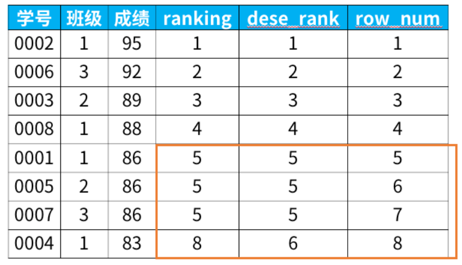

     - rank：有并列名次的行，会占用下一名次的位
     - dense_rank：有并列名次的行，不会占用下一名次的位
     - row_number：没有并列名次

   - `ntile(4) over (order by score desc)` 按照成绩降序，高到低分成4类作为新的列值

2. 聚合函数+窗口函数：查询结果是逐行聚合的，相当于把聚合的中间过程返回给当前行

   ```sql
   select *，
      sum(成绩) over (order by 学号) as current_sum，
      avg(成绩) over (order by 学号) as current_avg，
      count(成绩) over (order by 学号) as current_count，
      max(成绩) over (order by 学号) as current_max，
      min(成绩) over (order by 学号) as current_min
   from 班级表
   ```

   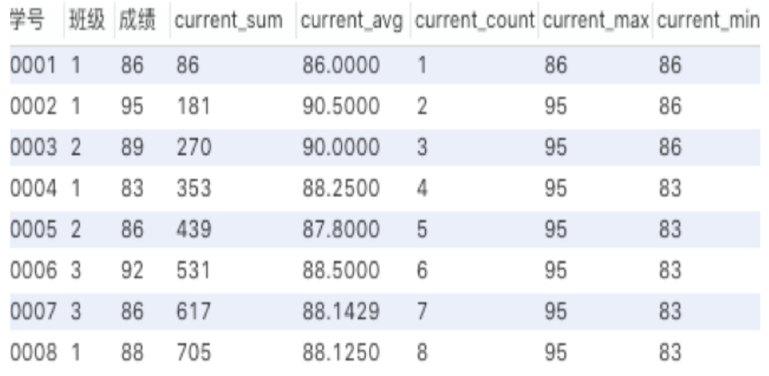

   >感觉其实用处不大：聚合函数作为窗口函数，可以在每一行的数据里直观的看到，**截止到本行数据，统计数据是多少（最大值、最小值等）。同时可以看出每一行数据，对整体统计数据的影响。**
   >
   >`max() over ()` `min() over ()`的窗口函数可以用order by+limit 1优化

3. 查询数学和英语两门课平均分最高的学生，返回学生id和平均分，别名为stu_id，avg_score

   - 本质为分组计算中间值，再拿中间值进行排序，再取出排序最高的结果
   - **注意**：主要到本题没法用group by + max 因为这样是每个分组的最大值，而分组必须是分组名stu_id，无法得到所有学生中的最大平均分
   - 窗口函数可以配合group by，加入聚合函数作为排序，分开来查出聚合结果作为子查询，再rank()

   ```sql
   select stu_id， avg(scores) avg_score # 不用加t.  因为只有一张表
   from
   (   
       select stu_id， avg(scores)， rank() over (order by avg(scores)) rank_avg
       from scores_info
       where course_id in
       (
           select course_id 
           from course_info
           where course_name='数学' or course_name='英语'
       )  
       group by stu_id
   ) t
   where t.rank_avg=1;
   ```

   


# Hive SQL

分布式场景下创建表

电商生产环境中的**用户信息表、商品信息表、商品分类表、订单信息表、订单明细表、登录明细表、商品价格变更明细表、配送信息表、好友关系表**

用户信息表结构

| user_id(用户id) | gender(性别) | birthday(生日) |
| --------------- | ------------ | -------------- |
| 101             | 男           | 1990-01-01     |
| 102             | 女           | 1991-02-01     |
| 103             | 女           | 1992-03-01     |
| 104             | 男           | 1993-04-01     |

商品信息表结构 sku_info

| sku_id(商品id) | name(商品名称) | category_id(分类id) | from_date(上架日期) | price(商品价格) |
| -------------- | -------------- | ------------------- | ------------------- | --------------- |
| 1              | xiaomi 10      | 1                   | 2020-01-01          | 2000            |
| 6              | 洗碗机         | 2                   | 2020-02-01          | 2000            |
| 9              | 自行车         | 3                   | 2020-01-01          | 1000            |

商品分类信息表结构 sku_detail

| category_id(分类id) | category_name(分类名称) |
| ------------------- | ----------------------- |
| 1                   | 数码                    |
| 2                   | 厨卫                    |
| 3                   | 户外                    |

订单信息表结构 order_info

| order_id(订单id) | user_id(用户id) | create_date(下单日期) | total_amount(订单金额) |
| ---------------- | --------------- | --------------------- | ---------------------- |
| 1                | 101             | 2021-09-30            | 29000.00               |
| 10               | 103             | 2020-10-02            | 28000.00               |

订单明细表结构 order_detail

| order_detail_id(订单明细id) | order_id(订单id) | sku_id(商品id) | create_date(下单日期) | price(商品单价) | sku_num(商品件数) |
| --------------------------- | ---------------- | -------------- | --------------------- | --------------- | ----------------- |
| 1                           | 1                | 1              | 2021-09-30            | 2000.00         | 2                 |
| 2                           | 1                | 3              | 2021-09-30            | 5000.00         | 5                 |
| 22                          | 10               | 4              | 2020-10-02            | 6000.00         | 1                 |
| 23                          | 10               | 5              | 2020-10-02            | 500.00          | 24                |
| 24                          | 10               | 6              | 2020-10-02            | 2000.00         | 5                 |

登录明细表结构 user_login

| user_id(用户id) | ip_address(ip地址) | login_ts(登录时间)    | logout_ts(登出时间)   |
| --------------- | ------------------ | --------------------- | --------------------- |
| 101             | 180.149.130.161    | 2021-09-21 08：00：00 | 2021-09-27 08：30：00 |
| 102             | 120.245.11.2       | 2021-09-22 09：00：00 | 2021-09-27 09：30：00 |
| 103             | 27.184.97.3        | 2021-09-23 10：00：00 | 2021-09-27 10：30：00 |

商品价格变更明细表结构

| sku_id(商品id) | new_price(本次变更之后的价格) | change_date(变更日期) |
| -------------- | ----------------------------- | --------------------- |
| 1              | 1900.00                       | 2021-09-25            |
| 1              | 2000.00                       | 2021-09-26            |
| 2              | 80.00                         | 2021-09-29            |
| 2              | 10.00                         | 2021-09-30            |

配送信息表结构

| delivery_id（运单id） | order_id（订单id） | user_id（用户id） | order_date（下单日期） | custom_date（期望配送日期） |
| --------------------- | ------------------ | ----------------- | ---------------------- | --------------------------- |
| 1                     | 1                  | 101               | 2021-09-27             | 2021-09-29                  |
| 2                     | 2                  | 101               | 2021-09-28             | 2021-09-28                  |
| 3                     | 3                  | 101               | 2021-09-29             | 2021-09-30                  |

好友关系表结构

| user1_id（用户1 id） | user2_id（用户2 id） |
| -------------------- | -------------------- |
| 101                  | 1010                 |
| 101                  | 108                  |
| 101                  | 106                  |

收藏信息表结构

| user_id(用户id) | sku_id(商品id) | create_date(收藏日期) |
| --------------- | -------------- | --------------------- |
| 101             | 3              | 2021-09-23            |
| 101             | 12             | 2021-09-23            |
| 101             | 6              | 2021-09-25            |

## 初级函数

1. 日期函数

   - `year(string datestr)`函数：参数datestr是格式化日期字符串，返回值为日期所属年份，**int类型**。
   - `datediff(string enddate， string startdate)`函数：startdate和enddate均为yyyy-MM-dd格式的日期字符串，返回值为二者的天数差，**int类型**。如datediff('2022-03-01'， '2022-02-21')返回值为8。
   - `date_format(date/timestamp/string dt， string formatstr)`：将date/timestamp/string类型的日期字段dt转换为formatstr格式的日期字符串，从而可以使用日期字符串进行聚合函数中的比较运算

2. 判断、转换函数

   - `if(boolean testCondition， T1 value1， T2 value2)`：判断testCondition是否为真，是则返回value1，否则返回value2，value1和value2类型可以不同，且后者可以为null
     - **结合聚集函数可以实现对分组结果value1重新赋值为value2**
     - 对应DataFrame API的 `F.sum(F.when(boolean testCondition， T1 value1).otherwise(T2 value2))`
   - `nvl(T value， T default_value)`：value为null则返回default_value，否则返回value。
   - `CAST(<expression> AS DECIMAL(16， 2))`：
     - `CAST` 函数用于将一个表达式转换为指定的数据类型。
     - `DECIMAL(16， 2)` 表示总共 16 位数字，其中小数部分占据 2 位。

3. 


# C/C++

## 指针

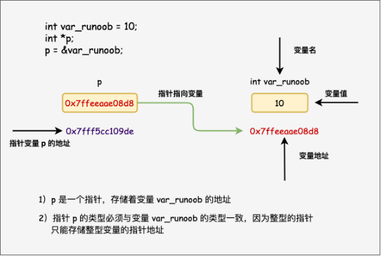

```c++
#include <stdio.h>
 
int main ()
{
 	int a = 10;  
    int *p = NULL;
	p = &a;
 	return 0;
}
```

- 指针变量`p`指向变量`a`的内存地址，`*p`将获取变量`a`的值

指针的算术运算 *++、--、+、-、<、>*

- 移动指针指向的内存地址，int类型的指针根据int占用4字节，自增/减将每次移动4字节；byte类型的指针自增/减移动1字节

- 使用指针指向数组位置，初始化指针`ptr`为数组第一个元素的内存地址，递增后将执行数组下一个元素的内存地址（数组是连续的内存空间），等价于使用数组下标获取数组元素

  ```c++
  #include <stdio.h>
   
  const int MAX = 3;
   
  int main ()
  {
     int  var[] = {10， 100， 200};
     int  i， *ptr;
   
     /* 指针中的数组地址 */
     ptr = var;
     for ( i = 0; i < MAX; i++)
     {
   
        printf("存储地址：var[%d] = %p\n"， i， ptr );
        printf("存储值：var[%d] = %d\n"， i， *ptr );
   
        /* 指向下一个位置 */
        ptr++;
     }
     return 0;
  }
  ```

- `while (ptr <= &var[MAX - 1]) ; ptr++` 通过内存地址的比较，进行数组的遍历

指针数组：存储指针的数组，处理具有不定数量元素的数据结构，如动态分配的字符串数组或动态创建的结构体数组。

```c++
#include <stdio.h>
 
int main() {
    int num1 = 10， num2 = 20， num3 = 30;
    
    // 声明一个整数指针数组，包含三个指针
    int *ptrArray[3];
    
    // 将指针指向不同的整数变量
    ptrArray[0] = &num1;
    ptrArray[1] = &num2;
    ptrArray[2] = &num3;
    
    // 使用指针数组访问这些整数变量的值
    printf("Value at index 0： %d\n"， *ptrArray[0]);
    printf("Value at index 1： %d\n"， *ptrArray[1]);
    printf("Value at index 2： %d\n"， *ptrArray[2]);
    
    return 0;
}
```

指向指针的指针：使用`*p1`和`**p2`获取变量`v`的值

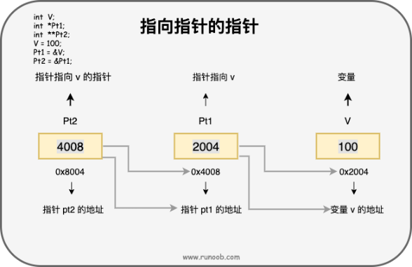

传递指针参数给函数

- 传递指针给函数，只需要简单地声明函数参数为指针类型即可。

- 指针给函数，可以在函数内改变这个值。

  定义函数 参数为指针 `void func(unsigned long *sec); `

  - 传入实参&sec，`getSeconds( &sec );` ，函数内需要加星号赋值 `*sec= time( NULL );`

  - 传入数组时，传入实参arr，`func( arr);` ，函数内不需要加星号赋值 `arr[i]= time( NULL );`

从函数返回指针

- `int * getRandom( ) {return XX;}`，将给指针函数返回给指针

  ```c++
  int main ()
  {
     /* 一个指向整数的指针 */
     int *p;
     int i;
   
     p = getRandom();
     for ( i = 0; i < 10; i++ )
     {
         printf("*(p + [%d]) ： %d\n"， i， *(p + i) );
     }
   
     return 0;
  }
  ```

函数指针：函数指针是指向函数的指针变量

-   声明一个指向同样参数、返回值的函数指针类型：`typedef int (*fun_ptr)(int，int);`	

```c++
#include <stdio.h>
 
int max(int x， int y)
{
    return x > y ? x ： y;
}
 
int main(void)
{
    /* p 是函数指针 */
    int (* p)(int， int) = & max; // &可以省略
    int a， b， c， d;
 
    printf("请输入三个数字：");
    scanf("%d %d %d"， & a， & b， & c);
 
    /* 与直接调用函数等价，d = max(max(a， b)， c) */
    d = p(p(a， b)， c); 
 
    printf("最大的数字是： %d\n"， d);
 
    return 0;
}
```

回调函数：函数指针`typedef (*getNextValue)(void)`，作为某个函数的参数

```c++
#include <stdlib.h>  
#include <stdio.h>
 
void populate_array(int *array， size_t arraySize， int (*getNextValue)(void))
{
    for (size_t i=0; i<arraySize; i++)
        array[i] = getNextValue();
}
 
// 获取随机值
int getNextRandomValue(void)
{
    return rand();
}
 
int main(void)
{
    int myarray[10];
    /* getNextRandomValue 不能加括号，否则无法编译，因为加上括号之后相当于传入此参数时传入了 int ， 而不是函数指针*/
    populate_array(myarray， 10， getNextRandomValue);
    for(int i = 0; i < 10; i++) {
        printf("%d "， myarray[i]);
    }
    printf("\n");
    return 0;
}
```


黑话：

- PV 页面访问量，UV访问用户数

解决大量小文件存取的模型有那些：*Bigtable* *GFS*


线性回归：适用于预测一个连续的目标变量，根据输入的自变量建立一个线性模型，通过最小化误差来拟合数据集。

逻辑回归：适用于分类问题，将特征值映射到0到1之间的概率值，通过设置阈值来判断样本属于哪一类。

决策树：适用于分类和回归问题，通过对样本数据集进行分裂来建立一棵树型结构，每个分支代表一个特征，每个叶子节点代表一个分类或回归结果。

随机森林：一种基于决策树的集成学习方法，通过随机选择特征和数据集来建立多棵决策树，最终通过投票或平均值来确定分类或回归结果。

支持向量机(SVM) ：适用于分类和回归问题，通过将数据映射到高维空间，并在该空间中找到一个最优的超平面来划分数据，从而实现分类或回归。

K-近邻(KNN) ：适用于分类和回归问题，通过找到离目标样本最近的K个样本，来预测该样本的类别或值


